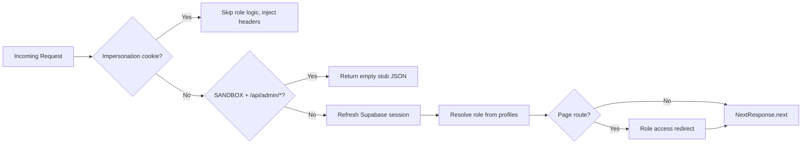
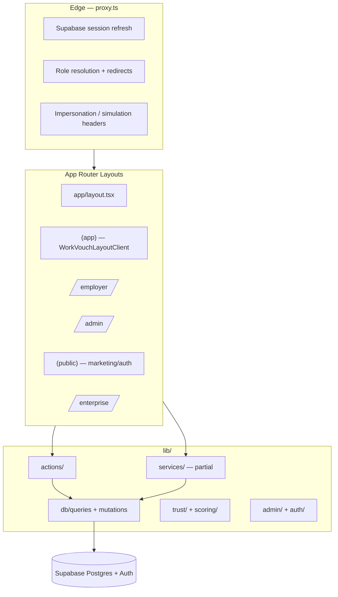

# 01 — Project Structure

> **Sprint:** Greenhouse Integration — Architecture Audit (Read-Only)  
> **Last updated:** 2026-08-07  
> **Status:** Documentation only — no code changes

---

## Overview

WorkVouch is a **Next.js 16 App Router** application (React 19) backed by **Supabase** (Auth + Postgres + Realtime). A companion **Expo mobile app** lives in `mobile/` and shares the same backend.

```
WorkVouch-Clean/
├── app/                  # Next.js App Router (pages + API)
├── components/           # Shared React UI (~518 files)
├── lib/                  # Business logic, auth, trust, actions (~563 files)
├── types/                # Shared TypeScript types (incl. database.ts)
├── supabase/             # SQL migrations (172), edge functions
├── prisma/               # Secondary ORM schema (minimal use)
├── tests/                # Vitest unit tests
├── e2e/                  # Playwright E2E
├── docs/                 # Internal documentation
├── mobile/               # Expo/React Native companion app
├── proxy.ts              # Edge request proxy (Next.js 16 — replaces middleware.ts)
└── package.json
```

---

## App Router Layout

### Root

| File | Role |
|------|------|
| `app/layout.tsx` | Global shell: `SupabaseProvider` → `AuthProvider` → `Navbar` → children |
| `app/page.tsx` | Marketing homepage |
| `app/error.tsx` | Global error boundary |

### Route Groups (parentheses = no URL segment)

| Group | Layout | URL examples | Purpose |
|-------|--------|--------------|---------|
| **`(app)`** | `app/(app)/layout.tsx` | `/dashboard`, `/profile`, `/requests` | **Employee/worker authenticated app** — `WorkVouchLayoutClient` (sidebar + navbar) |
| **`(public)`** | `app/(public)/layout.tsx` | `/login`, `/signup`, `/terms`, `/vouch/[token]` | Public marketing, auth, legal, token flows |
| **`(marketing)`** | `app/(marketing)/layout.tsx` | `/tour` | Minimal marketing passthrough |
| **`(auth)`** | *(no layout)* | — | `AuthSync.tsx` stub only |

### Standalone Zones (URL segments)

| Zone | Layout | Purpose |
|------|--------|---------|
| `/employer/*` | `app/employer/layout.tsx` | Employer portal — search, candidates, billing, job posts |
| `/admin/*` | `app/admin/layout.tsx` | Admin console (~92 pages) — analytics, sandbox, fraud, users |
| `/enterprise/*` | `app/enterprise/layout.tsx` | Enterprise org portal + hiring intelligence |
| `/superadmin/*` | `app/superadmin/layout.tsx` | Legacy super-admin surface |
| `/sandbox/*` | `app/sandbox/layout.tsx` | Admin-only sandbox playground |
| `/demo/*` | `app/demo/layout.tsx` | Public sales demo (canonical design reference) |
| `/directory/*` | `app/directory/layout.tsx` | Employer directory |

### API Routes

**462 route handlers** under `app/api/**`. See [04-api-map.md](./04-api-map.md).

**Convention (enforced by workspace rules):** All API routes use the shared `admin` Supabase client from `@/lib/supabase-admin`.

---

## Folder Hierarchy Detail

### `app/`

```
app/
├── (app)/              # Worker zone
│   ├── dashboard/      # Employee home
│   ├── coworker-matches/
│   ├── requests/       # Verification + vouch requests
│   ├── profile/        # Profile + work history
│   ├── my-jobs/        # Work history CRUD
│   ├── messages/
│   ├── notifications/
│   ├── onboarding/     # Industry onboarding flows
│   └── ...
├── (public)/           # Marketing + auth + legal
├── employer/           # Employer portal (~39 pages)
├── admin/              # Admin console (~92 pages)
├── enterprise/         # Enterprise portal
├── api/                # REST API (462 routes)
└── ...
```

### `components/`

| Folder | Purpose |
|--------|---------|
| **`wv/`** | **Canonical design system** — `WvShell`, `WvCard`, `WvButton`, `WvPageHeader`, `WvTrustScore` |
| **`ui/`** | Legacy shadcn-style primitives — prefer `wv/` for new code |
| **`workvouch/`** | App chrome — `WorkVouchLayoutClient`, sidebar, navbar |
| **`employer/`** | Employer search, candidate views, billing, verification panels |
| **`employee/`** | Worker trust coaching, career health |
| **`dashboard/`** | Stats grid, reputation hero, activity feed |
| **`trust/`** | Trust cards, trajectory, policy builder |
| **`profile/`** | Profile cards, job verification |
| **`onboarding/`** | Onboarding overlays, `OnboardingProvider` |
| **`enterprise/`** | Enterprise org shell, team risk |
| **`admin/`** | Admin dashboards, analytics, fraud, sandbox |
| **`demo/`**, **`demo-center/`** | Live demo UI (visual language reference) |
| **`messages/`** | User messaging |
| **`verification/`** | Verification request UI |
| **`guidance/`** | Smart guides (`EmployerGuidanceShell`) |

### `lib/`

| Area | Path | Purpose |
|------|------|---------|
| **Supabase** | `lib/supabase/` | Browser, server, admin clients |
| **Auth** | `lib/auth/` | Session, role resolution, post-login redirect |
| **Proxy routing** | `lib/proxy/routeAccess.ts` | Role-based path access (used by `proxy.ts`) |
| **Actions** | `lib/actions/` | ~35 server actions (notifications, search, jobs, trust) |
| **Trust** | `lib/trust/` | Score engine, timeline, policy, band labels |
| **Employer** | `lib/employer/`, `lib/search/` | Search service, verified workers, risk |
| **Enterprise** | `lib/enterprise/` | Org limits, contracts |
| **Billing** | `lib/billing/`, `lib/stripe/` | Plan limits, Stripe |
| **Verification** | `lib/verification/` | Credential payloads |
| **Email/SMS** | `lib/email/`, `lib/sms/` | SendGrid, Twilio |
| **AI** | `lib/ai/` | Embeddings, matching |
| **Sandbox** | `lib/sandbox/` | Synthetic data, DSL, fuzzer |
| **Admin** | `lib/admin/` | Context, audit, permissions |
| **DB DAL** | `lib/db/` | Centralized queries/mutations |
| **Services** | `lib/services/` | Thin service layer (profiles only — partial adoption) |

### `types/`

| File | Purpose |
|------|---------|
| `types/database.ts` | Generated Supabase types (~80 tables typed) |
| `types/supabase.ts` | Re-export / extended types |
| `types/admin.ts` | Admin-specific types |

### `supabase/`

| Path | Purpose |
|------|---------|
| `supabase/migrations/` | 172 incremental SQL migrations (production truth) |
| `supabase/schema.sql` | Original bootstrap schema |
| `docs/schema/` | Contract docs for trust, admin, analytics |

---

## Providers

| Provider | File | Mounted in | Role |
|----------|------|------------|------|
| **SupabaseProvider** | `components/SupabaseProvider.tsx` | `app/layout.tsx` | Passthrough wrapper |
| **AuthProvider** | `components/AuthProvider.tsx` | `app/layout.tsx` | Supabase `user` + `loading`; exports `useUser()` |
| **AuthContextProvider** | `components/AuthContext.tsx` | `app/admin/AdminClientLayout.tsx` | Profile **role** + `isFounder` for admin client |
| **OnboardingProvider** | `components/onboarding/OnboardingProvider.tsx` | `app/employer/layout.tsx` | Fetches `/api/onboarding/status`, overlay for employees |
| **Providers** (React Query) | `components/providers.tsx` | *Not mounted globally* | `QueryClientProvider` — limited adoption |
| **PreviewProvider** | `lib/preview-context.tsx` | *Not mounted* | Admin demo/preview state |
| **ImpersonationProvider** | `components/impersonation/ImpersonationContext.tsx` | *Not mounted* | Handled via cookies in `proxy.ts` |

---

## Hooks

### Primary: `lib/hooks/`

| Hook | Purpose |
|------|---------|
| `useUserRole` | Client profile role (UI only; enforcement in `proxy.ts`) |
| `useSupabaseSession` | Secure session via `getUser()` |
| `useFeatureFlag` | Feature flags + preview override |
| `useApiMode` | API mode detection |

### Elsewhere

| Hook | File |
|------|------|
| `useUser` | `lib/auth/useUser.ts` — fetches `/api/user/me` |
| `useTrustEngine` | `lib/trust/useTrustEngine.ts` |
| `useMultiverse` / `useSimulation` | `lib/trust/` |

---

## Services Layer

**Path:** `lib/services/`  
**Intent:** `Pages → Services → DB (queries/mutations) → Supabase`

| Module | Status |
|--------|--------|
| **Profiles** | **Active** — `getCandidateProfile`, `getCandidatePreview` |
| Jobs, Trust, Verifications, Employers | **Stubs** — exports commented |

> Most business logic lives in `lib/actions/` and API route handlers. Services are partially adopted.

---

## Middleware / Edge Proxy

**No `middleware.ts` exists.** Next.js 16 uses **`proxy.ts`** at repo root.



**Supporting files:**
- `lib/proxy/routeAccess.ts` — `AUTH_PREFIXES`, `pathRequiresAuth()`, `getRoleAccessRedirect()`
- `lib/middleware/plan-enforcement-supabase.ts` — Employer plan tier checks (API routes)
- `lib/middleware/paywall.ts` — Subscription feature gating

**Important:** API routes are **not** role-gated at the proxy layer. Each handler must enforce auth independently.

---

## Architecture Diagram



---

## Key Observations

1. **Dual auth contexts:** `AuthProvider` (Supabase user) vs `AuthContextProvider` (profile role in admin).
2. **Access control centralized in `proxy.ts`** — layouts note "enforced in proxy.ts only" for employer/enterprise/app zones.
3. **Service layer is early-stage** — profiles implemented; most logic in `lib/actions/` and API routes.
4. **Design system source of truth:** `components/wv/` + `/demo` routes.
5. **Three admin surfaces:** `/admin` (primary), `/superadmin` (legacy), `/sandbox` (playground).
6. **Mobile app** is sibling codebase under `mobile/` — not part of the Next.js bundle.
