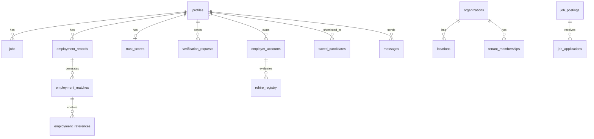

# 02 — Database Audit

> **Sprint:** Greenhouse Integration — Architecture Audit (Read-Only)  
> **Last updated:** 2026-08-07  
> **Primary source:** `supabase/migrations/` (172 files), `types/database.ts`

---

## Schema Sources

| Source | Path | Role |
|--------|------|------|
| Migrations | `supabase/migrations/*.sql` | Production truth (172 files) |
| Generated types | `types/database.ts` | Canonical TypeScript schema (~80 tables typed) |
| Bootstrap | `supabase/schema.sql` | Original core tables |
| Contract docs | `docs/schema/trust_schema.md`, `admin_schema.md`, `analytics_schema.md` | Domain contracts |

**Regenerate types:** `npm run generate:types`

---

## Inventory Summary

| Metric | Count |
|--------|-------|
| Tables in SQL (`CREATE TABLE public.*`) | **206** |
| Tables/views referenced in app code (`.from("…")`) | **198** |
| Tables with **zero** code references | **22** |
| Typed in `types/database.ts` | **~80** (partial) |

---

## Entity Relationship (Core)



---

## Tables by Domain

### 1. Core Identity & Auth

#### `profiles`
| | |
|---|---|
| **Purpose** | Primary user record (extends `auth.users`) |
| **Key columns** | `id` (PK, FK → auth.users), `full_name`, `email`, `role`, `industry`, `trust_score`, `public_slug`, `visibility`, `status`, `plan`, `onboarding_complete` |
| **Relationships** | Hub for most FKs |
| **Indexes** | `idx_profiles_email`, `idx_profiles_visibility` |
| **Usage** | **321 refs** — universal |

#### `user_roles`
| | |
|---|---|
| **Purpose** | Multi-role junction (`user`, `employer`, `admin`) |
| **Columns** | `user_id` → profiles, `role`, UNIQUE(user_id, role) |
| **Usage** | RLS policies; limited direct `.from()` |

#### `employee_profiles` / `employer_profiles`
| | |
|---|---|
| **Purpose** | Split identity model |
| **Usage** | Partial adoption vs monolithic `profiles` |

---

### 2. Worker Job History

#### `jobs`
| | |
|---|---|
| **Purpose** | User-reported employment history |
| **Columns** | `user_id`, `company_name`, `job_title`, dates, `verification_status`, `is_private` |
| **FKs** | `user_id` → profiles; referenced by connections, user_references, verification_requests |
| **Usage** | **107 refs** |

#### `employment_records`
| | |
|---|---|
| **Purpose** | Canonical verified employment (overlap matching via `company_normalized`) |
| **Columns** | `user_id`, `company_name`, `company_normalized`, dates, `verification_status`, `rehire_eligible` |
| **FKs** | `user_id` → profiles; `marked_by_employer_id` → employer_accounts |
| **Usage** | **93 refs** |

#### `employment_matches`
| | |
|---|---|
| **Purpose** | Coworker overlap pairs (≥30 days overlap) |
| **Columns** | `employment_record_id`, `matched_user_id`, `overlap_start/end`, `match_status` |
| **Usage** | **4 refs** |

---

### 3. References & Peer Verification

#### `user_references`
| | |
|---|---|
| **Purpose** | Job-linked peer references (original model) |
| **Columns** | `from_user_id`, `to_user_id`, `job_id`, `rating`, `written_feedback` |
| **Usage** | **44 refs** |

#### `employment_references`
| | |
|---|---|
| **Purpose** | **Canonical** references tied to confirmed `employment_matches` |
| **Usage** | **45 refs** |

#### `coworker_matches`
| | |
|---|---|
| **Purpose** | Discovered coworker overlaps |
| **Usage** | **23 refs** |

#### `reference_requests` / `reference_feedback`
| | |
|---|---|
| **Purpose** | Request queue and post-reference feedback |
| **Usage** | 21 / 5 refs |

#### `verification_requests`
| | |
|---|---|
| **Purpose** | Employment verification from peer by email |
| **Columns** | `requester_profile_id`, `target_email`, `employment_record_id`, `status`, `response_token` |
| **Usage** | **44 refs** |

#### `coworker_invites`
| | |
|---|---|
| **Purpose** | Tokenized email invites → signup → matching |
| **Usage** | **19 refs** |

---

### 4. Trust & Intelligence

#### `trust_scores`
| | |
|---|---|
| **Purpose** | Denormalized 0–100 score per user |
| **Columns** | `user_id` (unique), `score`, `job_count`, `reference_count`, `average_rating`, `calculated_at` |
| **Usage** | **52 refs** |

#### `trust_events`
| | |
|---|---|
| **Purpose** | Timeline of trust-impacting events |
| **Usage** | **29 refs** |

#### `trust_relationships`
| | |
|---|---|
| **Purpose** | Graph edges (peer_reference, manager_confirmation) |
| **Usage** | **11 refs** |

#### `intelligence_snapshots`
| | |
|---|---|
| **Purpose** | Cached intelligence breakdown per user |
| **Usage** | **21 refs** |

---

### 5. Employer & Billing

#### `employer_accounts`
| | |
|---|---|
| **Purpose** | Employer subscription account (Stripe, quotas, plan tier) |
| **Columns** | `user_id`, `company_name`, `plan_tier`, `stripe_customer_id`, `stripe_subscription_id`, `lookup_quota` |
| **Usage** | **130 refs** |

#### `employer_users`
| | |
|---|---|
| **Purpose** | Team seats / RBAC within employer |
| **Usage** | **13 refs** |

#### `employer_notifications`
| | |
|---|---|
| **Purpose** | In-app employer event feed |
| **Usage** | **6 refs** |

#### `rehire_registry`
| | |
|---|---|
| **Purpose** | Employer rehire eligibility per candidate |
| **Usage** | **19 refs** |

#### `subscriptions` / `user_subscriptions` / `finance_subscriptions`
| | |
|---|---|
| **Purpose** | Stripe billing (evolved across multiple tables) |
| **Usage** | 3 / 11 / 11 refs |

#### `stripe_events`
| | |
|---|---|
| **Purpose** | Webhook idempotency |
| **Usage** | 2 refs |

---

### 6. Internal ATS (Employer Tools)

Defined in `supabase/schema_employer_tools.sql`:

#### `job_postings`
| | |
|---|---|
| **Purpose** | Employer job listings |
| **Columns** | `employer_id`, `title`, `description`, `location`, pay range, `is_published` |
| **Usage** | **12 refs** |

#### `job_applications`
| | |
|---|---|
| **Purpose** | Candidate applications to postings |
| **Usage** | **3 refs** |

#### `saved_candidates`
| | |
|---|---|
| **Purpose** | Employer shortlist |
| **Usage** | **11 refs** |

#### `messages`
| | |
|---|---|
| **Purpose** | Employer↔candidate messaging |
| **Usage** | **10 refs** |

#### `employer_profile_views`
| | |
|---|---|
| **Purpose** | Profile view tracking / paywall |
| **Usage** | 4 refs |

---

### 7. Enterprise Multi-Tenant

#### `organizations`
| | |
|---|---|
| **Purpose** | Enterprise org record |
| **Usage** | **42 refs** |

#### `locations` / `departments`
| | |
|---|---|
| **Purpose** | Org hierarchy (country/state only per privacy rules) |
| **Usage** | 23 / 1 ref |

#### `tenant_memberships`
| | |
|---|---|
| **Purpose** | User ↔ org role binding |
| **Usage** | **13 refs** |

#### `workforce_employees`
| | |
|---|---|
| **Purpose** | Enterprise workforce roster |
| **Usage** | **10 refs** |

---

### 8. Admin, Audit & Analytics

| Table | Purpose | Usage |
|-------|---------|-------|
| `admin_audit_logs` | Immutable admin action log | 13 |
| `admin_alerts` | Real-time alerting | 15 |
| `incidents` / `incident_actions` | Incident management | 7 / 4 |
| `site_sessions` / `site_page_views` / `site_events` | Analytics (privacy-safe) | 17 / 7 / 7 |
| `user_locations` | **Canonical** country/state only | 8 |
| `abuse_signals` | Abuse detection | 8 |
| `feature_flags` / `feature_flag_assignments` | Feature gating | 17 / 13 |

---

### 9. Sandbox / Simulation (~40+ tables)

Prefix `sandbox_*` plus `simulation_sessions`. Used in admin playground, fuzzer, load simulation. Not production user data.

---

## Views (Not Tables)

| View | Purpose | Usage |
|------|---------|-------|
| `employer_candidate_view` | Tier-gated candidate summary for search | **1 ref** — `lib/search/employerSearchService.ts` |
| `admin_audit_log_entries_with_admin_email` | Admin audit with email join | Migration view |

---

## Unused / Legacy Tables (22 with zero code refs)

```
cna_credentials, employee_credentials, employer_candidate_rehire,
employer_internal_notes, employer_invites (DROPPED), employer_name_resolutions,
employer_scores, healthcare_profiles, hospitality_profiles,
law_enforcement_profiles, organization_members, reputation_marketplace_listings,
resume_files, retail_profiles, sandbox_ad_campaigns, sandbox_role_baselines,
sandbox_sub_industry_baselines, security_profiles, site_visits (legacy),
stripe_usage_events, workforce_audit_logs, workforce_metrics
```

| Item | Status |
|------|--------|
| `employer_invites` | **DROPPED** in migration `20250327000000` |
| `site_visits` | **Legacy** — use `site_sessions` + `site_page_views` |
| Industry vertical profile tables | Exist in SQL; data largely on `profiles.industry` |

---

## ATS Integration Points (Current State)

**No external ATS API integration exists.** Greenhouse/Lever/Workday sync tables are absent.

### Internal hiring workflow tables (integration candidates)

| Table | Greenhouse analog | Integration potential |
|-------|-------------------|----------------------|
| `saved_candidates` | Saved applications / prospects | Map Greenhouse candidates → WorkVouch profiles |
| `job_postings` | Job posts | Sync job requisitions |
| `job_applications` | Applications | Sync application status |
| `messages` | Notes / communication | Optional — high privacy risk |
| `verification_requests` | Custom fields / assessments | Attach WorkVouch verification status |
| `trust_scores` | Scorecard / custom attributes | Export trust score as candidate attribute |
| `employer_profile_views` | Activity tracking | Audit trail for integration events |

### Recommended future tables (not present)

| Proposed table | Purpose |
|----------------|---------|
| `ats_connections` | OAuth tokens, webhook secrets per employer |
| `ats_candidate_sync` | External candidate ID ↔ WorkVouch profile ID mapping |
| `ats_job_sync` | External job ID ↔ `job_postings` mapping |
| `ats_webhook_events` | Inbound event log + idempotency |

---

## Type Drift Notes

- `types/database.ts` covers ~80 of 206 tables
- Sandbox tables mostly untyped
- `profiles` still types legacy `city` field (location policy prefers `user_locations` country/state)
- Regenerate types before integration work: `npm run generate:types`

---

## Top Tables by Code Usage

| Refs | Table |
|------|-------|
| 321 | `profiles` |
| 130 | `employer_accounts` |
| 107 | `jobs` |
| 93 | `employment_records` |
| 52 | `trust_scores` |
| 45 | `employment_references` |
| 44 | `user_references`, `verification_requests` |
| 42 | `organizations` |
| 29 | `trust_events` |
| 23 | `coworker_matches`, `locations`, `disputes` |
| 21 | `reference_requests`, `intelligence_snapshots` |
