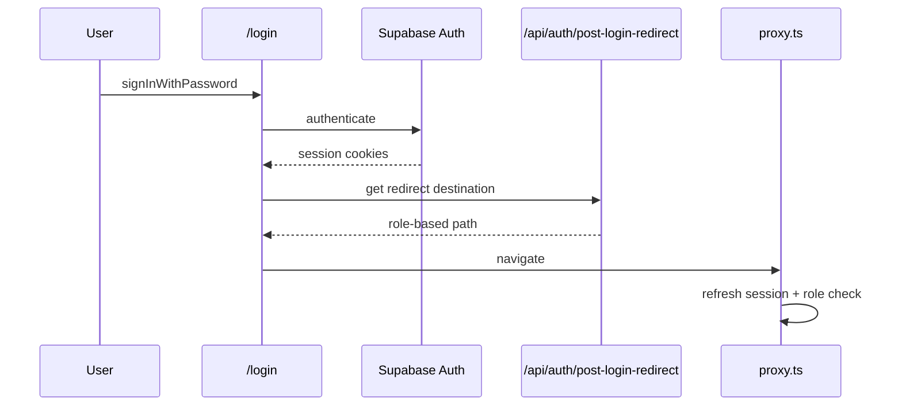

# 03 — Authentication

> **Sprint:** Greenhouse Integration — Architecture Audit (Read-Only)  
> **Last updated:** 2026-08-07

---

## Auth Provider

| Provider | Role |
|----------|------|
| **Supabase Auth** | Sole identity provider — email/password, OAuth callback, session cookies |
| **Stripe** | Billing only — not identity |
| **Beta routes** | Separate beta login (`/api/beta/*`) |

### Supabase Clients

| File | Purpose |
|------|---------|
| `lib/supabase/browser.ts` | Client-side (`createBrowserClient`) — login/signup |
| `lib/supabase/server.ts` | Server cookie session (`createServerClient` via `@supabase/ssr`) |
| `lib/supabase-admin.ts` | Service-role `admin` — **required for all API routes** |
| `lib/supabase/client.ts` | Alternate browser import |

---

## Login Flows

### Shared Entry



| Route | File | Behavior |
|-------|------|----------|
| `/login` | `(public)/login/LoginClient.tsx` | Password sign-in → post-login redirect |
| `/auth/callback` | OAuth PKCE exchange | `exchangeCodeForSession` → redirect |
| `/signup`, `/signup/employee`, `/signup/employer` | Signup flows | Supabase Auth client-side |
| `/choose-role` | Role selection | Required when `profiles.role` is null |

---

### Worker / Employee Flow

1. Signup at `/signup` or `/signup/employee`
2. If `profiles.role` is null → **`/choose-role`**
3. `POST /api/user/choose-role` sets `employee` or `employer` (not admin)
4. Post-login redirect → **`/dashboard`**
5. App zone: `(app)/layout.tsx` → `WorkVouchLayoutClient`

**Protected prefixes:** `/dashboard`, `/profile`, `/my-jobs`, `/requests`, `/coworker-matches`, `/settings`, `/messages`, `/notifications`

---

### Employer Flow

1. Signup at `/signup/employer`
2. Same role selection if pending
3. `getEmployerHomePath()`:
   - No `employer_accounts` → `/employer/onboarding/start`
   - Otherwise → **`/employer/dashboard`**
4. Layout: `app/employer/layout.tsx` → `EmployerGuidanceShell` + `OnboardingProvider`

**Protected prefixes:** `/employer/*`

---

### Admin Flow

1. `profiles.role` = `admin` / `superadmin` (or `app_metadata.role`)
2. Post-login → **`/admin`**
3. `app/admin/layout.tsx`:
   - `getAdminContext()` — auth check
   - Row in **`admin_users`** table (else `/404`)
   - God-mode banner for superadmin
4. Sub-areas: `/admin/financials` (finance/admin/board), `/admin/board` (board/admin)

---

### Enterprise Flow

1. `tenant_memberships` with `enterprise_owner` role
2. Org-scoped routes: `/enterprise/[orgId]/*`
3. `requireEnterpriseOwner(orgId)` in layout

---

## Session Management

| Mechanism | Location | Behavior |
|-----------|----------|----------|
| Supabase SSR cookies | `lib/supabase/server.ts`, `proxy.ts` | Refresh on matched requests |
| `getUser()` | `lib/auth/getUser.ts` | Canonical session read |
| `getAuthedUser()` | `lib/auth/getAuthedUser.ts` | Session + `app_metadata.role` |
| `getEffectiveUser()` | `lib/auth.ts` | Impersonation-aware |
| `getEffectiveSession()` | `lib/auth/actingUser.ts` | JWT cookie `acting_user` |
| Impersonation cookies | `impersonation_session` | Admin-only; proxy skips role checks |
| Analytics | `wv_sid` cookie | Anonymous session ID (1-year, httpOnly) |

**Post-login routing (single source):** `lib/auth/getPostLoginRedirect.ts`

---

## Role Permissions (RBAC)

### Canonical App Roles

`lib/auth/resolveUserRole.ts`:

| Role | Aliases normalized to |
|------|----------------------|
| `admin` | `superadmin`, `super_admin` |
| `employer` | — |
| `employee` | `user`, `worker`, `candidate` |
| `pending` | null role |

### Platform Hierarchy

`lib/roles.ts`: `user` < `employer` < `admin` < `superadmin` < `system`

### Enterprise RBAC

`lib/permissions/requireRole.ts` combines:
- `profiles.role`
- `employer_users`
- `tenant_memberships`
- `employer_accounts`

Roles: `superadmin`, `admin`, `org_admin`, `location_admin`, `hiring_manager`, `employer`, `employee`

### Admin Guards (multiple patterns — audit finding)

| Guard | Source | Used for |
|-------|--------|----------|
| `requireAdminForApi()` | `getAdminContext()` | Most `/api/admin/**` |
| `requireAdminRoute()` | `app_metadata.role` only | Legacy admin routes |
| `requireAdminThrow()` | `profiles.role` | Some admin APIs |
| `getAuthedUser()` | `app_metadata.role` | Admin role checks |

> **Risk:** Dual role sources (`profiles.role` vs `app_metadata.role`) can diverge if not synced.

---

## Protected Routes

### Layer 1 — `proxy.ts` (Edge)

```
Request
  → impersonation cookie? → skip role logic, inject headers
  → SANDBOX + /api/admin/*? → stub JSON 200
  → refresh Supabase session + resolve role
  → page + logged in on /login|/signup|/choose-role? → getPostLoginRedirect
  → page? → getRoleAccessRedirect (login, choose-role, unauthorized, role zones)
  → set wv_sid analytics cookie
  → NextResponse.next()
```

**Matcher:** dashboard, profile, settings, login, signup, `/api/*`, `/admin/*`, catch-all

### Layer 2 — `lib/proxy/routeAccess.ts`

- `pathRequiresAuth()` — prefixes requiring session
- Pending users → `/choose-role`
- Role zones via `lib/auth/roleRouting.ts` (employer ↔ employee ↔ admin isolation)

### Layer 3 — Layout Guards

| Layout | Enforcement |
|--------|-------------|
| `app/admin/layout.tsx` | Full — auth, admin role, `admin_users` row |
| `app/admin/financials/layout.tsx` | Finance/board/admin |
| `app/(app)/layout.tsx` | **No redirect** — proxy handles access |
| `app/employer/layout.tsx` | **No redirect** — proxy handles access |
| `app/sandbox/layout.tsx` | Admin auth required |

### Layer 4 — API Route Handlers

Each of **462 API routes** must enforce auth independently. Proxy does **not** gate API role access.

---

## Auth Flow Diagram

```mermaid
flowchart TB
  subgraph entry [Entry Points]
    LOGIN[/login]
    SIGNUP[/signup]
    OAUTH[/auth/callback]
  end

  subgraph gate [Role Gate]
    CR[/choose-role]
    PENDING{role null?}
  end

  subgraph zones [Role Zones]
    EMP[/dashboard — employee]
    EMPL[/employer/dashboard]
    ADM[/admin]
    ENT[/enterprise/orgId]
  end

  LOGIN --> PENDING
  SIGNUP --> PENDING
  OAUTH --> PENDING
  PENDING -->|yes| CR
  PENDING -->|employee| EMP
  PENDING -->|employer| EMPL
  PENDING -->|admin| ADM
  CR --> EMP
  CR --> EMPL
```

---

## Security Observations (Do Not Modify Lightly)

1. **No `middleware.ts`** — all page gating in `proxy.ts`
2. **462 API routes rely on per-handler guards** — inconsistent patterns exist
3. **Impersonation bypass** — when cookie set, proxy skips session refresh/role logic
4. **135 routes** use non-standard or unknown guard patterns (heuristic audit)
5. **Public endpoints:** `/api/metrics`, `/api/trades`, token-based credential/verification routes, `/api/stripe/webhook`

---

## Files Reference

| Concern | Primary files |
|---------|---------------|
| Session | `lib/auth/getUser.ts`, `lib/supabase/server.ts` |
| Role resolution | `lib/auth/resolveUserRole.ts`, `lib/auth/roleRouting.ts` |
| Post-login | `lib/auth/getPostLoginRedirect.ts` |
| Route access | `lib/proxy/routeAccess.ts`, `proxy.ts` |
| Admin context | `lib/admin/requireAdmin.ts`, `lib/admin/context.ts` |
| Plan enforcement | `lib/middleware/plan-enforcement-supabase.ts` |
