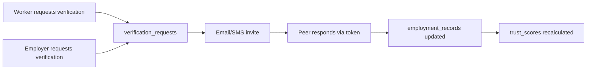
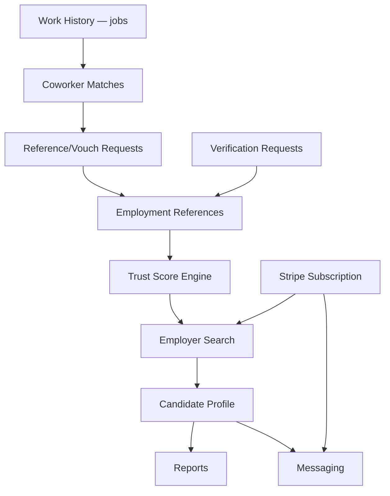

# 06 — Feature Inventory

> **Sprint:** Greenhouse Integration — Architecture Audit (Read-Only)  
> **Last updated:** 2026-08-07

---

## Feature Matrix

| Feature | Status | Worker | Employer | Admin | API namespace |
|---------|--------|--------|----------|-------|---------------|
| Verification | Production | ✅ | ✅ | ✅ | `/api/verification/*` |
| Vouch / Reference Requests | Production | ✅ | — | ✅ | `/api/public/vouch-invite/*` |
| Trust Score | Production | ✅ | ✅ | ✅ | `/api/trust/*` |
| AI (Resume parse) | Production | ✅ | — | — | `/api/resume/parse` |
| Notifications | Production | ✅ | ✅ | — | `/api/notifications`, `/api/employer/notifications` |
| Messaging | Production | ✅ | ✅ | — | `/api/messages` |
| Reports | Production | — | ✅ | ✅ | `/api/trust/report` |
| Stripe Billing | Production | — | ✅ | ✅ | `/api/stripe/*` |
| Employer Search | Production | — | ✅ | — | `/api/employer/search-users` |
| Saved Candidates | Production | — | ✅ | — | `saved_candidates` table |
| Request Management | Production | ✅ | ✅ | ✅ | `reference_requests`, `verification_requests` |
| Settings | Production | ✅ | ✅ | ✅ | Various |
| Admin Tools | Production | — | — | ✅ | `/api/admin/*` |
| Job Postings (internal ATS) | Partial | — | ✅ | — | `job_postings` table |
| Greenhouse Integration | **Not built** | — | — | — | — |

---

## 1. Verification

### Worker Flow
- **Pages:** `/verify/request`, `/requests`, public `/vouch/[token]`, `/credential/[token]`
- **Components:** `VerifyRequestClient`, `RequestsPageClient`, `VerificationsList` (admin)
- **APIs:** `/api/verification/request`, `/api/verification/respond`, `/api/verification/pending`
- **Tables:** `verification_requests`, `reference_requests`, `employment_records.verification_status`
- **Cron:** `/api/cron/verification-reminder` (SMS via Twilio)

### Employer-Initiated
- Request verification from candidate profile viewer
- File disputes: `/api/employer/file-dispute`
- APIs: `/api/employer/request-employment-verification`, `/api/employer/request-verification`

### Admin
- `/admin/verifications`, `/api/admin/verification-requests`, approve/reject endpoints

---

## 2. Vouch / Reference Requests

- **Pages:** `/coworker-matches`, `/requests`, `/references/request`
- **Actions:** `lib/actions/referenceFeedback.ts`, `lib/actions/coworkerReferences.ts`, `lib/actions/confirmMatch.ts`
- **Public respond:** `/api/public/vouch-invite/[token]/respond`
- **Tables:** `reference_requests`, `coworker_references`, `employment_references`, `user_references`
- **Realtime:** Supabase channels on `reference_requests`

---

## 3. Trust Score

- **Engine:** `lib/trust/` (40+ modules — `trustService.ts`, `trustEngine.ts`, `eventEngine.ts`)
- **Band labels:** `lib/trust/trustBandLabels.ts` (Low / Moderate / Strong / Exceptional)
- **UI:** `WvTrustScore`, `TrustCard`, `TrustCardEmployerView`, `DashboardReputationHero`
- **APIs:** 17 routes under `/api/trust/` — score, explain, timeline, graph, network, benchmark, forecast, report
- **Cron:** `/api/cron/trust-benchmarks`, `/api/cron/nightly-intelligence-recalc`
- **Admin:** `/admin/trust`, `/api/admin/users/[id]/recalculate`
- **Docs:** `lib/trust/TRUST_MODEL.md`, `docs/schema/trust_schema.md`

> **Do not modify trust engine during Greenhouse integration.**

---

## 4. AI

| Use case | File | Provider |
|----------|------|----------|
| Resume parsing | `app/api/resume/parse/route.ts`, `lib/resume/parseAndStore.ts` | OpenAI |
| Behavioral signals | `lib/intelligence/behavioralEngine.ts` | OpenAI |
| Embeddings | `lib/ai/embeddings.ts` | OpenAI |
| AI match | `app/api/ai/match/route.ts` | OpenAI |

**Env:** `OPENAI_API_KEY`

Guidance UI (non-LLM): `SmartGuide`, `SmartInsight` in `components/guidance/`

---

## 5. Notifications

| Surface | Page | Component | API |
|---------|------|-----------|-----|
| Worker | `/notifications` | `NotificationsPanel` | `GET /api/notifications` |
| Employer | `/employer/notifications` | `EmployerNotificationsPanel` | `GET /api/employer/notifications` |
| Navbar | All worker pages | `NotificationBell` | `getUnreadNotificationCount()` |

**Actions:** `lib/actions/notifications.ts`  
**Cron-created:** `/api/cron/worker-onboarding-reminders`  
**Email:** SendGrid (`lib/utils/sendgrid.ts`)

---

## 6. Messaging

| Surface | Page | Component | Backend |
|---------|------|-----------|---------|
| Worker | `/messages` | `UserMessages` | `lib/actions/messages.ts` |
| Employer | `/employer/messages` | `EmployerMessages` | `lib/actions/employer/messages.ts` |

**API:** `GET/POST /api/messages`  
**Table:** `messages` (sender/recipient → profiles)  
**Plan-gated:** Employer messaging requires subscription tier

---

## 7. Reports

| Report | Route | Component | Backend |
|--------|-------|-----------|---------|
| Candidate report | `/employer/reports/[candidateId]` | `CandidateReportView` | `getCandidateReport()` |
| Trust report | — | — | `/api/trust/report` |
| Resume PDF | — | — | `/api/resume/export` |
| Admin export | `/admin/export` | — | `/api/admin/export` |
| Data export (GDPR) | — | — | `/api/account/export` |

---

## 8. Stripe Billing

- **Config:** `lib/stripe/config.ts`
- **APIs:** `/api/stripe/checkout`, `/api/stripe/portal`, `/api/stripe/webhook`
- **Pages:** `/employer/billing`, `/employer/subscription`, `/employer/upgrade`, `(public)/pricing/**`
- **Webhook updates:** `plan_tier`, `subscription_status`, metered overage on `employer_accounts`

> **Do not modify billing during Greenhouse integration.**

---

## 9. Employer Search

- **Primary page:** `/employer/search-users` — `EmployerSearchClient`
- **API:** `GET /api/employer/search-users`
- **Service:** `lib/search/employerSearchService.ts`
- **Legal gate:** `/api/employer/legal-acceptance` required before search
- **Paywall:** Profile views tracked in `employer_profile_views`
- **Related:** compare, saved candidates, candidate reports, trust graph

---

## 10. Employee / Coworker Search

- **Coworker matches:** `/coworker-matches` — overlap discovery from work history
- **Public profiles:** `/u/[username]`, `/v/[slug]`, `/trust/[profileId]`
- **Admin user search:** `/admin/users`
- No separate worker-to-worker search beyond coworker matches

---

## 11. Request Management

| Queue | Page | Table |
|-------|------|-------|
| Worker verification/vouch | `/requests` | `reference_requests` |
| Employer verification | Candidate viewer | `verification_requests` |
| Company claims | `/employer/claim` → `/admin/claim-requests` | `employer_claim_requests` |
| Admin verifications | `/admin/verifications` | `verification_requests` |
| Disputes | Various | `disputes`, `compliance_disputes`, `employer_disputes` |

---

## 12. Settings

| Role | Route | Component |
|------|-------|-----------|
| Worker | `/settings` | `UserSettings`, `PublicPassportSettings`, `ChangeEmailSettings` |
| Employer | `/employer/settings` | `CompanyProfileSettings` |
| Admin | `/admin/system`, `/admin/preview-control` | System settings UI |
| Enterprise org | `/enterprise/[orgId]/admin-controls` | Org admin controls |

---

## 13. Admin Tools

| Tool | Route | Purpose |
|------|-------|---------|
| Impersonation | `/admin/impersonate` | Act as user |
| God mode / sandbox | `/admin/sandbox/**`, `/admin/sandbox-v2/**` | Synthetic data lab |
| Simulation lab | `/admin/testing-lab` | Load testing |
| Content moderation | `/admin/flagged-content` | Flag queue |
| Audit | `/admin/audit-logs` | Immutable audit trail |
| Feature flags | `/admin/hidden-features` | Feature gating |
| Ads system | `/admin/ads/**` | Ad management |
| Demo seeding | `/api/admin/reset-demo` | Reset demo data |

---

## 14. Internal ATS (Partial)

| Feature | Status | Tables |
|---------|--------|--------|
| Job postings | Wired (12 refs) | `job_postings` |
| Applications | Minimal (3 refs) | `job_applications` |
| Saved candidates | Production | `saved_candidates` |
| Resume requests | Production | `resume_requests` |

> This is WorkVouch's internal hiring workflow — **not** a Greenhouse replacement. Greenhouse integration should complement, not replace, these tables initially.

---

## Feature Dependency Diagram

---

## Greenhouse Integration Feature Gaps

| WorkVouch feature | Greenhouse equivalent | Gap |
|-------------------|----------------------|-----|
| Trust score | Custom candidate field | Export API needed |
| Verification status | Custom field / assessment | Webhook or polling needed |
| Saved candidates | Prospects / applications | Bidirectional sync needed |
| Employer search | Candidate search in GH | Identity mapping needed |
| Job postings | Job posts in GH | Optional sync |
| Messaging | GH notes | High privacy risk — defer |
