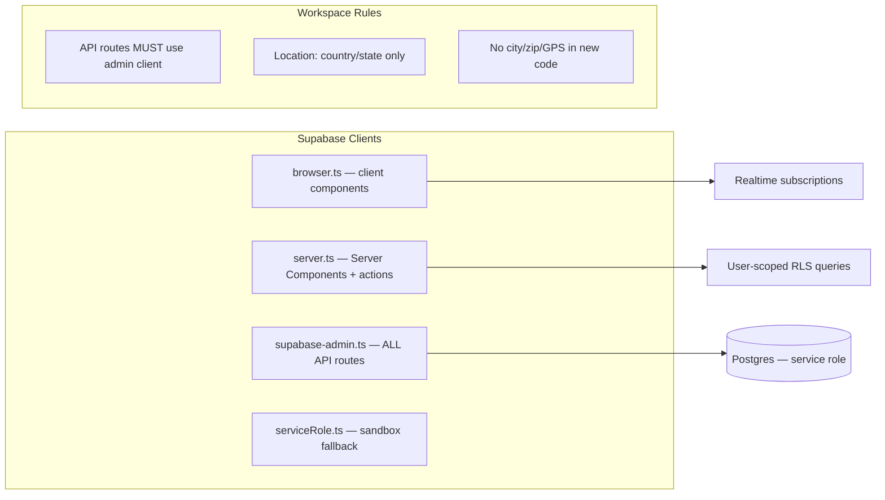

# 07 — Dependencies

> **Sprint:** Greenhouse Integration — Architecture Audit (Read-Only)  
> **Last updated:** 2026-08-07  
> **Source:** `package.json`, codebase inspection

---

## NPM Packages

### Production Dependencies

| Package | Version | Purpose |
|---------|---------|---------|
| `next` | ^16.1.4 | Framework (App Router) |
| `react` / `react-dom` | ^19.2.3 | UI |
| `@supabase/supabase-js` | ^2.91.0 | Database + Auth client |
| `@supabase/ssr` | ^0.8.0 | Server-side Supabase sessions |
| `stripe` | ^20.2.0 | Payment processing |
| `@stripe/stripe-js` | ^4.0.0 | Client-side Stripe |
| `@sendgrid/mail` | ^8.1.6 | Transactional email |
| `twilio` | ^5.0.0 | SMS verification reminders |
| `openai` | ^6.16.0 | Resume parsing, behavioral AI, embeddings |
| `framer-motion` | ^11.18.2 | UI animations |
| `lucide-react` | ^1.24.0 | Icons (preferred) |
| `@heroicons/react` | ^2.2.0 | Icons (legacy) |
| `recharts` | ^2.15.0 | Charts |
| `reactflow` | ^11.11.4 | Trust graph visualization |
| `react-hook-form` | ^7.71.1 | Form handling |
| `react-qr-code` | ^2.0.18 | Credential QR codes |
| `jspdf` | ^4.2.0 | PDF export |
| `pdf-parse` | ^2.4.5 | Resume PDF parsing |
| `mammoth` | ^1.11.0 | DOCX resume parsing |
| `zod` | ^4.3.5 | Schema validation |
| `date-fns` | ^4.1.0 | Date utilities |
| `nanoid` / `uuid` | ^5.1.7 / ^13.0.0 | ID generation |
| `bcryptjs` | ^3.0.3 | Password hashing |
| `clsx` / `tailwind-merge` | ^2.1.1 / ^3.4.0 | CSS utilities |
| `@tanstack/react-query` | ^5.90.21 | Data fetching (limited adoption) |
| `@prisma/client` | ^6.19.2 | Secondary ORM (minimal use) |

### Dev Dependencies

| Package | Purpose |
|---------|---------|
| `typescript` | Type checking |
| `tailwindcss` | Styling |
| `eslint` / `eslint-config-next` | Linting |
| `vitest` | Unit tests |
| `@playwright/test` | E2E tests |
| `prisma` | Schema tooling |
| `jose` | JWT handling |
| `sharp` | Image processing (PWA icons) |

### Scripts

| Script | Purpose |
|--------|---------|
| `dev` | Next.js dev server |
| `build` | Production build (`--webpack`) |
| `test` | Vitest unit tests |
| `e2e` | Playwright E2E |
| `generate:types` | Supabase type generation |
| `ci:admin-analytics` | CI analytics check |

---

## External APIs & Services

| Service | Purpose | Key files | Env vars |
|---------|---------|-----------|----------|
| **Supabase** | Auth, Postgres, Realtime, Storage | `lib/supabase/*`, `lib/supabase-admin.ts` | `NEXT_PUBLIC_SUPABASE_URL`, `NEXT_PUBLIC_SUPABASE_ANON_KEY`, `SUPABASE_SERVICE_ROLE_KEY` |
| **Stripe** | Subscriptions, checkout, webhooks | `lib/stripe/`, `app/api/stripe/` | `STRIPE_SECRET_KEY`, `STRIPE_WEBHOOK_SECRET`, `NEXT_PUBLIC_STRIPE_PUBLISHABLE_KEY` |
| **SendGrid** | Transactional email | `lib/utils/sendgrid.ts`, `lib/email/` | `SENDGRID_API_KEY` |
| **Twilio** | SMS verification reminders | `lib/sms/sendSms.ts` | Twilio account SID, auth token, phone number |
| **OpenAI** | Resume parse, behavioral analysis, embeddings | `lib/ai/`, `app/api/resume/parse/` | `OPENAI_API_KEY` |
| **Vercel** | Deployment | `vercel.json` | Region: `iad1` |

### Not Present (Greenhouse Integration Will Add)

| Service | Purpose |
|---------|---------|
| **Greenhouse Harvest API** | Candidate/job sync |
| **Greenhouse Webhooks** | Inbound event processing |
| **OAuth provider for Greenhouse** | Employer ATS connection |

---

## Supabase Usage Patterns



| Client | File | Use case |
|--------|------|----------|
| **`admin`** | `lib/supabase-admin.ts` | **Required for all `app/api/**` routes** |
| **`createClient()`** | `lib/supabase/server.ts` | Server Components, layouts, server actions |
| **`supabaseBrowser`** | `lib/supabase/browser.ts` | Client components, realtime |
| **`getSupabaseServer()`** | `lib/supabase/admin.ts` | Some enterprise/admin server pages |

**Types:** `types/database.ts` (generated via `npm run generate:types`)

---

## Stripe Integration

| Component | Detail |
|-----------|--------|
| Checkout | `/api/stripe/create-checkout`, `/api/stripe/checkout` |
| Portal | `/api/stripe/portal`, `/api/stripe/billing-portal` |
| Webhook | `/api/stripe/webhook` — syncs `plan_tier`, `subscription_status` to `employer_accounts` |
| Idempotency | `stripe_events` table |
| Pages | `/employer/billing`, `/employer/subscription`, `/employer/upgrade` |

> Stripe webhook is the **reference pattern** for future Greenhouse inbound webhooks.

---

## Email Provider

| Provider | Usage |
|----------|-------|
| **SendGrid** | Transactional email — verification invites, onboarding, notifications |

**Files:** `lib/utils/sendgrid.ts`, `lib/email/`

---

## Analytics

| Component | Detail |
|-----------|--------|
| Internal APIs | `/api/analytics/event`, `/api/analytics/capture`, `/api/analytics/track` |
| Heat map | `GET /api/analytics/heatmap` — aggregated country/state only |
| Admin UI | `AdminAnalyticsDashboard` — funnels, journeys, abuse, real-time |
| Session tracking | `site_sessions`, `site_page_views`, `site_events` tables |
| Anonymous cookie | `wv_sid` (set by `proxy.ts`) |

**Privacy rules:** `.cursor/rules/workvouch-location-safety.mdc` — no granular location data.

---

## Background Jobs & Cron

No in-repo scheduler. Jobs are HTTP endpoints protected by `CRON_SECRET` (external scheduler expected — likely Vercel Cron).

| Endpoint | Method | Schedule (expected) | Purpose |
|----------|--------|---------------------|---------|
| `/api/cron/verification-reminder` | GET | Daily | SMS reminders for pending verifications >24h |
| `/api/cron/worker-onboarding-reminders` | GET | Daily | In-app nudges for incomplete vouch onboarding |
| `/api/cron/nightly-intelligence-recalc` | POST | Nightly | Trust score recalc (`ENABLE_NIGHTLY_RECALC` flag) |
| `/api/cron/trust-benchmarks` | POST | Weekly | Aggregate industry trust benchmarks |
| `/api/cron/purge-deleted-users` | POST | Weekly | Hard-delete users soft-deleted 30+ days |
| `/api/cron/credentials-compliance` | POST | Daily | Credential status + compliance alerts |
| `/api/system/nightly-recalc` | GET | Nightly | Alternate recalc endpoint |
| `/api/admin/simulation-lab/cron/purge` | POST | On-demand | Simulation lab purge |

---

## Mobile Companion

| Component | Detail |
|-----------|--------|
| Framework | Expo / React Native |
| Location | `mobile/` |
| Backend | Same Supabase instance |
| Features | Dashboard, messages (realtime), profile, employer search |

Not part of Next.js bundle. Greenhouse integration should not depend on mobile initially.

---

## Prisma (Secondary)

| Component | Detail |
|-----------|--------|
| Schema | `prisma/schema.prisma` |
| Client | `lib/prisma.ts` |
| Usage | Minimal — scripts and legacy paths only |
| Primary ORM | Supabase client (not Prisma) |

---

## Dependency Risk for Greenhouse Integration

| Dependency | Risk | Recommendation |
|------------|------|----------------|
| Supabase service role in all API routes | High coupling | Add Greenhouse routes under new namespace; same pattern |
| No API versioning | Breaking changes risky | Version Greenhouse integration as `/api/integrations/greenhouse/v1/*` |
| OpenAI in resume parse | Not integration-critical | Do not touch during Sprint 1 |
| Stripe webhook pattern | Good reference | Mirror for Greenhouse webhooks |
| Cron via HTTP + secret | Good pattern | Add Greenhouse sync cron as new endpoint |
| 206 tables, partial types | Type drift | Regenerate types before integration work |

---

## Environment Variables (Representative)

```
# Supabase
NEXT_PUBLIC_SUPABASE_URL
NEXT_PUBLIC_SUPABASE_ANON_KEY
SUPABASE_SERVICE_ROLE_KEY

# Stripe
STRIPE_SECRET_KEY
STRIPE_WEBHOOK_SECRET
NEXT_PUBLIC_STRIPE_PUBLISHABLE_KEY

# Email
SENDGRID_API_KEY

# SMS
TWILIO_ACCOUNT_SID
TWILIO_AUTH_TOKEN
TWILIO_PHONE_NUMBER

# AI
OPENAI_API_KEY

# Cron
CRON_SECRET

# App
ENV=production|SANDBOX
ENABLE_NIGHTLY_RECALC=true|false
FOUNDER_EMAIL
```

**Greenhouse integration will require:**
```
GREENHOUSE_CLIENT_ID
GREENHOUSE_CLIENT_SECRET
GREENHOUSE_WEBHOOK_SECRET
GREENHOUSE_API_BASE_URL  # Harvest API
```
