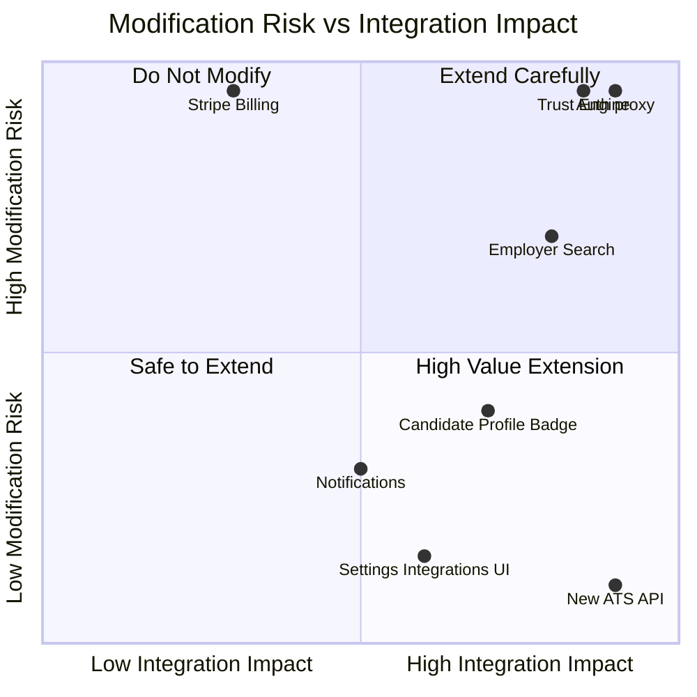

# 08 — Risk Analysis

> **Sprint:** Greenhouse Integration — Architecture Audit (Read-Only)  
> **Last updated:** 2026-08-07

---

## Purpose

Identify areas that **must not be modified** during Greenhouse integration to prevent regressions in production workflows, security, and billing.

---

## 🔴 Critical — Do Not Modify

### 1. Authentication & Session (`proxy.ts`, `lib/auth/`)

| Component | Why protected |
|-----------|---------------|
| `proxy.ts` | Sole edge gate for session refresh, role routing, impersonation |
| `lib/auth/getPostLoginRedirect.ts` | Single source of post-login routing |
| `lib/auth/resolveUserRole.ts` | Role normalization (employee/employer/admin) |
| `lib/proxy/routeAccess.ts` | Auth prefix definitions, role zone isolation |
| `lib/supabase/server.ts` | SSR cookie session management |

**Risk if modified:** Cross-role access, session invalidation, login loops, unauthorized zone access.

---

### 2. Trust Score Engine (`lib/trust/`)

| Component | Why protected |
|-----------|---------------|
| `lib/trust/trustService.ts` | Canonical trust read/write |
| `lib/trust/trustEngine.ts` | Score calculation |
| `lib/trust/eventEngine.ts` | Event-based scoring |
| `lib/trust/trustBandLabels.ts` | User-facing band labels |
| `lib/trust/policy.ts` | Trust policy enforcement |
| `/api/trust/*` (17 routes) | Trust API surface |

**Risk if modified:** Incorrect trust scores displayed to employers; legal/compliance exposure.

**Greenhouse integration should READ trust scores, not modify calculation logic.**

---

### 3. Verification Engine

| Component | Why protected |
|-----------|---------------|
| `verification_requests` table | Core verification workflow |
| `employment_records` | Canonical verified employment |
| `/api/verification/*` | Verification request/respond flow |
| `/api/public/vouch-invite/[token]/*` | Public token respond flow |
| `lib/verification/` | Credential payloads |

**Risk if modified:** Broken verification loops, invalid employment records, trust score corruption.

---

### 4. Reference / Vouch Engine

| Component | Why protected |
|-----------|---------------|
| `reference_requests` table | Request queue |
| `employment_references` / `user_references` | Canonical reference storage |
| `lib/actions/referenceFeedback.ts` | Request respond logic |
| `lib/actions/coworkerReferences.ts` | Coworker vouch submission |
| `lib/actions/confirmMatch.ts` | Match confirm/deny |

**Risk if modified:** Lost vouch data, broken coworker match flow.

---

### 5. Billing & Stripe (`lib/stripe/`, `/api/stripe/`)

| Component | Why protected |
|-----------|---------------|
| `/api/stripe/webhook` | Subscription sync to `employer_accounts` |
| `lib/middleware/plan-enforcement-supabase.ts` | Plan tier enforcement |
| `lib/middleware/paywall.ts` | Feature gating |
| `employer_accounts.plan_tier` | Subscription state |
| `employer_profile_views` | Paywall view tracking |

**Risk if modified:** Revenue loss, paywall bypass, incorrect plan access.

---

### 6. Admin Guards & Impersonation

| Component | Why protected |
|-----------|---------------|
| `lib/admin/requireAdmin.ts` | Admin API guards |
| `lib/admin/context.ts` | Admin context resolution |
| `app/admin/layout.tsx` | Admin layout guard (`admin_users` check) |
| Impersonation cookies + headers | Admin impersonation flow |
| `admin_audit_logs` | Immutable audit trail |

**Risk if modified:** Privilege escalation, audit trail gaps.

---

## 🟡 High Risk — Modify Only With Extreme Care

### 7. Employer Search (`lib/search/employerSearchService.ts`)

- Tier-gated candidate search
- Legal acceptance gate
- Paywall integration
- Recently stabilized in Greenhouse Solutions Review

**Integration approach:** Add Greenhouse candidate lookup as a **new layer** on top of existing search — do not rewrite search service.

---

### 8. Employer Candidate Profile Viewer

- `components/employer/candidate-profile-viewer.tsx`
- Trust API gating via `canViewCandidateProfile()`
- Paywall gates on profile views

**Integration approach:** Add Greenhouse link/badge as new UI section — do not change existing trust display logic.

---

### 9. Role Routing (`lib/auth/roleRouting.ts`)

- Employer ↔ employee ↔ admin zone isolation
- Canonical URL redirects (e.g., `/employer/search` → `/employer/search-users`)

**Integration approach:** Add new routes under `/employer/settings/integrations` — do not alter existing route map.

---

### 10. Shared Components (`components/wv/`)

- Canonical design system
- Used across all surfaces including demo reference

**Integration approach:** Use existing `WvCard`, `WvButton`, `WvPageHeader` for any new integration UI.

---

### 11. Location Safety

- `user_locations` table (country/state only)
- `GET /api/analytics/heatmap` (aggregated only)
- `.cursor/rules/workvouch-location-safety.mdc`

**Risk if modified:** SOC2/privacy compliance violation.

---

### 12. Database Schema (Existing Tables)

| Table | Why protected |
|-------|---------------|
| `profiles` | Universal identity hub (321 refs) |
| `employer_accounts` | Billing + org state (130 refs) |
| `jobs` | Worker job history (107 refs) |
| `trust_scores` | Denormalized trust (52 refs) |

**Integration approach:** Add **new** tables (`ats_connections`, `ats_candidate_sync`) — do not alter existing table schemas without migration plan.

---

## 🟢 Safe to Extend (Add, Don't Modify)

| Area | Safe extension |
|------|----------------|
| `/employer/settings` | Add "Integrations" tab |
| `/api/integrations/greenhouse/*` | New API namespace |
| `employer_notifications` | New notification types for ATS events |
| `docs/architecture/` | Documentation (this sprint) |
| `tests/` | New integration tests |
| New DB tables | `ats_connections`, `ats_sync_log`, `ats_webhook_events` |

---

## Risk Matrix



---

## Regression Scenarios to Avoid

| Scenario | Trigger | Impact |
|----------|---------|--------|
| Paywall bypass | Modifying candidate profile view gates | Revenue loss |
| Trust score corruption | Writing to trust engine from ATS sync | Legal/compliance |
| Cross-role access | Changing proxy.ts role checks | Security breach |
| Broken verification loop | Altering verification_requests flow | Core product broken |
| Stripe desync | Modifying webhook handler | Billing incorrect |
| Location data leak | Adding city/zip to ATS sync | Privacy violation |
| Admin privilege escalation | Weakening admin guards | Security breach |

---

## Testing Requirements Before Any Integration Code

| Test area | Existing tests | Gap |
|-----------|---------------|-----|
| Trust policy | `tests/trust-policy.test.ts` | ✅ |
| Admin context | `tests/admin-context.test.ts` | ✅ |
| Auth routing | `tests/auth-routing.test.ts` | ✅ |
| Employer search | — | ❌ Need before integration |
| Greenhouse sync | — | ❌ Need new test suite |
| Webhook idempotency | — | ❌ Need new tests |

---

## Summary: Protected Boundaries

```
DO NOT TOUCH:
  proxy.ts
  lib/auth/*
  lib/trust/*
  lib/verification/*
  lib/actions/referenceFeedback.ts
  lib/actions/coworkerReferences.ts
  lib/stripe/*
  /api/stripe/webhook
  lib/middleware/paywall.ts
  lib/middleware/plan-enforcement-supabase.ts
  app/admin/layout.tsx
  lib/admin/*

SAFE TO ADD:
  /api/integrations/greenhouse/*
  /employer/settings/integrations
  New DB tables (ats_*)
  New notification types
  New UI components (using Wv* design system)
```
