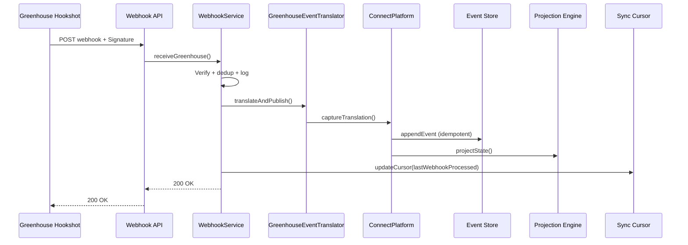

# Real-Time Events

Sprint 6 moves WorkVouch Connect from scheduled Harvest imports to **event-driven synchronization** for supported Greenhouse webhook types.

## Architecture

## Components

| Component | File |
|-----------|------|
| WebhookService | `lib/integrations/connect/webhooks/webhook-service.ts` |
| GreenhouseWebhookProcessor | `lib/integrations/connect/webhooks/greenhouse-webhook-processor.ts` |
| WebhookMetrics | `lib/integrations/connect/webhooks/webhook-metrics.ts` |
| Signature verification | `lib/integrations/providers/greenhouse/auth/webhook-signature.ts` |

## Replay & Audit

Every webhook creates a Connect audit trail:
- `recordReceived()` → timeline stage "received"
- `captureTranslation()` → validated, mapped, published, completed
- Event store append with idempotency key
- Replay available via `ConnectPlatform.replay` and cursor-based replay

## Sync Cursor Integration

Webhooks update cursor fields:
- `lastWebhookProcessed`
- `lastCandidateImported` / `lastJobImported` / `lastApplicationImported`
- `lastEventReceived`
- `providerCursor.lastWebhookAction`
- `providerCursor.lastEventId`

## Scheduled Import Still Required For

| Data | Reason |
|------|--------|
| Initial backfill | No webhooks for historical records |
| `job_created` | Not in default webhook set (Harvest only) |
| Users / permissions | No webhook event |
| Custom fields bulk sync | Partial webhook coverage |
| Connection health probes | Harvest API ping |
| Recovery after long outage | Catch-up beyond webhook retention |

For supported event types with webhooks enabled, **ongoing sync requires no polling**.
