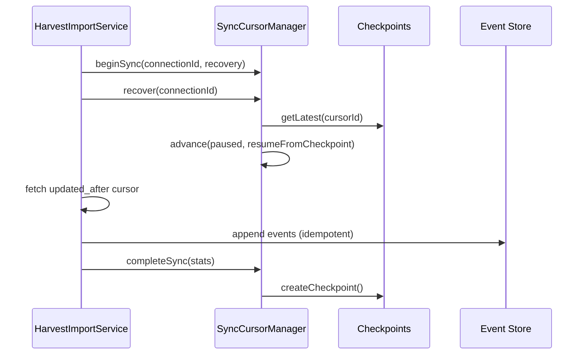

# Cursor Recovery

Every synchronization failure must be recoverable without data loss. The cursor engine supports resume after crash, timeout, OAuth refresh, provider outage, and deployment.

## Failure Scenarios

| Scenario | Cursor State | Recovery Action |
|----------|--------------|-----------------|
| Crash mid-sync | `syncing` → `error` on retry | `recoveryImport()` |
| Timeout | `error` with retry count | Exponential backoff + recovery |
| OAuth refresh | Tokens refreshed, cursor unchanged | Resume with same cursor |
| Provider outage | `error`, `lastError` set | `recover()` + incremental retry |
| Deployment | Cursor persisted in DB | Resume from checkpoint |

## Recovery Flow



## API

```typescript
// Mark error and increment retry
await cursorManager.recordError(connectionId, "Provider timeout");

// Recovery import (calls recover() then syncs)
await harvestImport.recoveryImport({ connectionId, employerAccountId });

// Manual recovery anchor
const result = await cursorManager.recover(connectionId);
// result.checkpoint — last successful checkpoint
// result.cursor — updated with resumeFromCheckpoint
```

## Replay Recovery

Replay events from cursor position without re-fetching:

```typescript
await replay.replayFromCursor(connectionId);
await replay.replaySinceCheckpoint(connectionId, checkpoint);
await replay.replaySinceTimestamp(connectionId, since);
await replay.replayUntilCursor(connectionId);
```

## Idempotency

Recovery relies on event store idempotency keys. Re-importing the same record does not create duplicates:

```
greenhouse:import:job:{externalId}:{connectionId}
```

## Admin Reset

Force full re-import (administrator only):

```typescript
await connections.resetCursor(connectionId);
await harvestImport.importFull({ connectionId, employerAccountId });
```

Reset clears all cursor timestamps and sequence numbers but preserves the cursor row.
