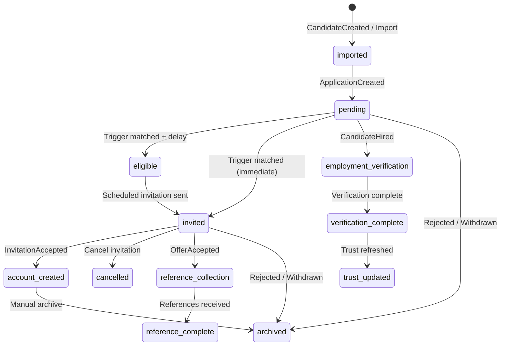

# Candidate Lifecycle State Machine

Each candidate tracked by Connect has a lifecycle state per connection. States are managed by the orchestration engine and persisted in `connect_lifecycle_state`.

## States

| State | Description |
|-------|-------------|
| `imported` | Candidate synced from ATS, no workflow started |
| `pending` | Awaiting trigger or manual action |
| `eligible` | Trigger matched, invitation scheduled |
| `invited` | Invitation queued or sent |
| `account_created` | Candidate accepted invitation (future consumer) |
| `employment_verification` | Verification workflow requested |
| `reference_collection` | References requested |
| `reference_complete` | All references received (future consumer) |
| `verification_complete` | Verification finished (future consumer) |
| `trust_updated` | Trust score refreshed (future consumer) |
| `archived` | Rejected, withdrawn, or manually archived |
| `cancelled` | Invitation cancelled |

## State Diagram



## Transitions (Current Implementation)

| Event / Action | From | To |
|----------------|------|-----|
| `ApplicationCreated` | `imported` | `pending` (via wait) |
| `invite_candidate` (immediate) | any | `invited` |
| `invite_candidate` (scheduled) | any | `eligible` |
| `create_verification` | any | `employment_verification` |
| `request_references` | any | `reference_collection` |
| `archive` | any | `archived` |
| `cancel_invitation` | any | `cancelled` |
| `wait` / `ignore` | current | unchanged (or `pending` / `imported`) |

Future states (`account_created`, `reference_complete`, `verification_complete`, `trust_updated`) are defined for downstream consumers. They will be set when invitation acceptance, verification completion, and trust refresh handlers are wired.

## Persistence

```typescript
interface LifecycleStateRecord {
  connectionId: string;
  externalCandidateId: string;
  state: LifecycleState;
  previousState?: LifecycleState;
  lastEventType?: string;
  lastDecision?: LifecycleDecision;
  metadata: { correlationId, ruleId, ... };
}
```

Unique constraint: `(connection_id, external_candidate_id)`.

## Replay

Because every transition is logged to the Connect event store with a correlation ID, lifecycle decisions are replayable:

1. Load event stream for candidate aggregate
2. Re-run `CandidateLifecycleEngine.handleEvent()` for each universal event
3. Compare resulting state to persisted `connect_lifecycle_state`

Idempotency: duplicate invitations are blocked via `candidateMap.metadata.invited_at`.

## Querying State

```typescript
const state = await lifecycleStateRepo.getByCandidate(connectionId, externalCandidateId);
// { state: "invited", previousState: "pending", lastDecision: "invite", ... }
```

In-memory repository is used in dev/test. Supabase repository planned for production persistence.
