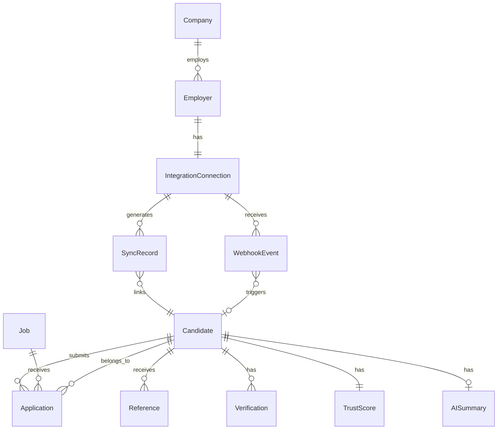

# 01 — Domain Model

> **Sprint:** Operation Greenhouse — Sprint 2.75 (Integration Contracts)  
> **Last updated:** 2026-08-07  
> **Status:** Design specification — no implementation

---

## Purpose

Define every business object in the WorkVouch ↔ Greenhouse integration domain. Each object specifies purpose, owner, lifecycle, relationships, source of truth, and read/write rules.

**Canonical namespace:** All integration objects use `ats_*` tables or canonical types from `AtsProvider` interface (see `docs/integrations/03-provider-interface.md`).

---

## Entity Relationship Overview



---

## 1. Company

### Purpose
Represents the hiring organization in Greenhouse. Maps to Greenhouse organization/account and WorkVouch employer account.

### Owner
- **Greenhouse:** Organization metadata (name, ID)
- **WorkVouch:** Employer account record (`employer_accounts`)

### Lifecycle
```
Created (GH org exists) → Connected (OAuth) → Active → Disconnected → Archived
```

### Relationships
| Related entity | Relationship |
|----------------|-------------|
| Employer | 1:1 (WorkVouch employer account) |
| IntegrationConnection | 1:1 per provider |
| Job | 1:N |
| Candidate (via applications) | 1:N |

### Source of Truth
| Field | Source |
|-------|--------|
| Organization name | Greenhouse |
| Organization ID | Greenhouse |
| WorkVouch employer settings | WorkVouch |
| Integration automation rules | WorkVouch |

### Read/Write Rules
| Operation | Allowed by | Notes |
|-----------|-----------|-------|
| Read GH org name/ID | WorkVouch (via OAuth) | Cached in `ats_connections.provider_account_name` |
| Write GH org data | ❌ Never | Read-only from GH |
| Write employer settings | WorkVouch employer admin | Via `/employer/settings/integrations` |

---

## 2. Employer

### Purpose
WorkVouch employer account that owns the integration connection, automation settings, and candidate mappings.

### Owner
WorkVouch (`employer_accounts`, `profiles` with employer role)

### Lifecycle
```
Signup → Onboarding → Integration connected → Active → Disconnected → Account retained
```

### Relationships
| Related entity | Relationship |
|----------------|-------------|
| Company | 1:1 (logical) |
| IntegrationConnection | 1:N (one per provider; only Greenhouse in Sprint 3) |
| Candidate (linked) | 1:N via `ats_candidate_map` |
| SyncRecord | 1:N |
| WebhookEvent | 1:N |

### Source of Truth
| Field | Source |
|-------|--------|
| Account ID, billing, team | WorkVouch |
| Automation preferences | WorkVouch (`ats_connections.sync_preferences`) |
| Connection status | WorkVouch (`ats_connections.status`) |

### Read/Write Rules
| Operation | Allowed by | Notes |
|-----------|-----------|-------|
| Connect/disconnect ATS | Org Admin only | OAuth flow |
| Modify automation | Org Admin only | Settings UI |
| View health dashboard | Org Admin, Hiring Manager (read-only) | RBAC enforced |
| View linked candidates | Employer team | Scoped by `employer_account_id` |

---

## 3. Candidate

### Purpose
A person being evaluated for hire. Exists in both Greenhouse (applicant) and optionally in WorkVouch (verified profile).

### Owner
- **Identity (name, email, phone):** Greenhouse (inbound); WorkVouch profile (once created)
- **Trust data:** WorkVouch exclusively

### Lifecycle

**Greenhouse side:**
```
Applied → Screening → Interview → Offer → Hired | Rejected | Withdrawn
```

**WorkVouch side:**
```
Not Invited → Invitation Sent → Account Created → Verification Pending → Verified
```

**Integration link:**
```
Not Linked → Pending Link → Auto Linked | Manual Linked → Synced → Stale | External Deleted
```

### Relationships
| Related entity | Relationship |
|----------------|-------------|
| Application | 1:N (one per job applied) |
| Job | N:M via Application |
| Reference | 1:N (vouches) |
| Verification | 1:N (employment verifications) |
| TrustScore | 1:1 |
| AISummary | 1:0..1 (generated on demand) |
| SyncRecord | 1:N |

### Source of Truth
| Field | Source |
|-------|--------|
| Name, email, phone | Greenhouse (for linking); WorkVouch profile (post-signup) |
| Application status | Greenhouse |
| Trust score, band | WorkVouch (`trust_scores`) |
| Verification status | WorkVouch (`verification_requests`, `employment_records`) |
| Vouch count (aggregate) | WorkVouch (`trust_scores.reference_count`) |
| Vouch text | WorkVouch — **never exported to GH** |
| Link status | WorkVouch (`ats_candidate_map.link_status`) |

### Read/Write Rules
| Operation | Direction | Rule |
|-----------|-----------|------|
| Read GH candidate | Inbound | Via Harvest API or webhook |
| Create WorkVouch profile | WorkVouch | Only via invitation (not auto-created Sprint 3) |
| Update GH custom fields | Outbound | Trust export only |
| Update GH candidate PII | ❌ Never | No write-back of PII |
| Link GH ↔ WV profile | WorkVouch | Auto (email) or manual |

---

## 4. Job

### Purpose
An open requisition in Greenhouse. Used for automation filters (invite only for selected jobs) and application context.

### Owner
Greenhouse (Harvest API)

### Lifecycle
```
Draft → Open → Closed → Archived
```

### Relationships
| Related entity | Relationship |
|----------------|-------------|
| Company | N:1 |
| Application | 1:N |
| SyncRecord | 1:N (via `ats_job_map`) |

### Source of Truth
| Field | Source |
|-------|--------|
| Title, status, department | Greenhouse |
| Location (country/state) | Greenhouse (normalized) |
| WorkVouch job posting link | WorkVouch (`ats_job_map`) — optional Sprint 5 |

### Read/Write Rules
| Operation | Direction | Rule |
|-----------|-----------|------|
| Read jobs | Inbound | Cron + webhook |
| Write job data to GH | ❌ Never | Read-only |
| Filter automation by job | WorkVouch | Job IDs stored in `sync_preferences` |

**Location rule:** Only `country` (ISO-2) and `state` (US only) persisted. City/ZIP/coordinates dropped.

---

## 5. Application

### Purpose
A candidate's application to a specific job. Carries pipeline stage used for automation triggers.

### Owner
Greenhouse

### Lifecycle
```
Submitted → Stage transitions → Hired | Rejected | Withdrawn
```

### Relationships
| Related entity | Relationship |
|----------------|-------------|
| Candidate | N:1 |
| Job | N:1 |
| WebhookEvent | Triggered by stage changes |

### Source of Truth
| Field | Source |
|-------|--------|
| Application ID | Greenhouse |
| Current stage | Greenhouse |
| Applied date | Greenhouse |
| Cached status | WorkVouch (`ats_candidate_map.application_status`) |

### Read/Write Rules
| Operation | Direction | Rule |
|-----------|-----------|------|
| Read application status | Inbound | Webhook + API |
| Write application status | ❌ Never | GH is source of truth |
| Trigger auto-invite | WorkVouch | On stage change webhook when rules match |

---

## 6. Reference

### Purpose
A peer or manager vouch for a candidate. In WorkVouch domain = vouch (`employment_references`, vouch ratings).

### Owner
WorkVouch

### Lifecycle
```
Not Requested → Requested → Submitted | Declined | Expired
```

### Relationships
| Related entity | Relationship |
|----------------|-------------|
| Candidate | N:1 |
| Reference Provider | N:1 (external, token-based) |

### Source of Truth
| Field | Source |
|-------|--------|
| Vouch rating, would rehire | WorkVouch |
| Vouch text/comment | WorkVouch — **private, not exported** |
| Aggregate vouch count | WorkVouch |
| Manager vs coworker count | WorkVouch (computed) |

### Read/Write Rules
| Operation | Direction | Rule |
|-----------|-----------|------|
| Export vouch count | Outbound | Integer only to GH custom field |
| Export vouch text | ❌ Never | Privacy policy |
| Export reference names | ❌ Never | Privacy policy |
| Export would rehire % | Outbound | Aggregate percentage only (Sprint 4+) |

---

## 7. Verification

### Purpose
Employment verification request and outcome. Confirms candidate worked at stated employer.

### Owner
WorkVouch (`verification_requests`, `employment_records`)

### Lifecycle
```
None → Requested → Pending → Verified | Disputed | Declined | Expired
```

### Relationships
| Related entity | Relationship |
|----------------|-------------|
| Candidate | N:1 |
| Employment record | 1:1 per verification |
| SyncRecord | Triggers export on status change |

### Source of Truth
| Field | Source |
|-------|--------|
| Verification status | WorkVouch |
| Verified employer count | WorkVouch (computed) |
| Employment dates (verified) | WorkVouch |
| Verifier identity | WorkVouch — not exported to GH |

### Read/Write Rules
| Operation | Direction | Rule |
|-----------|-----------|------|
| Export verification status | Outbound | GH custom field: `workvouch_verification_status` |
| Export employment count | Outbound | Integer: verified employment count |
| Export verifier details | ❌ Never | Privacy |
| Read verification from GH | ❌ Never | WV is source of truth |

---

## 8. Trust Score

### Purpose
Composite trust metric (0–100) with band label. Primary value exported to Greenhouse.

### Owner
WorkVouch (`trust_scores`, `lib/trust/trustBandLabels.ts`)

### Lifecycle
```
Insufficient data → Calculated → Updated (on vouch/verification) → Exported
```

### Relationships
| Related entity | Relationship |
|----------------|-------------|
| Candidate | 1:1 |
| SyncRecord | Export events |

### Source of Truth
| Field | Source |
|-------|--------|
| Score (0–100) | WorkVouch trust engine |
| Band (Low/Moderate/Strong/Exceptional) | `getTrustBandLabel(score)` |
| Reference count | WorkVouch |
| Verification count | WorkVouch |
| Last calculated at | WorkVouch |

### Read/Write Rules
| Operation | Direction | Rule |
|-----------|-----------|------|
| Read score | WorkVouch | Never recalculate during export |
| Export to GH | Outbound | Custom fields + panel display |
| Accept score from GH | ❌ Never | WV always wins on conflict |
| Modify score from integration | ❌ Never | Read-only export |

---

## 9. AI Summary

### Purpose
Generated recruiter brief summarizing candidate trust data. Displayed in GH panel; optionally exported as truncated custom field.

### Owner
WorkVouch AI service

### Lifecycle
```
Not generated → Processing → Generated → Stale → Regenerated
```

### Relationships
| Related entity | Relationship |
|----------------|-------------|
| Candidate | 1:0..1 |
| TrustScore | Input dependency |
| Reference | Input (aggregate only) |
| Verification | Input (status only) |

### Source of Truth
| Field | Source |
|-------|--------|
| Summary text | WorkVouch AI |
| Generated at | WorkVouch |
| Source attribution | WorkVouch ("Based on N vouches...") |

### Read/Write Rules
| Operation | Direction | Rule |
|-----------|-----------|------|
| Generate summary | WorkVouch | Only on verified data |
| Export to GH custom field | Outbound | Truncated to 255 chars max |
| Export full summary to GH notes | ❌ Default off | Configurable Sprint 6+ |
| Feed vouch text to AI | ❌ Never | Aggregate ratings only |

**Fallback:** If AI unavailable, panel shows structured data (score + counts). No error shown to recruiter.

---

## 10. Integration Connection

### Purpose
OAuth connection between a WorkVouch employer account and a Greenhouse organization.

### Owner
WorkVouch (`ats_connections`)

### Lifecycle
```
Pending → Connected → Token Expired | Error → Disconnected
```

### Relationships
| Related entity | Relationship |
|----------------|-------------|
| Employer | N:1 |
| SyncRecord | 1:N |
| WebhookEvent | 1:N |
| Candidate (mapped) | 1:N via `ats_candidate_map` |

### Source of Truth
| Field | Source |
|-------|--------|
| Connection status | WorkVouch |
| OAuth tokens | WorkVouch (encrypted) |
| Webhook secret | WorkVouch (encrypted) |
| Sync preferences | WorkVouch |
| Provider account ID | Greenhouse (cached) |

### Read/Write Rules
| Operation | Allowed by | Notes |
|-----------|-----------|-------|
| Create connection | Org Admin | OAuth flow |
| Refresh token | System (cron) | Automatic |
| Revoke/disconnect | Org Admin | Zeroes token fields |
| Modify sync preferences | Org Admin | JSONB update |

**Constraint:** One active connection per employer per provider (`UNIQUE employer_account_id, provider WHERE status != 'disconnected'`).

---

## 11. Webhook Event

### Purpose
Inbound event from Greenhouse signaling candidate, application, or job changes.

### Owner
Greenhouse (origin); WorkVouch (processing state)

### Lifecycle
```
Received → Validated → Queued → Processed | Failed → DLQ | Replayed
```

### Relationships
| Related entity | Relationship |
|----------------|-------------|
| IntegrationConnection | N:1 |
| Candidate | 0..1 (if candidate event) |
| SyncRecord | 0..1 (produced by processing) |

### Source of Truth
| Field | Source |
|-------|--------|
| Event ID | Greenhouse (`provider_event_id`) |
| Event type | Greenhouse → normalized by adapter |
| Raw payload | Greenhouse (stored in Supabase Storage, 30-day retention) |
| Processing status | WorkVouch (`ats_webhook_log`, `ats_events`) |

### Read/Write Rules
| Operation | Direction | Rule |
|-----------|-----------|------|
| Receive webhook | Inbound | Return 200 immediately |
| Validate signature | WorkVouch | HMAC-SHA256 |
| Deduplicate | WorkVouch | By `{provider}:{eventId}` |
| Process async | WorkVouch | Event bus worker |
| Replay | Admin/Employer | From DLQ or event log |

---

## 12. Sync Record

### Purpose
Audit log of every synchronization operation between WorkVouch and Greenhouse.

### Owner
WorkVouch (`ats_sync_log`)

### Lifecycle
```
Created → Success | Partial | Failed | Skipped
```

### Relationships
| Related entity | Relationship |
|----------------|-------------|
| IntegrationConnection | N:1 |
| Candidate | 0..1 |
| WebhookEvent | 0..1 (trigger) |

### Source of Truth
WorkVouch exclusively.

### Read/Write Rules
| Operation | Allowed by | Notes |
|-----------|-----------|-------|
| Create sync log | System only | Every sync operation |
| Read sync log | Employer admin | Via health dashboard / events API |
| Modify sync log | ❌ Never | Append-only |
| Delete sync log | System (retention) | 90-day retention, then archive |

---

## Domain Ownership Summary

| Domain | Source of Truth | Integration writes to |
|--------|----------------|----------------------|
| Candidate identity (GH) | Greenhouse | WorkVouch (cache only) |
| Candidate trust profile | WorkVouch | Greenhouse (custom fields) |
| Job/requisition | Greenhouse | WorkVouch (cache only) |
| Application pipeline stage | Greenhouse | WorkVouch (cache only) |
| Trust score | WorkVouch | Greenhouse (export) |
| Verification | WorkVouch | Greenhouse (export) |
| Vouches (aggregate) | WorkVouch | Greenhouse (count only) |
| Vouch text | WorkVouch | ❌ Never exported |
| Connection/automation | WorkVouch | — |
| Webhook/sync audit | WorkVouch | — |

---

## Related Documents

- [02-field-mapping.md](./02-field-mapping.md)
- [03-status-mapping.md](./03-status-mapping.md)
- [docs/integrations/03-provider-interface.md](../integrations/03-provider-interface.md)
- [docs/integrations/08-database-design.md](../integrations/08-database-design.md)
