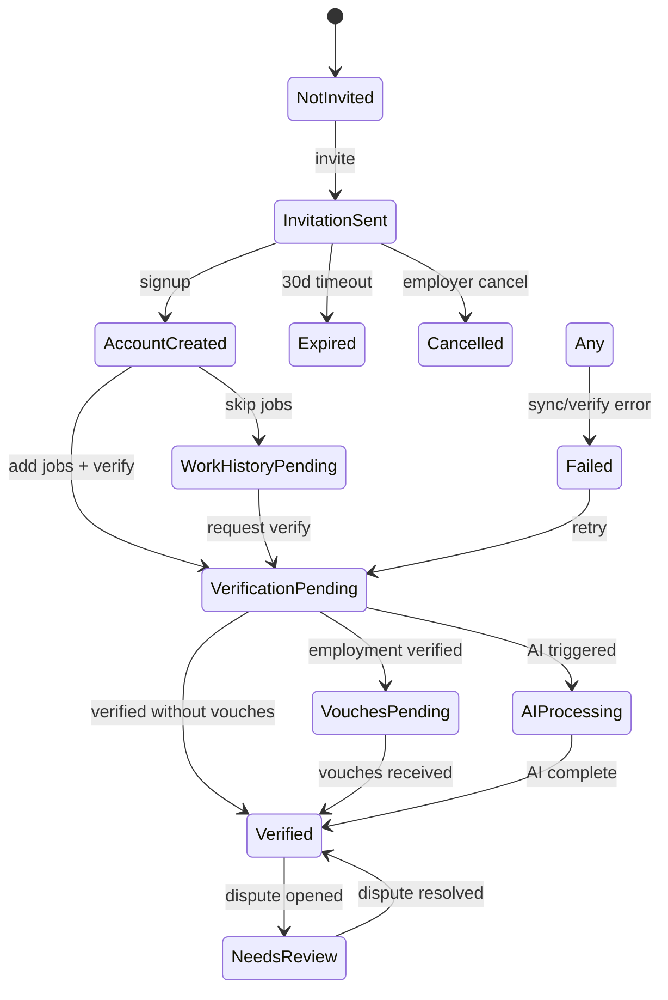
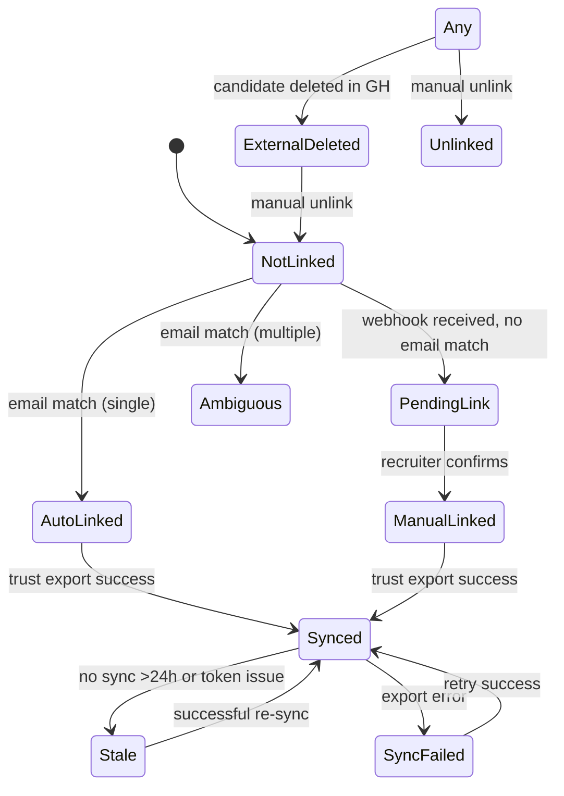
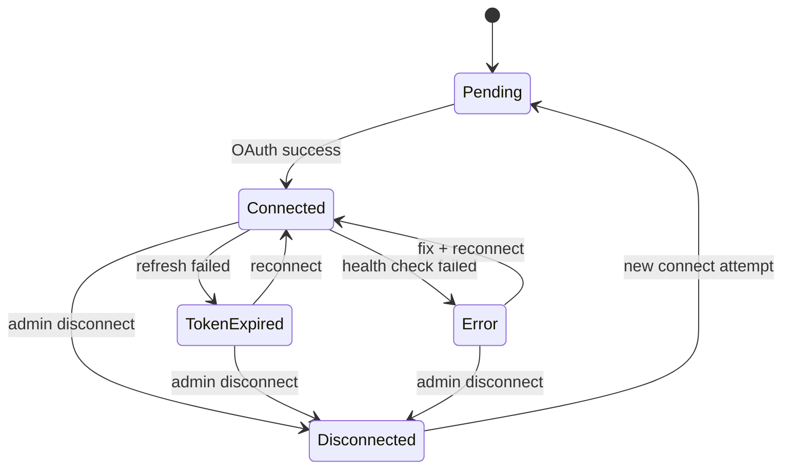

# 03 — Status Mapping

> **Sprint:** Operation Greenhouse — Sprint 2.75 (Integration Contracts)  
> **Last updated:** 2026-08-07  
> **Status:** Design specification — no implementation

---

## Overview

Three parallel status systems operate in the integration:

1. **Greenhouse Application Status** — pipeline stage (source: GH)
2. **WorkVouch Candidate Status** — verification lifecycle (source: WV)
3. **Integration Link Status** — GH ↔ WV mapping (source: WV platform)

These systems are **independent**. GH stage changes do not directly change WV verification status. WV verification completion triggers outbound export but does not change GH stage.

---

## Greenhouse → Canonical Application Status

| Greenhouse Stage (examples) | Canonical `ApplicationStatus` | Notes |
|----------------------------|------------------------------|-------|
| Application Review | `applied` | Initial submission |
| Phone Screen | `screening` | |
| Take Home Test | `screening` | Mapped to screening |
| On-site Interview | `interview` | |
| Final Interview | `interview` | |
| Reference Check | `interview` | Pre-offer stage |
| Offer | `offer` | |
| Offer Accepted | `offer` | Still offer until hired |
| Hired | `hired` | Terminal |
| Rejected | `rejected` | Terminal |
| Withdrawn | `withdrawn` | Terminal |
| *(unknown stage)* | `unknown` | Log warning; do not fail |

**Mapping rule:** Exact match on stage name (case-insensitive). Employer-configurable stage mapping stored in `ats_connections.sync_preferences.stage_mapping` (Sprint 5). Default: table above.

---

## Greenhouse → WorkVouch Status (Indirect)

GH application status does **not** map 1:1 to WV candidate status. Instead, GH stage triggers **automation rules**:

| GH Stage Transition | Automation Trigger | WV Action |
|--------------------|-------------------|-----------|
| → Final Interview | `auto_invite_trigger = final_interview` | Send WorkVouch invitation |
| → Offer | `auto_invite_trigger = offer` | Send WorkVouch invitation |
| → Applied | `auto_invite_trigger = immediate` | Send WorkVouch invitation |
| → Hired | — | Log event; no WV status change |
| → Rejected | — | Log event; no WV status change |

See [08-automation-rules.md](./08-automation-rules.md) for full automation spec.

---

## WorkVouch Candidate Status (Full State Machine)

### WV Status Definitions

| WV Status | Color | GH Custom Field Export |
|-----------|-------|----------------------|
| Not Invited | Gray | *(empty)* |
| Invitation Sent | Blue | `pending` |
| Account Created | Blue | `pending` |
| Verification Pending | Amber | `pending` |
| Vouches Pending | Amber | `pending` |
| Verified | Green | `verified` |
| Needs Review | Amber | `needs_review` |
| Disputed | Red | `disputed` |
| Expired | Gray | *(empty)* |
| Cancelled | Gray | *(empty)* |
| Failed | Red | `needs_review` |

---

## Integration Link Status (Full State Machine)

### Link Status Definitions

| Link Status | Panel Display | Allowed Transitions |
|-------------|--------------|---------------------|
| `pending` | "Not linked" | → auto_linked, manual_linked, ambiguous |
| `auto_linked` | "Linked automatically" | → synced, unlinked, external_deleted |
| `manual_linked` | "Linked by recruiter" | → synced, unlinked, external_deleted |
| `ambiguous` | "Needs review" | → manual_linked, unlinked |
| `synced` | "Synced {time} ago" | → stale, sync_failed, unlinked |
| `stale` | "Data may be outdated" | → synced, sync_failed |
| `sync_failed` | "Sync failed" | → synced, stale |
| `external_deleted` | "Removed from Greenhouse" | → unlinked |
| `unlinked` | "Not linked" | → manual_linked |

---

## Connection Status (Employer Integration)

| Connection Status | Badge | Recruiter Panel Behavior |
|-------------------|-------|-------------------------|
| `pending` | Blue pulse | "Connecting..." |
| `connected` | Green | Normal panel |
| `token_expired` | Red | Stale badge + "Contact admin" |
| `error` | Red | Stale badge + cached data |
| `disconnected` | Gray | "Integration not connected" |

---

## Transition Specifications

### T1: GH Stage → Auto-Invite

| Attribute | Value |
|-----------|-------|
| **Trigger** | Webhook `application_updated` with stage change |
| **Business Rules** | Auto-invite enabled; stage matches trigger; job filter passes; location filter passes; candidate not already invited |
| **Allowed** | Any stage → invite if rules match |
| **Blocked** | Already invited; auto-invite disabled; job/location filtered out; candidate already has WV profile |
| **Rollback** | Cancel invitation (employer action); status → Cancelled |
| **Notifications** | Candidate: invitation email; Employer: auto-linked notification |

---

### T2: GH Candidate Created → Auto-Link

| Attribute | Value |
|-----------|-------|
| **Trigger** | Webhook `candidate_created` |
| **Business Rules** | Email present; exactly one WV profile matches email (case-insensitive) |
| **Allowed** | 0 matches → pending; 1 match → auto_linked; 2+ matches → ambiguous |
| **Blocked** | Email already linked to different GH candidate ID |
| **Rollback** | Manual unlink → unlinked |
| **Notifications** | Employer: auto-linked or pending link notification |

---

### T3: WV Verified → GH Export

| Attribute | Value |
|-----------|-------|
| **Trigger** | Verification status → verified; or trust score change |
| **Business Rules** | Candidate linked; connection connected; score ≥ threshold |
| **Allowed** | Always export if linked and connected |
| **Blocked** | Not linked; connection disconnected; score below threshold |
| **Rollback** | Re-export on next sync; cannot "unverify" in GH |
| **Notifications** | Employer: trust exported notification (batch) |

---

### T4: GH Hired → Log Only

| Attribute | Value |
|-----------|-------|
| **Trigger** | Webhook `hire_candidate` |
| **Business Rules** | Update `application_status = hired` |
| **Allowed** | Always log |
| **Blocked** | — |
| **Rollback** | N/A (terminal state) |
| **Notifications** | Employer: in-app event log entry |

---

### T5: GH Rejected → Log Only

| Attribute | Value |
|-----------|-------|
| **Trigger** | Webhook `reject_candidate` |
| **Business Rules** | Update `application_status = rejected` |
| **Allowed** | Always log |
| **Blocked** | — |
| **Rollback** | N/A (terminal state) |
| **Notifications** | None (no trust score impact) |

---

### T6: Token Expired → Stale Panel

| Attribute | Value |
|-----------|-------|
| **Trigger** | OAuth refresh returns 401 |
| **Business Rules** | Mark connection `token_expired`; panel shows cached data |
| **Allowed** | Automatic on refresh failure |
| **Blocked** | — |
| **Rollback** | Admin reconnect → connected → catch-up sync |
| **Notifications** | Admin: email + in-app immediately |

---

### T7: Manual Link

| Attribute | Value |
|-----------|-------|
| **Trigger** | Recruiter clicks "Confirm link" in panel or employer dashboard |
| **Business Rules** | GH candidate exists; WV profile exists; not linked to different candidate |
| **Allowed** | pending → manual_linked; ambiguous → manual_linked |
| **Blocked** | Profile already linked to different GH candidate (409) |
| **Rollback** | Unlink → unlinked |
| **Notifications** | Employer: linked notification |

---

## Blocked Transitions

| From | To | Reason | User Message |
|------|-----|--------|--------------|
| Not Linked | Synced | Must link first | "Link candidate before exporting trust score" |
| Disconnected | Synced | Connection down | "Reconnect Greenhouse to resume sync" |
| Verified | Not Invited | Cannot revert | N/A (not exposed) |
| External Deleted | Synced | Candidate gone from GH | "Candidate removed from Greenhouse" |
| Ambiguous | Auto Linked | Multiple email matches | "Manual review required" |

---

## Rollback Strategies

| Scenario | Rollback Action | Data Impact |
|----------|----------------|-------------|
| Wrong auto-link | Manual unlink | Clears `workvouch_profile_id`; GH custom fields not auto-cleared |
| Wrong manual link | Unlink + re-link | Same as above |
| Failed export | Retry export | Idempotent — overwrites GH custom fields |
| Disconnect integration | Stop sync; preserve maps | Maps retained for reconnect |
| Reconnect integration | Catch-up sync | Re-exports all linked candidates |

---

## Notification Matrix by Transition

| Transition | Candidate | Recruiter | Employer Admin |
|------------|-----------|-----------|----------------|
| Auto-invite | Invitation email | Panel status update | Auto-linked notification |
| Verification complete | Score increase email | Panel refresh | Batch export notification |
| Token expired | — | Stale badge | Email + in-app |
| Manual link | — | Panel populates | Linked notification |
| Sync failed | — | Red sync badge | DLQ notification |
| Hired/Rejected | — | Status cache update | Event log only |

---

## Related Documents

- [02-field-mapping.md](./02-field-mapping.md)
- [08-automation-rules.md](./08-automation-rules.md)
- [docs/product-experience/09-status-system.md](../product-experience/09-status-system.md)
