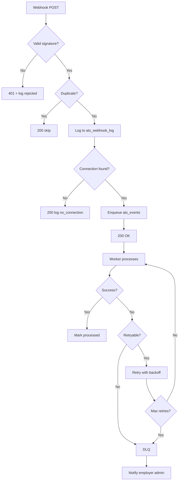

# 04 — Webhook Contract

> **Sprint:** Operation Greenhouse — Sprint 2.75 (Integration Contracts)  
> **Last updated:** 2026-08-07  
> **Status:** Design specification — no implementation

---

## Endpoint

```
POST /api/integrations/v1/webhooks/greenhouse
Content-Type: application/json
```

**Auth:** HMAC-SHA256 signature verification (no session).

**Response policy:** Return `200 OK` for all valid, deduplicated webhooks within 500ms. Process asynchronously.

---

## Authentication

| Header | Value |
|--------|-------|
| `Signature` | `sha256={hex_digest}` |
| `Content-Type` | `application/json` |
| `User-Agent` | `Greenhouse-Hookshot` (informational) |

**Verification algorithm:**
```
digest = HMAC-SHA256(raw_request_body, webhook_secret)
expected = "sha256=" + hex(digest)
valid = timing_safe_equal(expected, Signature_header)
```

**Secret source:** `ats_connections.webhook_secret_encrypted` (decrypted at runtime).

**On failure:** Return `401 Unauthorized`. Log to `ats_webhook_log` with `status = 'rejected'`.

---

## Idempotency

**Key:** `greenhouse:{payload.action}:{payload.payload.id}:{payload.payload.updated_at}`

Fallback if `updated_at` missing: `greenhouse:{action}:{entity_id}`

**Dedup check:**
```sql
SELECT id FROM ats_webhook_log
WHERE provider = 'greenhouse'
  AND provider_event_id = $idempotency_key
LIMIT 1
```

**On duplicate:** Return `200 OK` immediately. No reprocessing.

**Payload hash dedup (secondary):** SHA-256 of raw body within 1-hour window prevents replay with different event IDs.

---

## Retry (Provider-Side)

Greenhouse retries non-200 responses with exponential backoff up to 24 hours.

| WorkVouch Response | GH Behavior |
|-------------------|-------------|
| 200 | Success — no retry |
| 401 | Retry (check secret) |
| 404 | Retry (check URL) |
| 500 | Retry |

**Critical rule:** Return 200 even if internal processing will fail. Internal failures handled by Retry Service + DLQ.

---

## Webhook Event Catalog

### 1. Candidate Created

| Attribute | Value |
|-----------|-------|
| **GH Event** | `candidate_created` |
| **Normalized Type** | `inbound.candidate.created` |
| **Trigger** | New candidate added to GH |

**Payload (normalized):**
```json
{
  "action": "candidate_created",
  "payload": {
    "id": 12345,
    "first_name": "Jane",
    "last_name": "Chen",
    "email_addresses": [
      { "value": "jane.chen@email.com", "type": "personal" }
    ],
    "phone_numbers": [],
    "applications": [],
    "created_at": "2026-08-07T20:00:00Z",
    "updated_at": "2026-08-07T20:00:00Z"
  }
}
```

**Validation:**
- `payload.id` required, numeric
- At least one of `email_addresses` recommended (warn if missing)

**Processing:**
1. Resolve connection by GH organization ID in webhook metadata
2. Attempt email auto-link
3. Upsert `ats_candidate_map`
4. Evaluate auto-invite rules (if application present)

**Failure handling:** Log + DLQ after 5 retries. Return 200 on receipt.

**Recovery:** Manual link via employer dashboard or event replay.

---

### 2. Candidate Updated

| Attribute | Value |
|-----------|-------|
| **GH Event** | `candidate_updated` |
| **Normalized Type** | `inbound.candidate.updated` |

**Payload:** Same structure as `candidate_created` with updated fields.

**Processing:**
1. Update `ats_candidate_map.candidate_name`, `candidate_email`
2. Re-evaluate link if email changed
3. Do NOT modify WV profile

**Validation:** `payload.id` required.

---

### 3. Application Created

| Attribute | Value |
|-----------|-------|
| **GH Event** | `application_created` |
| **Normalized Type** | `inbound.application.created` |

**Payload (normalized):**
```json
{
  "action": "application_created",
  "payload": {
    "id": 67890,
    "candidate_id": 12345,
    "jobs": [{ "id": 111, "name": "Senior Software Engineer" }],
    "status": "active",
    "current_stage": {
      "id": 222,
      "name": "Application Review"
    },
    "applied_at": "2026-08-07T20:00:00Z"
  }
}
```

**Processing:**
1. Link `external_application_id` and `external_job_id` to candidate map
2. Set `application_status`
3. Evaluate auto-invite rules

---

### 4. Application Updated (Stage Changed)

| Attribute | Value |
|-----------|-------|
| **GH Event** | `application_updated` |
| **Normalized Type** | `inbound.application.updated` |

**Payload:** Same as application_created with updated `current_stage`.

**Processing:**
1. Compare previous vs new stage
2. If stage changed → evaluate auto-invite trigger
3. Update `application_status` cache

**Business rules:** Auto-invite only fires on stage **transition**, not on every update.

---

### 5. Offer Created

| Attribute | Value |
|-----------|-------|
| **GH Event** | `offer_created` |
| **Normalized Type** | `inbound.offer.created` |

**Payload (normalized):**
```json
{
  "action": "offer_created",
  "payload": {
    "id": 999,
    "application_id": 67890,
    "candidate_id": 12345,
    "status": "pending",
    "created_at": "2026-08-07T20:00:00Z"
  }
}
```

**Processing:**
1. Update `application_status = offer`
2. If `auto_invite_trigger = offer` → send invitation

---

### 6. Offer Accepted

| Attribute | Value |
|-----------|-------|
| **GH Event** | `offer_accepted` (via application_updated or dedicated event) |
| **Normalized Type** | `inbound.offer.accepted` |

**Processing:** Log event. Update status cache. No WV status change.

---

### 7. Offer Rejected

| Attribute | Value |
|-----------|-------|
| **GH Event** | `offer_rejected` |
| **Normalized Type** | `inbound.offer.rejected` |

**Processing:** Log event. No trust score impact.

---

### 8. Candidate Hired

| Attribute | Value |
|-----------|-------|
| **GH Event** | `hire_candidate` |
| **Normalized Type** | `inbound.application.hired` |

**Payload (normalized):**
```json
{
  "action": "hire_candidate",
  "payload": {
    "id": 67890,
    "candidate_id": 12345,
    "jobs": [{ "id": 111 }],
    "status": "hired"
  }
}
```

**Processing:**
1. Set `application_status = hired`
2. Log to `ats_events`
3. Future: trigger hiring outcome feedback (Sprint 8+)

---

### 9. Candidate Rejected

| Attribute | Value |
|-----------|-------|
| **GH Event** | `reject_candidate` |
| **Normalized Type** | `inbound.application.rejected` |

**Processing:**
1. Set `application_status = rejected`
2. Log event
3. No trust score impact
4. No WV status change

---

## Additional Events (Registered but Lower Priority)

| GH Event | Normalized Type | Sprint | Action |
|----------|----------------|--------|--------|
| `job_created` | `inbound.job.created` | 5 | Upsert job map |
| `job_updated` | `inbound.job.updated` | 5 | Update job map |
| `job_deleted` | `inbound.job.deleted` | 5 | Mark job closed |
| `candidate_deleted` | `inbound.candidate.deleted` | 4 | Mark external_deleted |

---

## Webhook Registration (On Connect)

During OAuth connect flow, register all events via Harvest API:

```
POST /v1/webhook_endpoints
{
  "url": "https://workvouch.com/api/integrations/v1/webhooks/greenhouse",
  "event_types": [
    "candidate_created",
    "candidate_updated",
    "application_created",
    "application_updated",
    "hire_candidate",
    "reject_candidate",
    "offer_created",
    "job_created",
    "job_updated"
  ],
  "secret": "{generated_webhook_secret}"
}
```

Store webhook endpoint IDs in `ats_connections.metadata.webhook_endpoint_ids`.

---

## Logging

Every webhook persisted to `ats_webhook_log` before processing:

| Field | Value |
|-------|-------|
| `provider` | `greenhouse` |
| `provider_event_id` | Idempotency key |
| `provider_event_type` | Raw GH action |
| `normalized_event_type` | Canonical type |
| `status` | `received` → `queued` → `processed` \| `failed` |
| `payload_hash` | SHA-256 of raw body |
| `payload_storage_path` | Supabase Storage path (30-day retention) |
| `received_at` | Timestamp |
| `processed_at` | Timestamp (on completion) |
| `duration_ms` | Processing time |

**Never log:** Full payload in application logs.

---

## Monitoring

| Metric | Threshold | Alert |
|--------|-----------|-------|
| Webhook receipt rate | Drop >50% vs 7-day avg | P2 |
| Signature rejection rate | >1% | P1 |
| Parse error rate | >5% | P2 |
| Processing failure rate | >10% | P1 |
| Processing latency p99 | >30s | P2 |
| DLQ depth | >10 events | P1 |

---

## Failure Handling Flow



**Retry schedule (internal):** 1m → 5m → 15m → 1h → 4h (max 5 attempts)

---

## Recovery

| Failure | Recovery Action |
|---------|----------------|
| Missed webhook (GH retry exhausted) | Cron candidate sync (every 6h) catches up |
| Processing failure | Auto-retry → DLQ → admin replay |
| Wrong connection resolved | Fix `provider_account_id` mapping → replay |
| Stale webhook (>24h) | Process with warning log; do not reject |

---

## Related Documents

- [05-api-contract.md](./05-api-contract.md)
- [06-sync-contract.md](./06-sync-contract.md)
- [09-error-catalog.md](./09-error-catalog.md)
- [docs/integrations/07-webhook-design.md](../integrations/07-webhook-design.md)
