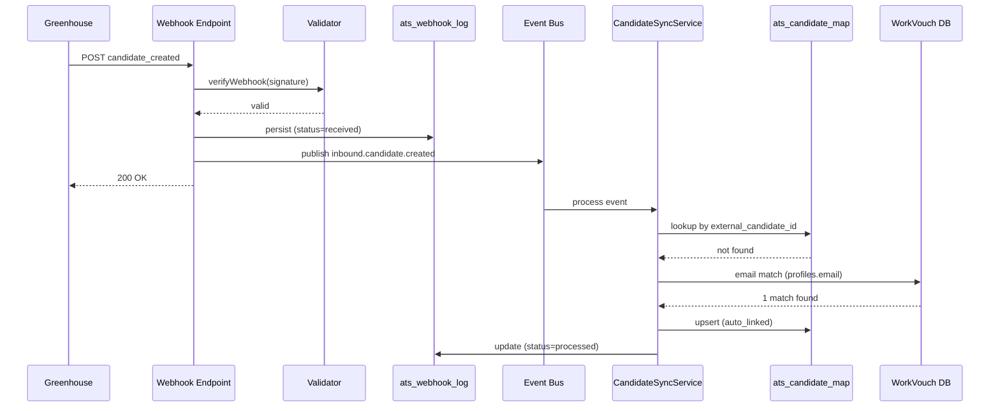
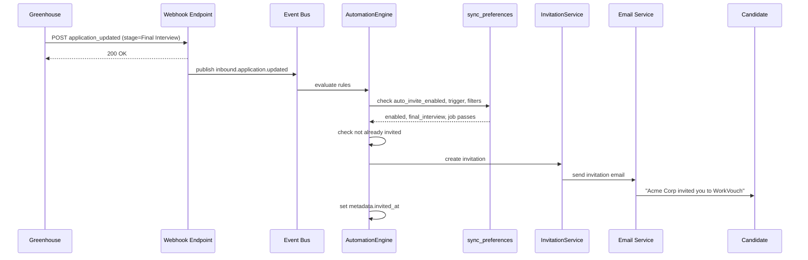
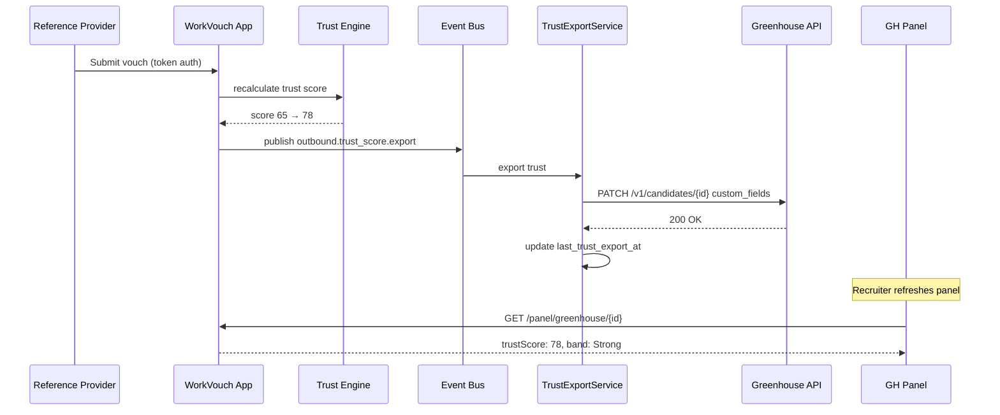
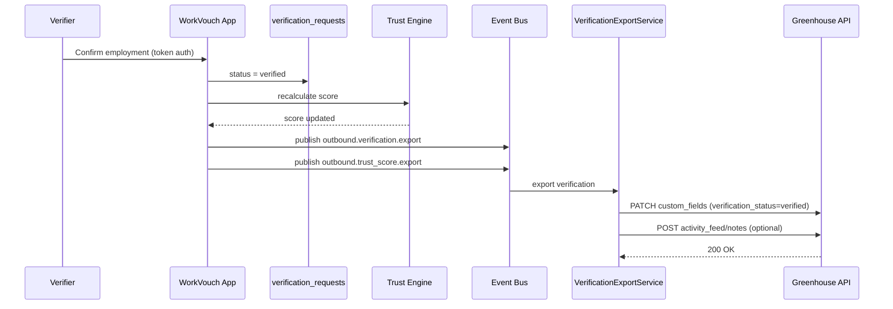
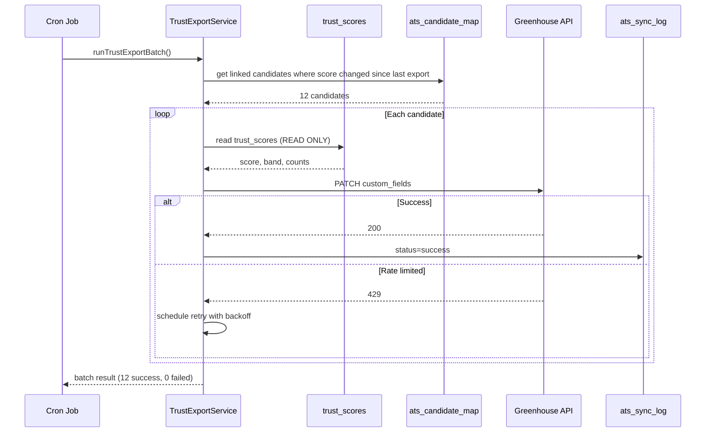
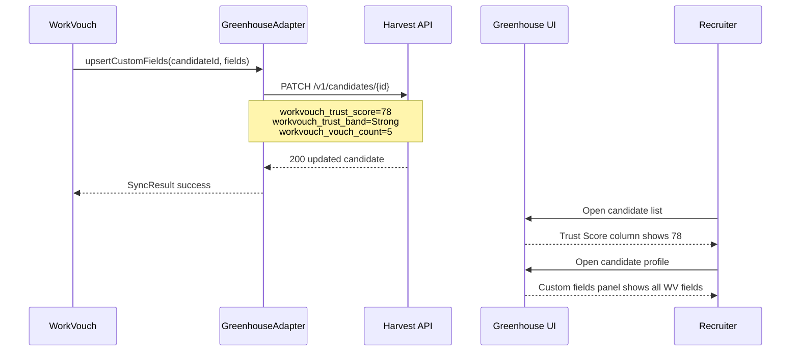
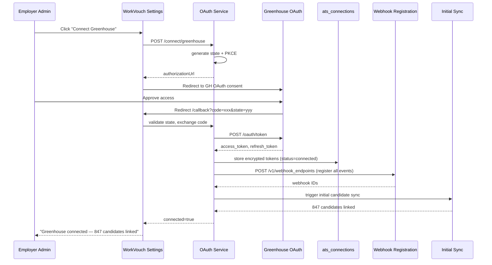
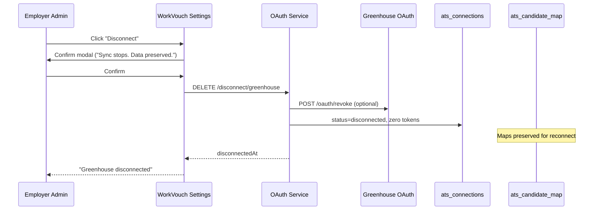
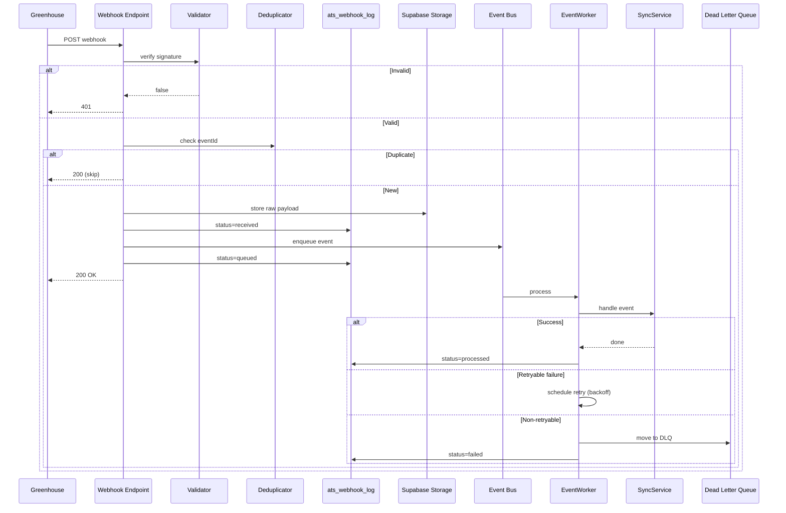
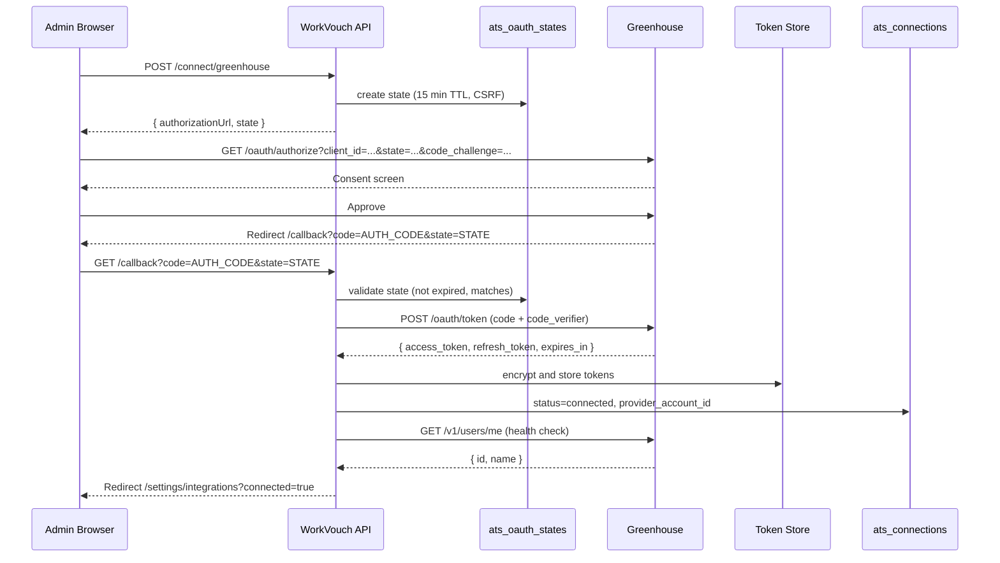

# 10 — Sequence Diagrams

> **Sprint:** Operation Greenhouse — Sprint 2.75 (Integration Contracts)  
> **Last updated:** 2026-08-07  
> **Status:** Design specification — no implementation

---

## 1. Candidate Imported (Webhook → Auto-Link)

---

## 2. Candidate Invited (Auto-Invite on Stage Change)

---

## 3. Reference Submitted (Vouch → Trust Update)

---

## 4. Verification Complete

---

## 5. Trust Score Updated (Cron Export)

---

## 6. Greenhouse Updated (Outbound Export)

---

## 7. Employer Connects (OAuth Flow)

---

## 8. Employer Disconnects

---

## 9. Webhook Received (Full Lifecycle)

---

## 10. OAuth Flow (Detailed)

---

## Related Documents

- [04-webhook-contract.md](./04-webhook-contract.md)
- [05-api-contract.md](./05-api-contract.md)
- [06-sync-contract.md](./06-sync-contract.md)
- [08-automation-rules.md](./08-automation-rules.md)
