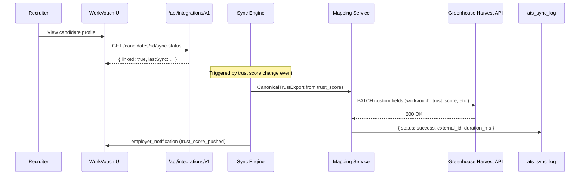
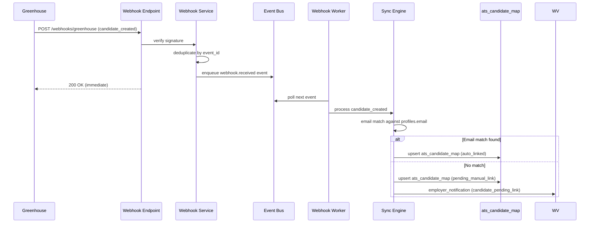

# 01 — ATS Integration Platform: System Architecture

> **Sprint:** Operation Greenhouse — Sprint 2 (Design Only)  
> **Last updated:** 2026-08-07  
> **Status:** Architecture specification — no production code

---

## Mission

Design an **enterprise-grade ATS Integration Platform** that:

1. Integrates with **Greenhouse first**
2. Supports future providers (Lever, Ashby, Workday, etc.) with **minimal code changes**
3. Preserves the existing WorkVouch application — **100% additive**
4. Exports WorkVouch trust/verification data **read-only** into ATS systems
5. Never modifies trust engine, auth, billing, or verification core logic

---

## Design Principles

| Principle | Rule |
|-----------|------|
| **Additive only** | New folders, tables, routes — zero changes to existing production paths |
| **Provider abstraction** | All ATS-specific logic behind `AtsProvider` interface |
| **Event-driven** | All sync operations flow through typed events |
| **Idempotent** | Every webhook and sync operation safe to replay |
| **Fail-safe** | Integration failures never break core WorkVouch flows |
| **Least privilege** | OAuth scopes minimal per provider |
| **Audit everything** | Every connect, sync, webhook logged immutably |

---

## High-Level Architecture

```mermaid
flowchart TB
  subgraph external [External ATS Providers]
    GH[Greenhouse]
    LV[Lever]
    AS[Ashby]
    WD[Workday]
    FUTURE[Future providers...]
  end

  subgraph wv_new [WorkVouch — NEW Integration Platform]
    subgraph api [API Layer]
      INT_API[/api/integrations/v1/*]
      WH_EP[/api/integrations/v1/webhooks/:provider]
    end

    subgraph platform [Integration Platform Core]
      OAUTH[OAuth Service]
      WH_SVC[Webhook Service]
      BUS[Event Bus]
      SYNC[Sync Engine]
      MAP[Mapping Service]
      RETRY[Retry Service]
      LOG[Logging Service]
    end

    subgraph adapters [Provider Adapters]
      GH_A[GreenhouseAdapter]
      LV_A[LeverAdapter]
      AS_A[AshbyAdapter]
      BASE[AtsProvider interface]
    end

    subgraph workers [Queue Workers]
      W1[Webhook Worker]
      W2[Sync Worker]
      W3[Export Worker]
      W4[Retry Worker]
      DLQ[Dead Letter Queue]
    end

    subgraph data [New Data Layer]
      ATS_DB[(ats_* tables)]
    end
  end

  subgraph wv_existing [WorkVouch — EXISTING — Read Only]
    TRUST[lib/trust/*]
    VERIFY[verification_requests]
    PROFILES[profiles]
    EMP[employer_accounts]
    SEARCH[lib/search/*]
    STRIPE[lib/stripe/*]
    AUTH[lib/auth/* + proxy.ts]
  end

  GH --> WH_EP
  LV --> WH_EP
  GH --> GH_A
  LV --> LV_A
  WH_EP --> WH_SVC --> BUS
  INT_API --> OAUTH
  INT_API --> SYNC
  OAUTH --> GH_A
  SYNC --> MAP
  BUS --> W1 & W2 & W3
  W1 & W2 & W3 --> RETRY
  RETRY --> DLQ
  SYNC --> adapters
  adapters --> BASE
  platform --> ATS_DB
  SYNC -.->|read only| TRUST
  SYNC -.->|read only| VERIFY
  SYNC -.->|read only| PROFILES
  INT_API --> EMP
```

---

## Component Specifications

### 1. Integration Layer

**Purpose:** Single entry point isolating all ATS integration concerns from the core application.

**Responsibilities:**
- Route all integration API requests
- Enforce employer-scoped auth on every request
- Instantiate correct provider adapter by `provider_id`
- Never expose provider tokens to client
- Fail gracefully — integration errors return structured JSON, never 500 on core paths

**Location (proposed):** `lib/integrations/platform/IntegrationPlatform.ts`

**Boundary rule:** The integration layer may **read** from existing WorkVouch tables and APIs. It may **write only** to `ats_*` tables and outbound ATS API calls. It must not write to `trust_scores`, `verification_requests`, or `profiles` except through existing documented server actions (future sprint, explicit approval).

---

### 2. Provider Adapters

**Purpose:** Encapsulate all ATS-provider-specific API logic behind a uniform interface.

**Pattern:** Strategy + Adapter

```
AtsProvider (interface)
  ├── GreenhouseAdapter   ← Sprint 3
  ├── LeverAdapter        ← Sprint 6+
  ├── AshbyAdapter        ← Sprint 6+
  └── MockAtsAdapter      ← Testing only
```

Each adapter implements:
- OAuth flow (authorize URL, token exchange, refresh)
- Harvest/REST API calls
- Webhook signature verification
- Field mapping (provider schema → WorkVouch canonical schema)
- Rate limit handling (provider-specific)

**Location (proposed):** `lib/integrations/providers/{provider}/`

See [03-provider-interface.md](./03-provider-interface.md) for full contract.

---

### 3. Event Bus

**Purpose:** Decouple webhook receipt, sync triggers, and export operations.

**Implementation options (design decision for Sprint 3):**

| Option | Pros | Cons | Recommendation |
|--------|------|------|----------------|
| **Supabase `ats_events` table + polling worker** | No new infra; fits existing stack | Polling latency; manual DLQ | **Phase 1 (MVP)** |
| **Supabase Edge Functions + pg_notify** | Low latency; native | Complexity | Phase 2 |
| **External queue (Inngest / Trigger.dev)** | Mature retry/DLQ | New dependency | Phase 3 at scale |

**Event flow:**
```
Webhook received → ats_webhook_log (persisted) → ats_events (queued)
  → Worker picks up → Sync Engine processes → ats_sync_log (result)
  → Success: mark event processed | Failure: Retry Service → DLQ
```

See [04-event-system.md](./04-event-system.md).

---

### 4. Sync Engine

**Purpose:** Orchestrate bidirectional data synchronization between WorkVouch and ATS providers.

**Sync types:**
| Type | Direction | Priority |
|------|-----------|----------|
| Trust score export | WV → ATS | P0 (Sprint 3) |
| Verification status export | WV → ATS | P0 (Sprint 4) |
| Candidate identity link | ATS → WV | P0 (Sprint 3) |
| Candidate metadata sync | ATS → WV | P1 (Sprint 4) |
| Job sync | ATS → WV | P2 (Sprint 5) |
| Application status sync | ATS → WV | P2 (Sprint 5) |
| Reference/vouch count export | WV → ATS | P3 (Sprint 6) |

**Conflict resolution:** WorkVouch is source of truth for trust/verification. ATS is source of truth for job/application status. See [05-sync-engine.md](./05-sync-engine.md).

---

### 5. OAuth Service

**Purpose:** Manage ATS OAuth connections per employer account.

**Responsibilities:**
- Generate authorization URLs with PKCE
- Exchange authorization codes for tokens
- Encrypt and store tokens in `ats_connections`
- Refresh expired tokens proactively
- Revoke tokens on disconnect
- Health check token validity

See [06-oauth-design.md](./06-oauth-design.md).

---

### 6. Webhook Service

**Purpose:** Receive, validate, persist, and queue inbound ATS webhook events.

**Responsibilities:**
- Verify webhook signatures (provider-specific)
- Persist raw payload to `ats_webhook_log` before processing
- Deduplicate by `(provider, event_id)` or payload hash
- Enqueue to Event Bus
- Return 200 immediately (async processing)

See [07-webhook-design.md](./07-webhook-design.md).

---

### 7. Mapping Service

**Purpose:** Translate between WorkVouch canonical schema and provider-specific schemas.

**Canonical entities:**
```typescript
// Design types only — not production code
CanonicalCandidate {
  workvouchProfileId?: string
  externalCandidateId: string
  email: string
  fullName: string
  phone?: string
  applicationStatus?: string
  metadata: Record<string, unknown>
}

CanonicalJob {
  externalJobId: string
  title: string
  status: 'open' | 'closed' | 'draft'
  location?: { country: string; state?: string }  // country/state only
  metadata: Record<string, unknown>
}

CanonicalTrustExport {
  trustScore: number          // 0-100
  trustBand: string           // Low | Moderate | Strong | Exceptional
  verificationCount: number
  vouchCount: number
  profileUrl: string
  lastCalculatedAt: string
}
```

**Location (proposed):** `lib/integrations/shared/mapping/`

Each provider adapter includes a `*Mapper.ts` implementing bidirectional transforms.

---

### 8. Logging Service

**Purpose:** Structured, immutable audit trail for all integration operations.

**Log destinations:**
| Log type | Table | Retention |
|----------|-------|-----------|
| Webhook receipt | `ats_webhook_log` | 90 days |
| Sync operations | `ats_sync_log` | 1 year |
| Events | `ats_events` | 30 days (processed), indefinite (failed) |
| OAuth events | `ats_connections` audit columns | Indefinite |
| Admin audit | Existing `admin_audit_logs` | Indefinite |

**Log schema (all integration logs):**
```
{ id, employer_account_id, provider, operation, status, 
  external_id, workvouch_id, duration_ms, error_code, 
  error_message, metadata, created_at }
```

**Never log:** OAuth tokens, webhook secrets, candidate PII beyond IDs.

---

### 9. Retry Service

**Purpose:** Handle transient failures with exponential backoff.

**Retry policy:**
| Failure type | Max retries | Backoff | DLQ after |
|--------------|-------------|---------|-----------|
| Provider API 429 (rate limit) | 5 | Provider `Retry-After` header | 5 failures |
| Provider API 5xx | 5 | 1m, 2m, 4m, 8m, 16m | 5 failures |
| Network timeout | 3 | 30s, 60s, 120s | 3 failures |
| Mapping error | 0 | — | Immediate DLQ |
| Auth error (401/403) | 1 | Refresh token, retry once | Immediate DLQ + alert |

**DLQ handling:** Failed events move to `ats_events.status = 'dead_letter'`. Admin UI shows DLQ queue. Manual replay available.

---

### 10. Queue Workers

**Purpose:** Async processing of events without blocking API responses.

**Workers (proposed cron/edge functions):**

| Worker | Trigger | Processes |
|--------|---------|-----------|
| `WebhookWorker` | `ats_events.type = 'webhook.received'` | Route to Sync Engine |
| `SyncWorker` | `ats_events.type = 'sync.requested'` | Execute sync operations |
| `ExportWorker` | `ats_events.type = 'export.trust_score'` etc. | Push data to ATS |
| `RetryWorker` | `ats_events.status = 'retry_scheduled'` | Re-attempt failed events |
| `TokenRefreshWorker` | Cron daily | Proactive OAuth token refresh |

**Cron endpoints (proposed, additive):**
- `POST /api/cron/ats-process-events` — Process queued events
- `POST /api/cron/ats-retry-dlq` — Retry DLQ events
- `POST /api/cron/ats-refresh-tokens` — Refresh expiring OAuth tokens
- `POST /api/cron/ats-health-check` — Provider connectivity health

All protected by existing `CRON_SECRET` pattern.

---

## Data Flow: Trust Score Export (Primary Use Case)



---

## Data Flow: Inbound Webhook (Candidate Created)



---

## Isolation Boundaries

```
┌─────────────────────────────────────────────────────┐
│  EXISTING WORKVOUCH (DO NOT MODIFY)                 │
│  proxy.ts | lib/auth/* | lib/trust/* | lib/stripe/* │
│  lib/search/* | verification engine | billing       │
└─────────────────────────────────────────────────────┘
                        ↕ read-only
┌─────────────────────────────────────────────────────┐
│  NEW INTEGRATION PLATFORM (ADDITIVE)                │
│  lib/integrations/** | app/api/integrations/v1/**   │
│  app/employer/settings/integrations/**              │
│  components/integrations/**                         │
│  ats_* tables                                       │
└─────────────────────────────────────────────────────┘
                        ↕ OAuth + REST + Webhooks
┌─────────────────────────────────────────────────────┐
│  EXTERNAL ATS PROVIDERS                             │
│  Greenhouse | Lever | Ashby | Workday | ...         │
└─────────────────────────────────────────────────────┘
```

---

## Technology Alignment

| Concern | WorkVouch existing | Integration platform |
|---------|-------------------|---------------------|
| Framework | Next.js 16 App Router | Same — new routes only |
| Database | Supabase Postgres | Same — new `ats_*` tables |
| API auth | `admin` client + session | Same pattern |
| Employer auth | `employer_accounts` ownership | Same — scoped by `employer_account_id` |
| Cron | HTTP + `CRON_SECRET` | Same pattern — new cron endpoints |
| UI | `components/wv/*` | Same design system |
| Queue (Phase 1) | `ats_events` table polling | No new infra |
| Encryption | — | Application-level AES-256-GCM for tokens |

---

## Non-Goals (This Platform)

- Replacing WorkVouch's internal ATS tables (`job_postings`, `saved_candidates`)
- Writing ATS data into trust engine or verification engine
- Real-time bidirectional sync (batch/event-driven only)
- Mobile app integration (web employer portal first)
- Enterprise multi-tenant org-level connections (Phase 2 — employer account first)
- Candidate PII storage beyond identity mapping fields

---

## Related Documents

- [02-folder-structure.md](./02-folder-structure.md)
- [03-provider-interface.md](./03-provider-interface.md)
- [04-event-system.md](./04-event-system.md)
- [05-sync-engine.md](./05-sync-engine.md)
- [08-database-design.md](./08-database-design.md)
- [09-api-design.md](./09-api-design.md)
- [docs/architecture/08-risk-analysis.md](../architecture/08-risk-analysis.md)
