# 02 — Folder Structure

> **Sprint:** Operation Greenhouse — Sprint 2 (Design Only)  
> **Last updated:** 2026-08-07  
> **Rule:** Proposed new folders only — do not modify existing folders

---

## Design Goal

Create a self-contained integration platform that:
- Lives entirely in new directories
- Can be developed, tested, and deployed independently
- Requires zero changes to existing `lib/`, `app/`, or `components/` structure
- UI integration points are **new pages** linked from existing employer settings

---

## Proposed Top-Level Additions

```
WorkVouch-Clean/
├── lib/
│   └── integrations/          ← NEW (all integration logic)
├── app/
│   ├── api/
│   │   └── integrations/        ← NEW (API routes)
│   └── employer/
│       └── settings/
│           └── integrations/    ← NEW (UI pages)
├── components/
│   └── integrations/            ← NEW (UI components)
└── docs/
    └── integrations/              ← THIS documentation
```

**Existing folders untouched:** `lib/trust/`, `lib/auth/`, `lib/search/`, `lib/stripe/`, `components/wv/`, `components/employer/`, etc.

---

## Complete Proposed Structure

```
lib/integrations/
├── platform/                    # Integration Layer (orchestrator)
│   ├── IntegrationPlatform.ts   # Main entry point
│   ├── IntegrationContext.ts    # Request-scoped context (employer, provider)
│   └── IntegrationError.ts      # Typed error hierarchy
│
├── providers/                   # Provider Adapters
│   ├── base/
│   │   ├── AtsProvider.ts       # Interface definition
│   │   ├── BaseAtsAdapter.ts    # Abstract base with shared logic
│   │   └── ProviderRegistry.ts  # Provider lookup by ID
│   ├── greenhouse/
│   │   ├── GreenhouseAdapter.ts
│   │   ├── GreenhouseOAuth.ts
│   │   ├── GreenhouseClient.ts  # Harvest API HTTP client
│   │   ├── GreenhouseWebhook.ts
│   │   ├── GreenhouseMapper.ts
│   │   └── greenhouse.types.ts
│   ├── lever/
│   │   └── ... (future)
│   ├── ashby/
│   │   └── ... (future)
│   └── mock/
│       └── MockAtsAdapter.ts    # Testing only
│
├── services/                    # Platform Services
│   ├── oauth/
│   │   ├── OAuthService.ts
│   │   ├── TokenStore.ts
│   │   └── TokenEncryption.ts
│   ├── webhooks/
│   │   ├── WebhookService.ts
│   │   ├── WebhookValidator.ts
│   │   └── WebhookDeduplicator.ts
│   ├── sync/
│   │   ├── SyncEngine.ts
│   │   ├── SyncOrchestrator.ts
│   │   ├── CandidateSyncService.ts
│   │   ├── JobSyncService.ts
│   │   ├── TrustExportService.ts
│   │   └── VerificationExportService.ts
│   ├── mapping/
│   │   ├── MappingService.ts
│   │   └── canonical.types.ts
│   ├── events/
│   │   ├── EventBus.ts
│   │   ├── EventPublisher.ts
│   │   ├── EventConsumer.ts
│   │   └── event.types.ts
│   ├── retry/
│   │   ├── RetryService.ts
│   │   └── DeadLetterService.ts
│   └── logging/
│       ├── IntegrationLogger.ts
│       └── SyncLogWriter.ts
│
├── workers/                     # Queue Workers
│   ├── WebhookWorker.ts
│   ├── SyncWorker.ts
│   ├── ExportWorker.ts
│   ├── RetryWorker.ts
│   └── TokenRefreshWorker.ts
│
└── shared/                      # Shared utilities
    ├── constants.ts             # Provider IDs, event types, statuses
    ├── errors.ts                # Error codes
    ├── rateLimiter.ts           # Per-provider rate limit tracking
    └── idempotency.ts           # Idempotency key generation

app/api/integrations/
└── v1/
    ├── connect/
    │   └── [provider]/
    │       ├── route.ts         # POST — initiate OAuth
    │       └── callback/
    │           └── route.ts     # GET — OAuth callback
    ├── disconnect/
    │   └── [provider]/
    │       └── route.ts         # DELETE
    ├── status/
    │   └── route.ts             # GET — all connections for employer
    ├── status/
    │   └── [provider]/
    │       └── route.ts         # GET — single provider status
    ├── webhooks/
    │   └── [provider]/
    │       └── route.ts         # POST — inbound webhooks
    ├── sync/
    │   ├── route.ts             # POST — manual sync trigger
    │   └── [entity]/
    │       └── route.ts         # POST — entity-specific sync
    ├── candidates/
    │   ├── route.ts             # GET — list mapped candidates
    │   └── [profileId]/
    │       ├── route.ts         # GET — sync status
    │       ├── link/
    │       │   └── route.ts     # POST — manual link
    │       └── export/
    │           └── route.ts     # POST — push trust/verification
    ├── jobs/
    │   └── route.ts             # GET — list mapped jobs
    ├── events/
    │   ├── route.ts             # GET — event log (paginated)
    │   └── [eventId]/
    │       └── replay/
    │           └── route.ts     # POST — replay failed event
    ├── health/
    │   └── route.ts             # GET — platform health
    └── admin/
        └── dlq/
            └── route.ts         # GET/POST — dead letter queue (admin)

app/employer/settings/integrations/
├── page.tsx                     # Integrations hub
├── [provider]/
│   ├── page.tsx                 # Provider connection detail
│   └── setup/
│       └── page.tsx             # Connection wizard
├── sync/
│   └── page.tsx                 # Sync dashboard
└── health/
    └── page.tsx                 # Health & error dashboard

components/integrations/
├── IntegrationsHub.tsx          # Main settings page
├── ProviderCard.tsx             # Per-provider connection card
├── ConnectionWizard.tsx         # OAuth setup wizard
├── ConnectionStatusBadge.tsx    # Connected / Error / Pending
├── SyncDashboard.tsx            # Sync activity table
├── SyncLogTable.tsx             # Paginated sync log
├── HealthDashboard.tsx          # Provider health metrics
├── ErrorDashboard.tsx           # Failed events / DLQ
├── CandidateLinkPanel.tsx       # Manual link UI (for profile viewer)
├── GreenhouseCandidateBadge.tsx # Badge on candidate profile
├── DisconnectConfirmModal.tsx   # Disconnect confirmation
└── shared/
    ├── IntegrationEmptyState.tsx
    └── IntegrationErrorState.tsx

tests/integrations/              # NEW test directory
├── providers/
│   └── greenhouse/
│       ├── GreenhouseAdapter.test.ts
│       ├── GreenhouseWebhook.test.ts
│       └── GreenhouseMapper.test.ts
├── services/
│   ├── SyncEngine.test.ts
│   ├── OAuthService.test.ts
│   └── WebhookService.test.ts
└── fixtures/
    ├── greenhouse/
    │   ├── candidate_created.json
    │   └── application_updated.json
    └── mock/
        └── MockAtsAdapter.test.ts
```

---

## Folder Responsibilities

### `lib/integrations/platform/`

| File | Responsibility |
|------|---------------|
| `IntegrationPlatform.ts` | Facade — resolves provider, creates context, routes to services |
| `IntegrationContext.ts` | Request-scoped: `{ employerAccountId, provider, connection, userId }` |
| `IntegrationError.ts` | Typed errors: `ProviderAuthError`, `RateLimitError`, `MappingError`, etc. |

**Rule:** Only `IntegrationPlatform` is imported by API routes. Routes never import provider adapters directly.

---

### `lib/integrations/providers/`

| Subfolder | Responsibility |
|-----------|---------------|
| `base/` | Interface, abstract base, registry |
| `greenhouse/` | All Greenhouse-specific logic |
| `lever/` | Future — same structure as greenhouse |
| `mock/` | Test double implementing full interface |

**Rule:** Provider adapters are the **only** files that call external ATS APIs. No other layer makes HTTP calls to ATS providers.

---

### `lib/integrations/services/`

| Service | Responsibility |
|---------|---------------|
| `oauth/OAuthService` | Connect, disconnect, refresh, revoke flows |
| `oauth/TokenStore` | Read/write encrypted tokens from `ats_connections` |
| `webhooks/WebhookService` | Receive, validate, deduplicate, enqueue |
| `sync/SyncEngine` | Orchestrate all sync operations |
| `sync/TrustExportService` | Read trust_scores → export to ATS (read-only) |
| `mapping/MappingService` | Canonical ↔ provider schema transforms |
| `events/EventBus` | Publish/consume typed events via `ats_events` |
| `retry/RetryService` | Backoff, DLQ, replay |
| `logging/IntegrationLogger` | Write to `ats_sync_log`, `ats_webhook_log` |

---

### `lib/integrations/workers/`

| Worker | Responsibility |
|--------|---------------|
| `WebhookWorker` | Process `webhook.received` events |
| `SyncWorker` | Process `sync.requested` events |
| `ExportWorker` | Process `export.*` events |
| `RetryWorker` | Process `retry_scheduled` events |
| `TokenRefreshWorker` | Proactive token refresh |

**Triggered by:** Cron endpoints (`/api/cron/ats-*`) — same pattern as existing cron jobs.

---

### `app/api/integrations/v1/`

All new API routes. **Never modify existing `/api/employer/*` or `/api/trust/*` routes.**

Auth pattern (same as existing):
```typescript
// Design pattern only
import { admin } from "@/lib/supabase-admin"
import { getUser } from "@/lib/auth/getUser"
import { IntegrationPlatform } from "@/lib/integrations/platform/IntegrationPlatform"
```

---

### `app/employer/settings/integrations/`

New UI pages only. Linked from existing `/employer/settings` via a new nav item — **add link only, do not refactor settings page layout.**

Uses existing design system: `WvCard`, `WvButton`, `WvPageHeader`, `WvBadge`, `WvEmptyState`.

---

### `components/integrations/`

Integration-specific UI components. **Do not add integration UI to existing `components/employer/` files** except:
- One optional `<CandidateLinkPanel />` import in `candidate-profile-viewer.tsx` (Sprint 4, additive render only)
- One optional nav link in employer settings (Sprint 3, additive only)

---

## Import Rules

```mermaid
flowchart TD
  API[app/api/integrations/v1/*] --> PLATFORM[lib/integrations/platform]
  UI[components/integrations/*] --> API
  PLATFORM --> SERVICES[lib/integrations/services]
  PLATFORM --> PROVIDERS[lib/integrations/providers]
  SERVICES --> PROVIDERS
  SERVICES --> SHARED[lib/integrations/shared]
  WORKERS[lib/integrations/workers] --> SERVICES
  PROVIDERS --> SHARED

  SERVICES -.->|read only| TRUST[lib/trust/trustService]
  SERVICES -.->|read only| PROFILES[profiles table via admin]
  SERVICES -.->|read only| EMP[employer_accounts via admin]

  style TRUST fill:#1a3a1a
  style PROFILES fill:#1a3a1a
  style EMP fill:#1a3a1a
```



**Forbidden imports:**
- `lib/integrations/**` must NOT import from `lib/trust/trustEngine.ts`, `lib/trust/eventEngine.ts`
- `lib/integrations/**` must NOT import from `lib/auth/proxy.ts`
- `lib/integrations/**` must NOT import from `lib/stripe/**`
- Provider adapters must NOT import from other provider adapters

---

## Testing Structure

```
tests/integrations/
├── unit/           # Pure logic — mappers, validators, retry policy
├── integration/    # MockAtsAdapter + real Supabase test DB
└── e2e/            # Playwright — connection wizard, sync dashboard
```

Existing test files (`tests/trust-policy.test.ts`, etc.) are **not modified**.

---

## Related Documents

- [01-system-architecture.md](./01-system-architecture.md)
- [03-provider-interface.md](./03-provider-interface.md)
- [09-api-design.md](./09-api-design.md)
- [10-ui-specification.md](./10-ui-specification.md)
