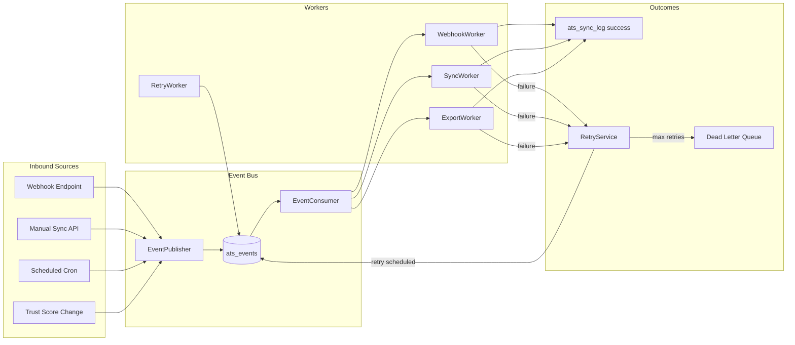
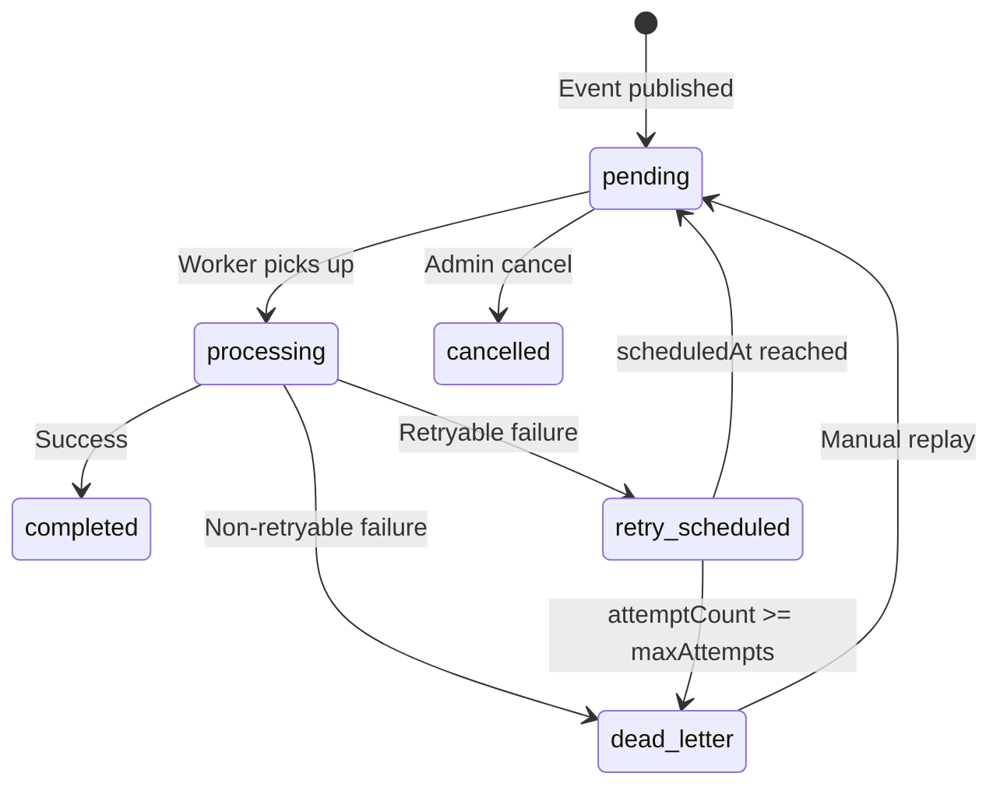

# 04 — Event System

> **Sprint:** Operation Greenhouse — Sprint 2 (Design Only)  
> **Last updated:** 2026-08-07

---

## Overview

The integration platform uses an **event-driven architecture** to decouple webhook receipt, sync operations, and export jobs. All async work flows through typed events stored in `ats_events`.

**Phase 1 implementation:** Database-backed event queue (`ats_events` table + cron polling worker).  
**Phase 2 upgrade path:** Supabase Edge Functions or external queue (Inngest) without changing event schema.

---

## Event Architecture



---

## Event Categories

### Inbound Events (External → WorkVouch)

Triggered by ATS provider webhooks or polling.

| Event Type | Source | Description |
|------------|--------|-------------|
| `inbound.candidate.created` | Webhook | New candidate in ATS |
| `inbound.candidate.updated` | Webhook | Candidate profile changed |
| `inbound.application.created` | Webhook | New job application |
| `inbound.application.updated` | Webhook | Application status changed |
| `inbound.application.hired` | Webhook | Candidate hired |
| `inbound.application.rejected` | Webhook | Candidate rejected |
| `inbound.job.created` | Webhook | New job posting |
| `inbound.job.updated` | Webhook | Job posting updated |
| `inbound.job.closed` | Webhook | Job posting closed |

### Outbound Events (WorkVouch → ATS)

Triggered by WorkVouch state changes or manual export.

| Event Type | Source | Description |
|------------|--------|-------------|
| `outbound.trust_score.export` | Trust change / manual | Push trust score to ATS |
| `outbound.verification.export` | Verification complete | Push verification status |
| `outbound.vouch_count.export` | Vouch submitted | Push vouch count |
| `outbound.profile_link.export` | Manual / auto | Push WorkVouch profile URL |
| `outbound.note.add` | Manual | Add note to ATS candidate |

### Internal Events (Platform-only)

| Event Type | Source | Description |
|------------|--------|-------------|
| `internal.connection.established` | OAuth callback | New ATS connection |
| `internal.connection.disconnected` | Disconnect flow | Connection revoked |
| `internal.connection.token_refreshed` | TokenRefreshWorker | Token refreshed |
| `internal.connection.health_failed` | HealthCheckWorker | Connection unhealthy |
| `internal.sync.requested` | Manual API / cron | Trigger full sync |
| `internal.sync.candidate_link` | Email match / manual | Link candidate identity |
| `internal.webhook.received` | WebhookService | Raw webhook queued |
| `internal.retry.scheduled` | RetryService | Retry attempt scheduled |

---

## Event Schema

```typescript
// Stored in ats_events table — design specification only

interface AtsEvent {
  id: string                        // UUID
  employerAccountId: string
  provider: AtsProviderId
  connectionId: string

  // Event identity
  eventType: string                 // e.g. 'inbound.candidate.created'
  idempotencyKey: string            // Unique — prevents duplicate processing
  correlationId?: string            // Groups related events (e.g. same sync batch)
  causationId?: string              // ID of event that caused this one

  // Payload
  payload: Record<string, unknown>   // Event-specific data (JSONB)
  
  // Processing state
  status: EventStatus
  attemptCount: number
  maxAttempts: number
  scheduledAt: string               // When to process (for delayed retry)
  processedAt?: string
  lastError?: string
  lastErrorCode?: string

  // Metadata
  createdAt: string
  updatedAt: string
}

type EventStatus =
  | 'pending'           // Awaiting processing
  | 'processing'        // Currently being processed (locked)
  | 'completed'         // Successfully processed
  | 'retry_scheduled'   // Failed — scheduled for retry
  | 'dead_letter'       // Max retries exceeded
  | 'cancelled'         // Manually cancelled
```

---

## Event Naming Conventions

```
{direction}.{entity}.{action}

direction:  inbound | outbound | internal
entity:    candidate | application | job | connection | trust_score | verification | webhook | sync
action:    created | updated | deleted | export | link | received | requested | established | failed
```

**Examples:**
- `inbound.candidate.created`
- `outbound.trust_score.export`
- `internal.webhook.received`
- `internal.connection.health_failed`

**Rules:**
- All lowercase, dot-separated
- Never include provider name in event type (provider is a column)
- Never include employer ID in event type (employer is a column)
- Action verbs are past tense for completed facts, present for requests

---

## Idempotency

Every event has an **`idempotencyKey`** computed at publish time:

| Event source | Idempotency key formula |
|--------------|--------------------------|
| Webhook | `{provider}:{eventId}` |
| Manual sync | `{employerAccountId}:{eventType}:{entityId}:{timestamp_hour}` |
| Trust export | `{provider}:{profileId}:trust_export:{trustScore}:{calculatedAt}` |
| Cron sync | `{employerAccountId}:cron_sync:{date}:{hour}` |

**Enforcement:**
```sql
-- Design specification only
UNIQUE (idempotency_key) on ats_events
```

On duplicate insert: return existing event, do not reprocess.

---

## Ordering

**Guarantee:** Events for the same `(employerAccountId, externalCandidateId)` are processed in `created_at` order.

**Implementation:**
- Worker queries: `SELECT ... WHERE status = 'pending' ORDER BY created_at ASC LIMIT N FOR UPDATE SKIP LOCKED`
- Per-candidate lock: Before processing candidate events, acquire logical lock via `status = 'processing'`

**No global ordering guarantee** across different candidates or employers — by design for parallelism.

---

## Retry Strategy



### Retry Configuration by Event Type

| Event Type | Max Attempts | Initial Backoff | Max Backoff |
|------------|-------------|-----------------|-------------|
| `inbound.*` | 5 | 30s | 15m |
| `outbound.trust_score.export` | 3 | 1m | 8m |
| `outbound.verification.export` | 3 | 1m | 8m |
| `internal.webhook.received` | 5 | 10s | 5m |
| `internal.sync.requested` | 3 | 2m | 30m |
| `internal.connection.token_refreshed` | 2 | 0s | 0s |

### Backoff Formula

```
delay = min(initialBackoff * 2^(attemptCount - 1), maxBackoff)
if (RateLimitError) delay = max(delay, error.retryAfterMs)
scheduledAt = now + delay + jitter(0, 5000ms)
```

---

## Dead Letter Queue (DLQ)

Events with `status = 'dead_letter'` are surfaced in:
- Admin: `/api/integrations/v1/admin/dlq` (admin-guard required)
- Employer: Error dashboard at `/employer/settings/integrations/health`

**DLQ entry includes:**
- Original event payload
- All attempt error messages
- Timestamp of each attempt
- Suggested action (refresh token, manual link, contact support)

**Manual replay:**
```
POST /api/integrations/v1/events/{eventId}/replay
→ Sets status = 'pending', attemptCount = 0, scheduledAt = now
→ Creates audit log entry
```

**Auto-DLQ triggers (no retry):**
- `MAPPING_ERROR` — schema mismatch
- `WEBHOOK_INVALID_SIGNATURE` — security rejection
- `CONNECTION_DISCONNECTED` — no active connection
- `PROVIDER_NOT_FOUND` — 404 from provider

---

## Event Payload Examples

### `inbound.candidate.created`

```json
{
  "externalCandidateId": "12345",
  "externalApplicationId": "67890",
  "email": "candidate@example.com",
  "fullName": "Jane Smith",
  "jobExternalId": "111",
  "applicationStatus": "applied",
  "providerEventId": "gh_evt_abc123",
  "receivedAt": "2026-08-07T20:00:00Z"
}
```

### `outbound.trust_score.export`

```json
{
  "workvouchProfileId": "uuid-profile",
  "externalCandidateId": "12345",
  "trustExport": {
    "trustScore": 78,
    "trustBand": "Strong",
    "verificationCount": 2,
    "vouchCount": 5,
    "profileUrl": "https://workvouch.com/v/jane-smith",
    "lastCalculatedAt": "2026-08-07T19:55:00Z"
  }
}
```

### `internal.webhook.received`

```json
{
  "webhookLogId": "uuid-webhook-log",
  "providerEventId": "gh_evt_abc123",
  "providerEventType": "candidate_created",
  "normalizedEventType": "inbound.candidate.created",
  "rawPayloadHash": "sha256:..."
}
```

---

## Trust Score Change Detection

Trust score exports are triggered by polling (Phase 1) or DB trigger (Phase 2):

**Phase 1 — Cron polling:**
```
POST /api/cron/ats-trust-export
→ Query trust_scores WHERE calculated_at > last_export_at
→ For each changed score with active ats_candidate_map:
  → Publish outbound.trust_score.export event
```

**Phase 2 — Event hook (future):**
```
After trust_scores UPDATE → publish outbound.trust_score.export
(Requires explicit approval — touches trust write path)
```

**Rule for Sprint 3:** Polling only. Do not add triggers to `trust_scores` table.

---

## Event Bus API (Internal)

```typescript
// Design specification only

interface EventPublisher {
  publish(event: PublishEventParams): Promise<AtsEvent>
  publishBatch(events: PublishEventParams[]): Promise<AtsEvent[]>
}

interface PublishEventParams {
  employerAccountId: string
  provider: AtsProviderId
  connectionId: string
  eventType: string
  payload: Record<string, unknown>
  idempotencyKey: string
  correlationId?: string
  scheduledAt?: string       // Default: now
  maxAttempts?: number       // Default: per event type config
}

interface EventConsumer {
  poll(batchSize: number): Promise<AtsEvent[]>
  markProcessing(eventId: string): Promise<void>
  markCompleted(eventId: string, result: ProcessResult): Promise<void>
  markFailed(eventId: string, error: IntegrationError): Promise<void>
}
```

---

## Monitoring Events

| Metric | Source |
|--------|--------|
| Events published / hour | `ats_events.created_at` |
| Events completed / hour | `ats_events.status = 'completed'` |
| Events in DLQ | `ats_events.status = 'dead_letter'` |
| Avg processing time | `ats_sync_log.duration_ms` |
| Retry rate | `ats_events.attempt_count > 1` |
| Webhook receipt rate | `ats_webhook_log.created_at` |

See [12-monitoring.md](./12-monitoring.md).

---

## Related Documents

- [01-system-architecture.md](./01-system-architecture.md)
- [05-sync-engine.md](./05-sync-engine.md)
- [07-webhook-design.md](./07-webhook-design.md)
- [08-database-design.md](./08-database-design.md)
