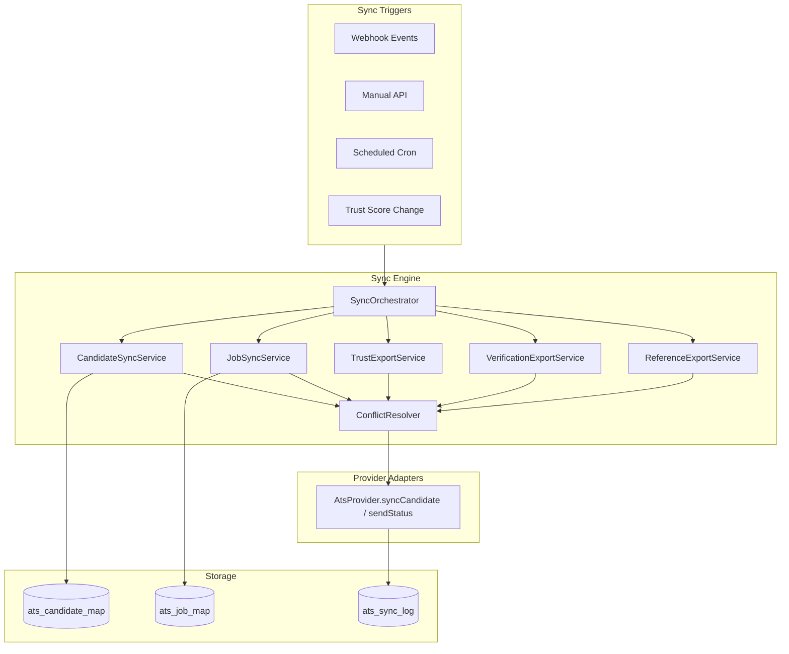
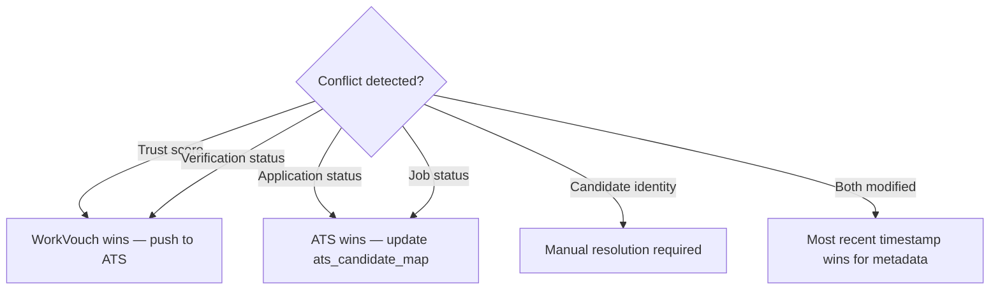

# 05 — Sync Engine

> **Sprint:** Operation Greenhouse — Sprint 2 (Design Only)  
> **Last updated:** 2026-08-07

---

## Overview

The Sync Engine orchestrates all data synchronization between WorkVouch and ATS providers. It is the **only component** that coordinates read operations from WorkVouch core tables and write operations to ATS APIs.

**Core rule:** WorkVouch is source of truth for trust/verification. ATS is source of truth for job/application status.

---

## Sync Engine Architecture



---

## Sync Types

### 1. Candidate Sync (ATS → WorkVouch)

**Direction:** Inbound  
**Priority:** P0 — Sprint 3  
**Trigger:** `inbound.candidate.created`, `inbound.candidate.updated`, manual sync

**Flow:**
```
1. Receive CanonicalCandidate from provider adapter
2. Check ats_candidate_map for existing link
3. If no link:
   a. Attempt email match: profiles.email = candidate.email (case-insensitive)
   b. If single match → auto-link (status: 'auto_linked')
   c. If zero matches → status: 'pending_manual_link', notify employer
   d. If multiple matches → status: 'ambiguous', notify employer
4. If linked:
   a. Update ats_candidate_map metadata (application status, job ID)
   b. Do NOT modify profiles table
5. Write ats_sync_log
```

**What is NOT synced inbound:**
- Candidate PII into new WorkVouch profiles (no auto-profile creation in Sprint 3)
- Trust scores from ATS
- Location data beyond country/state

**Future (Sprint 5):** Optional auto-profile creation with employer consent toggle.

---

### 2. Job Sync (ATS → WorkVouch)

**Direction:** Inbound  
**Priority:** P2 — Sprint 5  
**Trigger:** `inbound.job.created`, `inbound.job.updated`, manual sync

**Flow:**
```
1. Receive CanonicalJob from provider adapter
2. Upsert ats_job_map (external_job_id ↔ metadata)
3. Optionally upsert job_postings table (requires explicit Sprint 5 approval)
4. Write ats_sync_log
```

**Location rule:** Only country/state stored. Invalid US locations (missing state) dropped.

---

### 3. Status Sync (ATS → WorkVouch)

**Direction:** Inbound  
**Priority:** P2 — Sprint 5  
**Trigger:** `inbound.application.updated`, `inbound.application.hired`, `inbound.application.rejected`

**Flow:**
```
1. Update ats_candidate_map.application_status
2. If hired → publish internal event for hiring_outcome_feedback (future)
3. Write ats_sync_log
4. Notify employer via employer_notifications
```

**WorkVouch does NOT write back to ATS on status sync inbound.**

---

### 4. Trust Score Export (WorkVouch → ATS)

**Direction:** Outbound  
**Priority:** P0 — Sprint 3  
**Trigger:** `outbound.trust_score.export`, cron polling, manual export

**Flow:**
```
1. Read trust_scores for workvouchProfileId (read-only)
2. Read trust band from getTrustBandLabel(score)
3. Build CanonicalTrustExport
4. Verify ats_candidate_map link exists and status != 'pending_manual_link'
5. Call provider.syncCandidate() with trustExport
6. Update ats_candidate_map.last_trust_export_at
7. Write ats_sync_log
```

**Custom fields pushed to Greenhouse:**
| Field | Value |
|-------|-------|
| `workvouch_trust_score` | Integer 0–100 |
| `workvouch_trust_band` | Low / Moderate / Strong / Exceptional |
| `workvouch_vouch_count` | Integer |
| `workvouch_verification_count` | Integer |
| `workvouch_profile_url` | Public profile URL |
| `workvouch_last_synced_at` | ISO 8601 timestamp |

---

### 5. Verification Export (WorkVouch → ATS)

**Direction:** Outbound  
**Priority:** P0 — Sprint 4  
**Trigger:** `outbound.verification.export`, verification status change, manual export

**Flow:**
```
1. Read verification_requests + employment_records for profile (read-only)
2. Build CanonicalVerificationExport
3. Call provider.sendStatus() with statusType: 'verification_completed'
4. Add note to ATS candidate activity feed (optional, configurable)
5. Update ats_candidate_map.last_verification_export_at
6. Write ats_sync_log
```

---

### 6. Reference / Vouch Count Export (WorkVouch → ATS)

**Direction:** Outbound  
**Priority:** P3 — Sprint 6  
**Trigger:** Manual only (no automatic trigger on vouch submission in Sprint 6)

**Flow:**
```
1. Read trust_scores.reference_count (read-only)
2. Push workvouch_vouch_count custom field
3. Do NOT sync vouch text content (privacy)
```

---

## Conflict Resolution



| Data field | Source of truth | On conflict |
|------------|----------------|---------------|
| Trust score | WorkVouch | Always push WV value to ATS |
| Verification status | WorkVouch | Always push WV value to ATS |
| Vouch count | WorkVouch | Always push WV value to ATS |
| Application status | ATS | Always accept ATS value |
| Job title/status | ATS | Always accept ATS value |
| Candidate email | ATS (for linking) | Used for initial link only |
| Link status | WorkVouch platform | Manual resolution for ambiguous |

---

## Retry Policy

See [04-event-system.md](./04-event-system.md) for event-level retry.

**Sync-level retry rules:**

| Failure | Action |
|---------|--------|
| Provider 429 | Retry with `Retry-After` header value |
| Provider 5xx | Exponential backoff, max 5 attempts |
| Provider 401 | Refresh token → retry once → DLQ if still 401 |
| Provider 404 (candidate deleted in ATS) | Mark `ats_candidate_map.status = 'external_deleted'`, notify employer |
| Mapping error | Immediate DLQ, no retry |
| WorkVouch profile not found | Mark sync as `skipped`, log reason |
| No candidate link | Skip export, log `no_link`, notify employer |

---

## Partial Failures

Bulk sync operations (e.g., cron trust export for all linked candidates) use **per-item isolation**:

```
Batch sync 100 candidates:
  → 95 succeed → ats_sync_log status: success (95 entries)
  → 3 fail (retryable) → ats_events status: retry_scheduled (3 entries)
  → 2 fail (non-retryable) → ats_events status: dead_letter (2 entries)
  → Batch summary written to ats_sync_log with partial status
```

**Batch result schema:**
```json
{
  "batchId": "uuid",
  "totalItems": 100,
  "successCount": 95,
  "failureCount": 5,
  "skippedCount": 0,
  "status": "partial",
  "durationMs": 12400
}
```

---

## Sync Orchestrator API (Internal)

```typescript
// Design specification only

interface SyncOrchestrator {
  // Single entity sync
  syncCandidate(params: SyncCandidateRequest): Promise<SyncResult>
  syncJob(params: SyncJobRequest): Promise<SyncResult>
  exportTrustScore(params: ExportTrustRequest): Promise<SyncResult>
  exportVerification(params: ExportVerificationRequest): Promise<SyncResult>

  // Batch sync
  runFullSync(params: FullSyncRequest): Promise<BatchSyncResult>
  runTrustExportBatch(params: TrustExportBatchRequest): Promise<BatchSyncResult>

  // Identity
  linkCandidate(params: LinkCandidateRequest): Promise<LinkResult>
  unlinkCandidate(params: UnlinkCandidateRequest): Promise<void>
}

interface SyncCandidateRequest {
  employerAccountId: string
  provider: AtsProviderId
  externalCandidateId: string
  direction: 'inbound' | 'outbound'
  triggeredBy: 'webhook' | 'manual' | 'cron'
}

interface LinkCandidateRequest {
  employerAccountId: string
  provider: AtsProviderId
  externalCandidateId: string
  workvouchProfileId: string
  linkMethod: 'auto_email' | 'manual' | 'admin'
  linkedByUserId: string
}
```

---

## Sync Schedule (Cron)

| Cron endpoint | Frequency | Action |
|---------------|-----------|--------|
| `/api/cron/ats-process-events` | Every 1 min | Process pending ats_events |
| `/api/cron/ats-trust-export` | Every 15 min | Export changed trust scores |
| `/api/cron/ats-verification-export` | Every 30 min | Export changed verification statuses |
| `/api/cron/ats-candidate-sync` | Every 6 hours | Pull new candidates from ATS |
| `/api/cron/ats-job-sync` | Daily | Pull job updates from ATS |
| `/api/cron/ats-retry-dlq` | Every 5 min | Retry DLQ events past scheduledAt |
| `/api/cron/ats-refresh-tokens` | Daily | Proactive OAuth token refresh |

All protected by `CRON_SECRET` — same pattern as existing cron jobs.

---

## Sync Log Schema

Every sync operation writes to `ats_sync_log`:

```json
{
  "id": "uuid",
  "employerAccountId": "uuid",
  "provider": "greenhouse",
  "connectionId": "uuid",
  "eventId": "uuid",
  "operation": "trust_score_export",
  "direction": "outbound",
  "entityType": "candidate",
  "workvouchProfileId": "uuid",
  "externalCandidateId": "12345",
  "status": "success",
  "fieldsUpdated": ["workvouch_trust_score", "workvouch_trust_band"],
  "durationMs": 342,
  "attemptCount": 1,
  "errorCode": null,
  "errorMessage": null,
  "metadata": {},
  "createdAt": "2026-08-07T20:00:00Z"
}
```

---

## Related Documents

- [04-event-system.md](./04-event-system.md)
- [03-provider-interface.md](./03-provider-interface.md)
- [08-database-design.md](./08-database-design.md)
- [09-api-design.md](./09-api-design.md)
