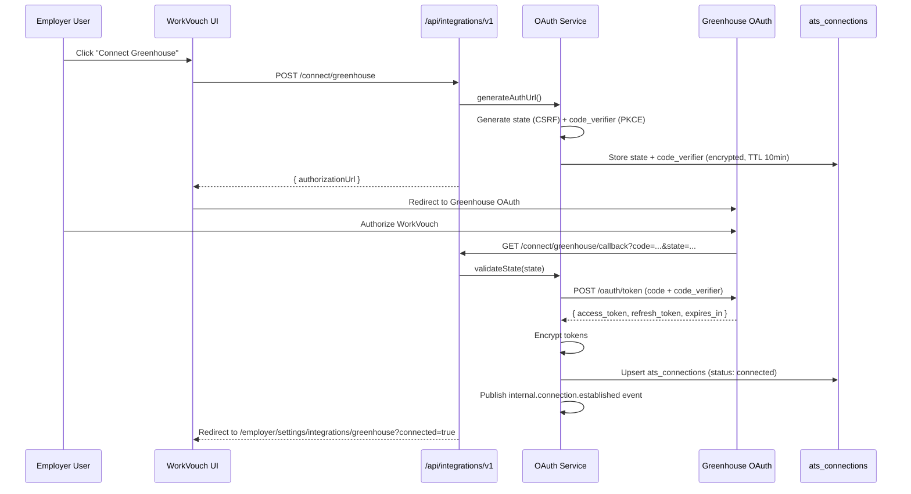
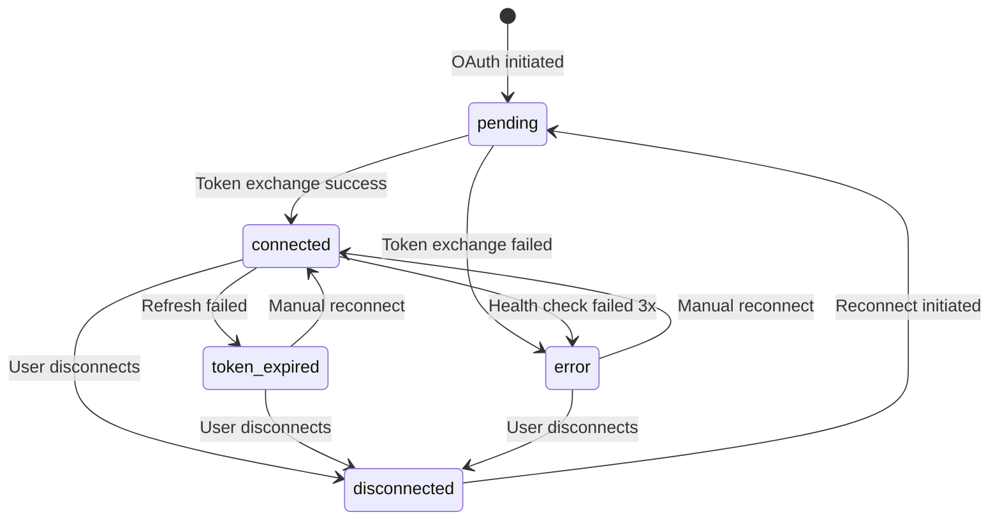
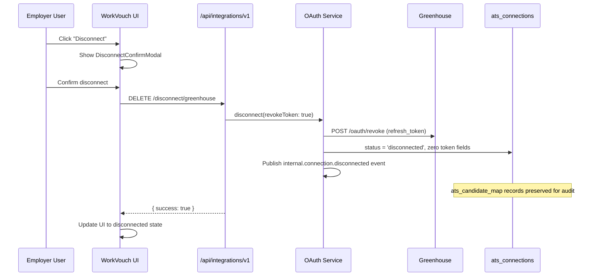

# 06 — OAuth Design

> **Sprint:** Operation Greenhouse — Sprint 2 (Design Only)  
> **Last updated:** 2026-08-07

---

## Overview

OAuth 2.0 with PKCE is the standard authentication mechanism for all ATS provider connections. Each employer account may have one active connection per provider.

---

## OAuth Flow



---

## Greenhouse OAuth Specifics

| Parameter | Value |
|-----------|-------|
| Authorization URL | `https://auth.greenhouse.io/oauth/authorize` |
| Token URL | `https://auth.greenhouse.io/oauth/token` |
| Revoke URL | `https://auth.greenhouse.io/oauth/revoke` |
| Grant type | `authorization_code` with PKCE (`S256`) |
| Client auth | Client ID + Client Secret (server-side only) |

### Required Scopes (Greenhouse)

| Scope | Purpose |
|-------|---------|
| `harvest:read` | Read candidates, jobs, applications |
| `harvest:write` | Update custom fields, add notes |
| `harvest:webhooks` | Register webhook endpoints |

**Principle of least privilege:** Request only scopes needed for Sprint 3 features. Add scopes in future sprints as features are added — never request all scopes upfront.

---

## Token Storage

Tokens are stored encrypted in `ats_connections` (see [08-database-design.md](./08-database-design.md)).

```
ats_connections:
  access_token_encrypted   — AES-256-GCM encrypted
  refresh_token_encrypted  — AES-256-GCM encrypted
  token_expires_at         — Plaintext expiry timestamp
  scopes                   — Plaintext scope list
  status                   — connected | disconnected | error | token_expired
```

**Never stored in plaintext. Never logged. Never returned to client.**

### Encryption Design

```
Algorithm:  AES-256-GCM
Key:        ATS_TOKEN_ENCRYPTION_KEY env var (32 bytes, base64)
IV:         Random 12 bytes per encryption (stored with ciphertext)
Format:     base64(iv + ciphertext + authTag)
```

**Key rotation:** Support dual-key decryption during rotation window. New encryptions use current key. Old tokens decrypted with previous key until refreshed.

---

## Token Refresh Strategy

### Proactive Refresh (Primary)

```
TokenRefreshWorker (daily cron):
  SELECT * FROM ats_connections
  WHERE status = 'connected'
  AND token_expires_at < NOW() + INTERVAL '7 days'
  
  For each:
    → adapter.refreshToken(refreshToken)
    → Update access_token_encrypted, token_expires_at
    → Publish internal.connection.token_refreshed event
    → On failure: status = 'token_expired', notify employer
```

### Reactive Refresh (Fallback)

```
On any provider API call returning 401:
  → Attempt refreshToken() once
  → Retry original request once
  → If still 401: status = 'token_expired', DLQ event, notify employer
```

### Refresh Token Expiry

Greenhouse refresh tokens expire after **30 days of inactivity**. Proactive daily refresh prevents expiry.

---

## CSRF Protection

| Mechanism | Implementation |
|-----------|---------------|
| State parameter | Random 32-byte hex, stored in DB with 10-minute TTL |
| PKCE | `code_verifier` (43–128 chars), `code_challenge = SHA256(verifier)` |
| State validation | Exact match on callback, then delete state record |
| Redirect URI validation | Must match registered URI exactly |

**State storage (temporary):**
```
ats_oauth_states (proposed, or Redis in Phase 2):
  state, employer_account_id, provider, code_verifier_encrypted,
  redirect_uri, created_at, expires_at
  TTL: 10 minutes — auto-delete on use or expiry
```

---

## Connection States



| Status | UI badge | Action available |
|--------|----------|-----------------|
| `pending` | Yellow "Connecting..." | Cancel |
| `connected` | Green "Connected" | Disconnect, Sync now |
| `token_expired` | Red "Session expired" | Reconnect |
| `error` | Red "Connection error" | Reconnect, View error |
| `disconnected` | Gray "Disconnected" | Connect |

---

## Revocation & Disconnect Flow



**On disconnect:**
- Revoke tokens at provider (best effort — continue even if revoke fails)
- Zero out encrypted token fields (not delete — audit trail)
- Preserve `ats_candidate_map` records (mark `connection_status = 'disconnected'`)
- Preserve `ats_sync_log` and `ats_webhook_log` (audit)
- Cancel pending `ats_events` for this connection

---

## Reconnect Flow

When status is `token_expired` or `error`:

1. UI shows "Reconnect" button (not "Connect" — connection record exists)
2. Reconnect initiates same OAuth flow as initial connect
3. On success: update existing `ats_connections` row (same ID), set status = `connected`
4. Re-publish `internal.connection.established` event
5. Trigger incremental sync (not full re-sync of all history)

---

## Multi-Provider Support

Each employer account may have **one connection per provider**:

```
employer_account_id + provider → UNIQUE constraint on ats_connections
```

An employer may simultaneously connect Greenhouse AND Lever (future) — separate connection records, separate sync state.

---

## Security Requirements

| Requirement | Implementation |
|-------------|---------------|
| Client secret | Server-side env var only — never in client bundle |
| Tokens | AES-256-GCM encrypted at rest |
| State/PKCE | 10-minute TTL, single use |
| Redirect URI | Allowlist validation |
| Scope minimization | Request only needed scopes per sprint |
| Audit | Log connect/disconnect/refresh events (no token values) |
| RBAC | Only employer account owner or admin role can connect/disconnect |

See [11-security.md](./11-security.md).

---

## Provider OAuth Variations (Future)

| Provider | OAuth type | Notes |
|----------|-----------|-------|
| Greenhouse | OAuth 2.0 + PKCE | Sprint 3 |
| Lever | OAuth 2.0 | Similar to Greenhouse |
| Ashby | API key + OAuth | Dual auth mode in adapter |
| Workday | OAuth 2.0 (complex) | Requires tenant-specific config |
| BambooHR | API key | No OAuth — adapter uses API key auth |
| Rippling | OAuth 2.0 | Partner program required |
| HiBob | OAuth 2.0 | Partner program required |

The `AtsProvider.connect()` interface accommodates both OAuth and API key auth via `ConnectParams.authType`.

---

## Related Documents

- [03-provider-interface.md](./03-provider-interface.md)
- [08-database-design.md](./08-database-design.md)
- [09-api-design.md](./09-api-design.md)
- [11-security.md](./11-security.md)
