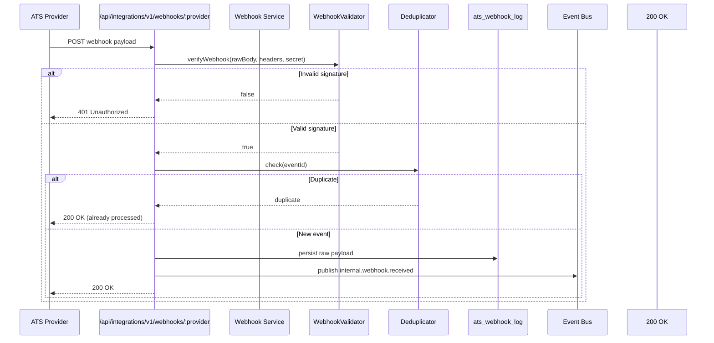
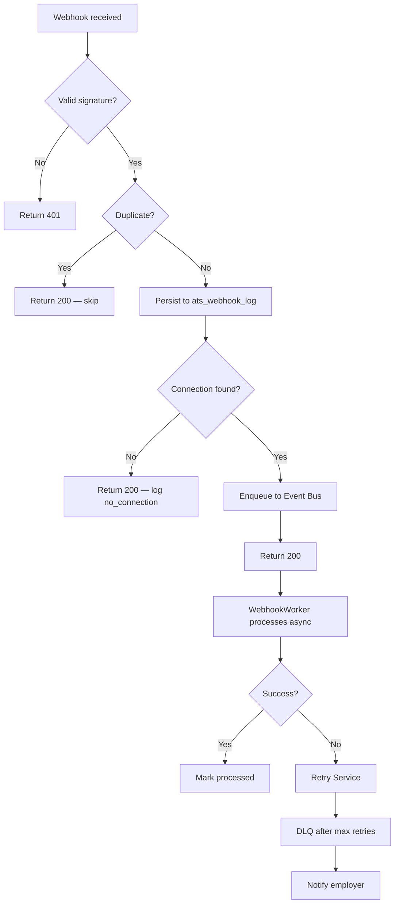

# 07 — Webhook Design

> **Sprint:** Operation Greenhouse — Sprint 2 (Design Only)  
> **Last updated:** 2026-08-07

---

## Overview

Webhooks are the primary real-time inbound channel from ATS providers. The Webhook Service receives, validates, persists, and queues all inbound webhooks before returning 200 to the provider.

**Golden rule:** Return 200 immediately. Process asynchronously.

---

## Webhook Architecture



---

## Endpoint Design

**Single endpoint per provider (not per employer):**

```
POST /api/integrations/v1/webhooks/greenhouse
POST /api/integrations/v1/webhooks/lever      (future)
POST /api/integrations/v1/webhooks/ashby        (future)
```

**Why not per-employer endpoints?**
- Simpler webhook registration (one URL per provider)
- Provider sends employer identity in payload
- Employer resolved from payload → `ats_connections` lookup

**Auth:** No Supabase session required. Provider signature verification only.

---

## Validation

### Step 1: Signature Verification

Each provider adapter implements `verifyWebhook()`:

**Greenhouse:**
```
Signature header: "sha256={hex_digest}"
Digest: HMAC-SHA256(rawBody, webhookSecret)
Compare: timing-safe equal
```

**General pattern:**
```typescript
// Design specification only
function verifyWebhook(params: VerifyWebhookParams): boolean {
  const expected = computeHmac(params.rawBody, params.webhookSecret)
  const received = extractSignature(params.headers)
  return timingSafeEqual(expected, received)
}
```

On failure: Return `401 Unauthorized`. Log to `ats_webhook_log` with `status = 'rejected'`. Do not enqueue.

### Step 2: Payload Parsing

```typescript
const parsed = adapter.parseWebhookEvent(rawBody)
// Must extract: eventId, eventType, externalCandidateId (if applicable)
```

On parse failure: Return `200 OK` (prevent provider retries). Log with `status = 'parse_error'`. Do not enqueue.

### Step 3: Connection Resolution

```
Lookup ats_connections by:
  - provider = 'greenhouse'
  - provider_account_id = payload.organization_id (or equivalent)
  - status = 'connected'

If not found: Return 200. Log with status = 'no_connection'. Do not enqueue.
```

---

## Authentication Methods by Provider

| Provider | Method | Header |
|----------|--------|--------|
| Greenhouse | HMAC-SHA256 | `Signature: sha256={digest}` |
| Lever | HMAC-SHA256 | `X-Lever-Signature: {digest}` |
| Ashby | HMAC-SHA256 | `Ashby-Signature: {digest}` |
| Workday | OAuth + IP allowlist | Custom |
| BambooHR | Shared secret in URL path | Path parameter |

Webhook secrets stored encrypted in `ats_connections.webhook_secret_encrypted`.

---

## Logging

Every webhook receipt is persisted to `ats_webhook_log` **before** any processing:

```json
{
  "id": "uuid",
  "provider": "greenhouse",
  "connectionId": "uuid",
  "employerAccountId": "uuid",
  "providerEventId": "gh_evt_abc123",
  "providerEventType": "candidate_created",
  "normalizedEventType": "inbound.candidate.created",
  "status": "received | rejected | parse_error | no_connection | queued | processed",
  "payloadHash": "sha256:abc...",
  "payloadSizeBytes": 1234,
  "headers": { "signature": "present" },
  "receivedAt": "2026-08-07T20:00:00Z",
  "processedAt": null
}
```

**Raw payload storage:** Store in Supabase Storage bucket `ats-webhook-payloads` (not in DB row). Reference by `payloadStoragePath`. Retention: 30 days.

**Never log:** Full payload in application logs. Payload hash only.

---

## Queue

After validation and logging:

```
1. Publish internal.webhook.received event to ats_events
2. Update ats_webhook_log.status = 'queued'
3. Return 200 to provider
```

Worker processes asynchronously (see [04-event-system.md](./04-event-system.md)).

---

## Retry (Provider-Side)

ATS providers retry failed webhook deliveries (non-200 responses):

| Provider | Retry policy |
|----------|-------------|
| Greenhouse | Exponential backoff, up to 24 hours |
| Lever | 3 retries over 1 hour |
| Ashby | 5 retries over 4 hours |

**WorkVouch must always return 200 for valid, deduplicated webhooks** — even if internal processing will fail. Processing failures are handled by the Retry Service, not by rejecting the webhook.

**Return non-200 only for:**
- Invalid signature (401)
- Unknown provider (404)

---

## Replay Protection

### Duplicate Detection

```
Idempotency key: {provider}:{providerEventId}
Check: SELECT FROM ats_webhook_log WHERE provider_event_id = ? AND provider = ?
If exists: Return 200, skip processing
```

**Also check `ats_events.idempotency_key`** for events already queued.

### Replay Attack Prevention

| Attack | Defense |
|--------|---------|
| Replayed webhook (same eventId) | Idempotency key dedup |
| Replayed webhook (different eventId, same payload) | Payload hash dedup (within 1-hour window) |
| Forged webhook (no valid signature) | HMAC verification → 401 |
| Webhook for wrong employer | Connection resolution check |
| Stale webhook (> 24 hours old) | Timestamp check in payload → log warning, still process |

---

## Greenhouse Webhook Events

| Greenhouse event | Normalized type | Action |
|-----------------|-----------------|--------|
| `candidate_created` | `inbound.candidate.created` | Email match + link |
| `candidate_updated` | `inbound.candidate.updated` | Update metadata |
| `application_created` | `inbound.application.created` | Link + status |
| `application_updated` | `inbound.application.updated` | Update status |
| `hire_candidate` | `inbound.application.hired` | Update status + notify |
| `reject_candidate` | `inbound.application.rejected` | Update status |
| `job_created` | `inbound.job.created` | Upsert job map |
| `job_updated` | `inbound.job.updated` | Update job map |
| `job_deleted` | `inbound.job.updated` | Mark job closed |

### Webhook Registration

Greenhouse requires webhook registration via Harvest API after OAuth connect:

```
POST /v1/webhooks
{
  "endpoint_url": "https://workvouch.com/api/integrations/v1/webhooks/greenhouse",
  "event_type": "candidate_created",
  ...
}
```

Register all required event types during `connect()` flow. Store Greenhouse webhook IDs in `ats_connections.metadata`.

---

## Failure Handling



---

## Webhook Health Monitoring

| Metric | Alert threshold |
|--------|----------------|
| Webhook receipt rate | Drop > 50% vs 7-day avg |
| Signature rejection rate | > 1% of receipts |
| Parse error rate | > 5% of receipts |
| Processing failure rate | > 10% of queued |
| No-connection rate | > 0 (investigate) |

See [12-monitoring.md](./12-monitoring.md).

---

## Related Documents

- [04-event-system.md](./04-event-system.md)
- [06-oauth-design.md](./06-oauth-design.md)
- [08-database-design.md](./08-database-design.md)
- [11-security.md](./11-security.md)
