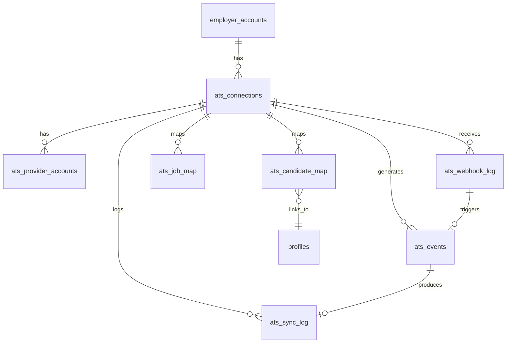

# 08 — Database Design

> **Sprint:** Operation Greenhouse — Sprint 2 (Design Only)  
> **Last updated:** 2026-08-07  
> **IMPORTANT:** Proposed tables only. No migrations created in this sprint.

---

## Design Principles

- All tables prefixed with `ats_` — clearly namespaced
- No modifications to existing tables
- No foreign keys to existing tables that would block deletion (soft references via UUID)
- All tables have `employer_account_id` for tenant isolation
- RLS policies scoped to employer account owner
- Encrypted columns for all secrets

---

## Entity Relationship Diagram



---

## Table Specifications

### `ats_connections`

Primary connection record — one per employer account per provider.

| Column | Type | Constraints | Description |
|--------|------|-------------|-------------|
| `id` | UUID | PK, default gen_random_uuid() | |
| `employer_account_id` | UUID | NOT NULL, indexed | FK → employer_accounts.id (soft) |
| `provider` | TEXT | NOT NULL | 'greenhouse', 'lever', etc. |
| `status` | TEXT | NOT NULL, default 'pending' | See status enum |
| `provider_account_id` | TEXT | nullable | GH organization ID |
| `provider_account_name` | TEXT | nullable | GH organization name |
| `access_token_encrypted` | TEXT | nullable | AES-256-GCM |
| `refresh_token_encrypted` | TEXT | nullable | AES-256-GCM |
| `token_expires_at` | TIMESTAMPTZ | nullable | Plaintext expiry |
| `webhook_secret_encrypted` | TEXT | nullable | AES-256-GCM |
| `scopes` | TEXT[] | default '{}' | Granted OAuth scopes |
| `sync_preferences` | JSONB | default '{}' | Per-connection sync config |
| `metadata` | JSONB | default '{}' | Provider-specific data (webhook IDs, etc.) |
| `last_health_check_at` | TIMESTAMPTZ | nullable | |
| `last_health_check_status` | TEXT | nullable | 'healthy' | 'unhealthy' |
| `connected_at` | TIMESTAMPTZ | nullable | |
| `disconnected_at` | TIMESTAMPTZ | nullable | |
| `connected_by_user_id` | UUID | nullable | FK → profiles.id (soft) |
| `created_at` | TIMESTAMPTZ | NOT NULL, default now() | |
| `updated_at` | TIMESTAMPTZ | NOT NULL, default now() | |

**Indexes:**
- `UNIQUE (employer_account_id, provider) WHERE status != 'disconnected'`
- `INDEX (provider, status)`
- `INDEX (token_expires_at) WHERE status = 'connected'`

**Status enum:** `pending | connected | token_expired | error | disconnected`

---

### `ats_provider_accounts`

Provider-side account metadata (supports multi-account per provider in future).

| Column | Type | Constraints | Description |
|--------|------|-------------|-------------|
| `id` | UUID | PK | |
| `connection_id` | UUID | NOT NULL, FK → ats_connections.id | |
| `provider_account_id` | TEXT | NOT NULL | External org/account ID |
| `provider_account_name` | TEXT | nullable | |
| `provider_account_type` | TEXT | nullable | 'organization', 'team', 'workspace' |
| `is_primary` | BOOLEAN | default true | |
| `metadata` | JSONB | default '{}' | |
| `created_at` | TIMESTAMPTZ | NOT NULL, default now() | |

**Indexes:**
- `UNIQUE (connection_id, provider_account_id)`

---

### `ats_candidate_map`

Identity mapping between ATS candidates and WorkVouch profiles.

| Column | Type | Constraints | Description |
|--------|------|-------------|-------------|
| `id` | UUID | PK | |
| `connection_id` | UUID | NOT NULL, FK → ats_connections.id | |
| `employer_account_id` | UUID | NOT NULL, indexed | Denormalized for RLS |
| `provider` | TEXT | NOT NULL | |
| `external_candidate_id` | TEXT | NOT NULL | ATS candidate ID |
| `external_application_id` | TEXT | nullable | ATS application ID |
| `external_job_id` | TEXT | nullable | ATS job ID |
| `workvouch_profile_id` | UUID | nullable | FK → profiles.id (soft) |
| `candidate_email` | TEXT | nullable | From ATS — for matching |
| `candidate_name` | TEXT | nullable | From ATS — display only |
| `link_status` | TEXT | NOT NULL, default 'pending' | See link status enum |
| `link_method` | TEXT | nullable | 'auto_email', 'manual', 'admin' |
| `linked_by_user_id` | UUID | nullable | |
| `linked_at` | TIMESTAMPTZ | nullable | |
| `application_status` | TEXT | nullable | From ATS |
| `last_trust_export_at` | TIMESTAMPTZ | nullable | |
| `last_verification_export_at` | TIMESTAMPTZ | nullable | |
| `last_inbound_sync_at` | TIMESTAMPTZ | nullable | |
| `metadata` | JSONB | default '{}' | |
| `created_at` | TIMESTAMPTZ | NOT NULL, default now() | |
| `updated_at` | TIMESTAMPTZ | NOT NULL, default now() | |

**Indexes:**
- `UNIQUE (connection_id, external_candidate_id)`
- `INDEX (employer_account_id, link_status)`
- `INDEX (workvouch_profile_id) WHERE workvouch_profile_id IS NOT NULL`
- `INDEX (candidate_email) WHERE link_status = 'pending'`

**Link status enum:** `pending | auto_linked | manual_linked | ambiguous | external_deleted | unlinked`

---

### `ats_job_map`

Mapping between ATS jobs and WorkVouch job postings.

| Column | Type | Constraints | Description |
|--------|------|-------------|-------------|
| `id` | UUID | PK | |
| `connection_id` | UUID | NOT NULL, FK → ats_connections.id | |
| `employer_account_id` | UUID | NOT NULL, indexed | |
| `provider` | TEXT | NOT NULL | |
| `external_job_id` | TEXT | NOT NULL | |
| `workvouch_job_posting_id` | UUID | nullable | FK → job_postings.id (soft) |
| `job_title` | TEXT | nullable | |
| `job_status` | TEXT | nullable | 'open', 'closed', 'draft' |
| `location_country` | TEXT | nullable | ISO-2 only |
| `location_state` | TEXT | nullable | US states only |
| `last_synced_at` | TIMESTAMPTZ | nullable | |
| `metadata` | JSONB | default '{}' | |
| `created_at` | TIMESTAMPTZ | NOT NULL, default now() | |
| `updated_at` | TIMESTAMPTZ | NOT NULL, default now() | |

**Indexes:**
- `UNIQUE (connection_id, external_job_id)`
- `INDEX (employer_account_id, job_status)`

**Location rule:** No city, zip, or coordinates columns. US locations require state.

---

### `ats_sync_log`

Immutable log of every sync operation.

| Column | Type | Constraints | Description |
|--------|------|-------------|-------------|
| `id` | UUID | PK | |
| `connection_id` | UUID | NOT NULL, indexed | |
| `employer_account_id` | UUID | NOT NULL, indexed | |
| `provider` | TEXT | NOT NULL | |
| `event_id` | UUID | nullable, FK → ats_events.id | |
| `operation` | TEXT | NOT NULL | 'trust_score_export', 'candidate_link', etc. |
| `direction` | TEXT | NOT NULL | 'inbound', 'outbound' |
| `entity_type` | TEXT | NOT NULL | 'candidate', 'job', 'application' |
| `workvouch_profile_id` | UUID | nullable | |
| `external_candidate_id` | TEXT | nullable | |
| `external_job_id` | TEXT | nullable | |
| `status` | TEXT | NOT NULL | 'success', 'failure', 'skipped', 'partial' |
| `fields_updated` | TEXT[] | default '{}' | |
| `duration_ms` | INTEGER | nullable | |
| `attempt_count` | INTEGER | default 1 | |
| `error_code` | TEXT | nullable | |
| `error_message` | TEXT | nullable | Truncated to 500 chars |
| `metadata` | JSONB | default '{}' | |
| `created_at` | TIMESTAMPTZ | NOT NULL, default now() | |

**Indexes:**
- `INDEX (employer_account_id, created_at DESC)`
- `INDEX (connection_id, operation, created_at DESC)`
- `INDEX (workvouch_profile_id) WHERE workvouch_profile_id IS NOT NULL`
- `INDEX (status) WHERE status = 'failure'`

**Retention:** 1 year. Archive to cold storage after 1 year.

---

### `ats_events`

Event queue for async processing.

| Column | Type | Constraints | Description |
|--------|------|-------------|-------------|
| `id` | UUID | PK | |
| `employer_account_id` | UUID | NOT NULL, indexed | |
| `provider` | TEXT | NOT NULL | |
| `connection_id` | UUID | NOT NULL, FK → ats_connections.id | |
| `event_type` | TEXT | NOT NULL | Normalized event type |
| `idempotency_key` | TEXT | NOT NULL, UNIQUE | |
| `correlation_id` | UUID | nullable | |
| `causation_id` | UUID | nullable | |
| `payload` | JSONB | NOT NULL, default '{}' | |
| `status` | TEXT | NOT NULL, default 'pending' | See event status enum |
| `attempt_count` | INTEGER | default 0 | |
| `max_attempts` | INTEGER | default 5 | |
| `scheduled_at` | TIMESTAMPTZ | NOT NULL, default now() | |
| `processed_at` | TIMESTAMPTZ | nullable | |
| `last_error` | TEXT | nullable | |
| `last_error_code` | TEXT | nullable | |
| `created_at` | TIMESTAMPTZ | NOT NULL, default now() | |
| `updated_at` | TIMESTAMPTZ | NOT NULL, default now() | |

**Indexes:**
- `UNIQUE (idempotency_key)`
- `INDEX (status, scheduled_at) WHERE status IN ('pending', 'retry_scheduled')`
- `INDEX (employer_account_id, created_at DESC)`
- `INDEX (connection_id, event_type)`

**Event status enum:** `pending | processing | completed | retry_scheduled | dead_letter | cancelled`

**Retention:** Processed events deleted after 30 days. Failed/DLQ events retained 90 days.

---

### `ats_webhook_log`

Raw webhook receipt log.

| Column | Type | Constraints | Description |
|--------|------|-------------|-------------|
| `id` | UUID | PK | |
| `provider` | TEXT | NOT NULL | |
| `connection_id` | UUID | nullable | Resolved after validation |
| `employer_account_id` | UUID | nullable | |
| `provider_event_id` | TEXT | nullable | |
| `provider_event_type` | TEXT | nullable | Raw provider event name |
| `normalized_event_type` | TEXT | nullable | |
| `status` | TEXT | NOT NULL | 'received', 'rejected', 'queued', 'processed', 'parse_error', 'no_connection' |
| `payload_hash` | TEXT | NOT NULL | SHA-256 of raw body |
| `payload_storage_path` | TEXT | nullable | Supabase Storage path |
| `payload_size_bytes` | INTEGER | nullable | |
| `headers_present` | JSONB | default '{}' | Which headers were present (not values) |
| `received_at` | TIMESTAMPTZ | NOT NULL, default now() | |
| `processed_at` | TIMESTAMPTZ | nullable | |

**Indexes:**
- `UNIQUE (provider, provider_event_id) WHERE provider_event_id IS NOT NULL`
- `INDEX (provider, received_at DESC)`
- `INDEX (employer_account_id, received_at DESC)`
- `INDEX (status) WHERE status IN ('received', 'queued')`

**Retention:** 90 days.

---

### `ats_oauth_states` (Temporary)

Short-lived OAuth state storage. Deleted after use or expiry.

| Column | Type | Description |
|--------|------|-------------|
| `state` | TEXT PK | CSRF state token |
| `employer_account_id` | UUID | |
| `provider` | TEXT | |
| `code_verifier_encrypted` | TEXT | PKCE verifier |
| `redirect_uri` | TEXT | |
| `created_at` | TIMESTAMPTZ | |
| `expires_at` | TIMESTAMPTZ | created_at + 10 minutes |

**Cleanup:** Cron deletes expired rows every hour.

---

## RLS Policies (Proposed)

All `ats_*` tables: employer account owner can read/write their own records.

```sql
-- Design specification only
CREATE POLICY "employer_own_connections" ON ats_connections
  FOR ALL USING (
    employer_account_id IN (
      SELECT id FROM employer_accounts WHERE user_id = auth.uid()
    )
  );
```

Admin service role (`admin` client) bypasses RLS for worker processing.

---

## Migration Strategy (Sprint 3)

```
Migration 1: ats_connections + ats_oauth_states
Migration 2: ats_candidate_map + ats_job_map
Migration 3: ats_events + ats_sync_log + ats_webhook_log
Migration 4: ats_provider_accounts
Migration 5: RLS policies + indexes
```

Each migration is additive. No existing tables modified.

---

## Related Documents

- [04-event-system.md](./04-event-system.md)
- [05-sync-engine.md](./05-sync-engine.md)
- [06-oauth-design.md](./06-oauth-design.md)
- [docs/architecture/02-database-audit.md](../architecture/02-database-audit.md)
