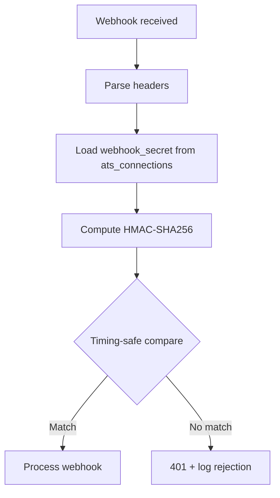

# 11 — Security

> **Sprint:** Operation Greenhouse — Sprint 2 (Design Only)  
> **Last updated:** 2026-08-07

---

## Security Principles

1. Integration platform failures must never compromise core WorkVouch security
2. OAuth tokens are the highest-value secrets — treat accordingly
3. Webhook endpoints are public — signature verification is mandatory
4. Employer data isolation is non-negotiable
5. Audit everything; log nothing sensitive

---

## Encryption

### Token Encryption at Rest

| Secret | Algorithm | Key source |
|--------|-----------|-----------|
| OAuth access tokens | AES-256-GCM | `ATS_TOKEN_ENCRYPTION_KEY` env var |
| OAuth refresh tokens | AES-256-GCM | Same key |
| Webhook secrets | AES-256-GCM | Same key |
| PKCE code verifiers | AES-256-GCM | Same key |

**Key requirements:**
- 32 bytes, base64-encoded
- Stored in Vercel environment variables (not in code)
- Rotatable with dual-key support during rotation window
- Never logged, never returned to client, never in API responses

### Encryption Format

```
stored_value = base64(iv[12 bytes] + ciphertext + authTag[16 bytes])
```

### In Transit

- All ATS API calls: HTTPS only (TLS 1.2+)
- All WorkVouch API calls: HTTPS only
- Webhook payloads: HTTPS only (reject HTTP webhook URLs at registration)

---

## Secrets Management

| Secret | Storage | Rotation |
|--------|---------|----------|
| `ATS_TOKEN_ENCRYPTION_KEY` | Vercel env | Manual, dual-key window |
| `GREENHOUSE_CLIENT_ID` | Vercel env | On GH app rotation |
| `GREENHOUSE_CLIENT_SECRET` | Vercel env | On GH app rotation |
| Per-connection webhook secrets | `ats_connections.webhook_secret_encrypted` | On reconnect |
| Per-connection OAuth tokens | `ats_connections.access_token_encrypted` | Automatic refresh |
| `CRON_SECRET` | Vercel env (existing) | Existing rotation process |

**Never:**
- Store secrets in `ats_events.payload`
- Store secrets in `ats_sync_log.metadata`
- Return secrets in any API response
- Include secrets in error messages
- Log secrets at any log level

---

## Webhook Verification

Every inbound webhook must pass signature verification before any processing.



**Additional webhook security:**
- Reject webhooks with missing signature headers
- Reject webhooks for unknown providers (404, not 401 — no information leak)
- Rate limit webhook endpoint: 1000 req/min per provider (DDoS protection)
- Payload size limit: 1MB max
- No reflection of raw payload in error responses

---

## Rate Limiting

### Internal Rate Limits (WorkVouch API)

| Endpoint | Limit | Window |
|----------|-------|--------|
| `POST /connect/{provider}` | 10 | per hour per employer |
| `POST /sync` | 5 | per hour per employer |
| `POST /candidates/{id}/export` | 20 | per hour per employer |
| `GET /candidates` | 100 | per minute per employer |
| `POST /events/{id}/replay` | 10 | per hour per employer |

### External Rate Limits (Provider APIs)

Each provider adapter tracks rate limit state:

```typescript
// Design specification only
interface RateLimitState {
  provider: AtsProviderId
  connectionId: string
  remaining: number
  resetAt: string
  lastUpdatedAt: string
}
```

On 429 from provider: respect `Retry-After` header, schedule retry, do not hammer provider.

**Greenhouse limits:** 100 requests per 10 seconds per API key.

---

## Permissions & RBAC

### Who Can Connect/Disconnect

| Role | Connect | Disconnect | Sync | View logs |
|------|---------|-----------|------|-----------|
| Employer account owner | ✅ | ✅ | ✅ | ✅ |
| Employer team member (employer_users) | ❌ | ❌ | ✅ | ✅ |
| Employee | ❌ | ❌ | ❌ | ❌ |
| Admin | ✅ (via admin UI) | ✅ | ✅ | ✅ |
| Anonymous | ❌ | ❌ | ❌ | ❌ |

**Enforcement:**
```typescript
// Design pattern only
async function requireEmployerOwner(userId: string, employerAccountId: string) {
  const account = await admin.from('employer_accounts')
    .select('user_id').eq('id', employerAccountId).single()
  if (account.user_id !== userId) throw new ForbiddenError()
}
```

### Row-Level Security

All `ats_*` tables scoped to `employer_account_id`:

```sql
-- Design specification only
-- Employer can only see their own integration data
CREATE POLICY "employer_isolation" ON ats_connections
  FOR ALL USING (
    employer_account_id IN (
      SELECT id FROM employer_accounts WHERE user_id = auth.uid()
    )
  );
```

Worker processing uses `admin` service role (bypasses RLS) with explicit `employer_account_id` filter in every query.

---

## Audit Logging

Every security-relevant action logged:

| Action | Log destination | Fields logged |
|--------|----------------|---------------|
| OAuth connect initiated | `ats_sync_log` | employer_id, provider, user_id, timestamp |
| OAuth connect completed | `ats_sync_log` | connection_id, provider_account_name |
| OAuth disconnect | `ats_sync_log` | connection_id, user_id, revoke_attempted |
| Token refresh | `ats_sync_log` | connection_id, success/failure |
| Webhook rejected (bad signature) | `ats_webhook_log` | provider, payload_hash, ip (hashed) |
| Manual candidate link | `ats_sync_log` | profile_id, external_id, user_id |
| DLQ replay | `ats_sync_log` | event_id, user_id |
| Admin DLQ replay | `admin_audit_logs` | event_id, admin_user_id |

**Never logged:** Token values, webhook secrets, full candidate PII.

---

## Least Privilege

### OAuth Scopes (Greenhouse)

Request minimum scopes per sprint:

| Sprint | Scopes requested |
|--------|-----------------|
| Sprint 3 | `harvest:read`, `harvest:write` (custom fields only) |
| Sprint 4 | Add note writing (same write scope) |
| Sprint 5 | `harvest:webhooks` (if not already included) |

### API Access

Integration workers use `admin` service role but:
- Query always filtered by `employer_account_id`
- Never query across employer accounts in a single operation
- Never expose admin service role to client

### Data Minimization

| Data | Stored | Reason |
|------|--------|--------|
| Candidate email | `ats_candidate_map.candidate_email` | Identity matching |
| Candidate name | `ats_candidate_map.candidate_name` | Display only |
| Trust score | Not stored in ats_* (read from trust_scores) | Source of truth |
| OAuth tokens | Encrypted in ats_connections | Required for API calls |
| Webhook payload | Supabase Storage, 30-day retention | Debugging |
| Candidate phone | NOT stored | Not needed for integration |

---

## Threat Model

| Threat | Vector | Mitigation |
|--------|--------|-----------|
| Token theft | DB breach | AES-256-GCM encryption at rest |
| Webhook forgery | Fake webhook POST | HMAC signature verification |
| Cross-employer data access | API parameter manipulation | employer_account_id ownership check on every request |
| OAuth CSRF | Malicious redirect | State parameter + PKCE |
| Replay attack | Replayed webhook | Idempotency key dedup |
| Privilege escalation | Non-owner connecting ATS | requireEmployerOwner check |
| Token in logs | Logging misconfiguration | Never log token fields; code review gate |
| Rate limit abuse | Manual sync spam | Internal rate limits |
| Payload injection | Malicious webhook payload | Parse + validate; no eval; JSONB only |
| Location data leak | ATS city/zip in sync | Strip to country/state only |

---

## Compliance Alignment

| Requirement | Implementation |
|-------------|---------------|
| SOC2 data minimization | Store only email + name for candidate mapping |
| Location privacy | Country/state only in ats_job_map |
| Audit trail | ats_sync_log + ats_webhook_log immutable |
| Right to disconnect | Full token revocation on disconnect |
| Data retention | 90-day webhook log, 1-year sync log, then archive |
| GDPR | Disconnect preserves audit log but zeros tokens; no new PII stored |

---

## Security Review Checklist (Pre-Launch)

- [ ] Token encryption key in Vercel env (not in code)
- [ ] Webhook signature verification tested with invalid signatures
- [ ] OAuth CSRF state validation tested
- [ ] Cross-employer access tested (employer A cannot see employer B's connections)
- [ ] Non-owner employer user cannot connect/disconnect
- [ ] Token values absent from all log outputs
- [ ] Rate limits tested
- [ ] Payload size limit tested
- [ ] Disconnect zeros token fields
- [ ] RLS policies applied to all ats_* tables

---

## Related Documents

- [06-oauth-design.md](./06-oauth-design.md)
- [07-webhook-design.md](./07-webhook-design.md)
- [08-database-design.md](./08-database-design.md)
- [docs/architecture/03-authentication.md](../architecture/03-authentication.md)
