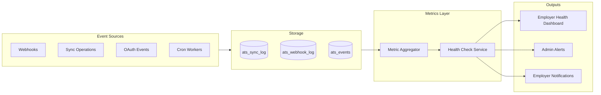

# 12 — Monitoring

> **Sprint:** Operation Greenhouse — Sprint 2 (Design Only)  
> **Last updated:** 2026-08-07

---

## Observability Strategy

The integration platform must be observable independently of core WorkVouch monitoring. Integration failures should alert before employers notice sync gaps.

**Phase 1:** Database-backed metrics + structured logging + employer-facing health dashboard.  
**Phase 2:** External APM (Datadog/Sentry) integration tags for integration spans.

---

## Metrics

### Platform Metrics

| Metric | Source | Alert threshold |
|--------|--------|----------------|
| `ats.events.published.count` | `ats_events.created_at` | — |
| `ats.events.completed.count` | `ats_events.status = completed` | — |
| `ats.events.dlq.count` | `ats_events.status = dead_letter` | > 10 per hour |
| `ats.events.retry_rate` | `attempt_count > 1` / total | > 15% |
| `ats.sync.success_rate` | `ats_sync_log.status = success` / total | < 95% |
| `ats.sync.duration_p99_ms` | `ats_sync_log.duration_ms` p99 | > 5000ms |
| `ats.webhook.received.count` | `ats_webhook_log` | — |
| `ats.webhook.rejected.count` | `status = rejected` | > 1% of received |
| `ats.connections.active.count` | `ats_connections.status = connected` | — |
| `ats.connections.token_expired.count` | `status = token_expired` | > 0 |
| `ats.candidate_map.pending_link.count` | `link_status = pending` | > 50 per employer |
| `ats.trust_export.count` | `operation = trust_score_export` | — |
| `ats.trust_export.failure_rate` | failures / total | > 5% |

### Per-Provider Metrics

| Metric | Tags |
|--------|------|
| `ats.provider.api.latency_ms` | `provider`, `operation` |
| `ats.provider.api.error_rate` | `provider`, `error_code` |
| `ats.provider.rate_limit.hit_count` | `provider`, `connection_id` |
| `ats.provider.webhook.processing_time_ms` | `provider`, `event_type` |

### Per-Employer Metrics (Employer Dashboard)

| Metric | Display |
|--------|---------|
| Events processed (24h) | Stat card |
| Sync success rate (24h) | Stat card |
| Avg sync duration | Stat card |
| DLQ count | Stat card (red if > 0) |
| Pending link count | Stat card |
| Last trust export | Timestamp |

---

## Logging

### Structured Log Format

All integration operations log in structured JSON:

```json
{
  "level": "info",
  "service": "integrations",
  "component": "SyncEngine",
  "operation": "trust_score_export",
  "employerAccountId": "uuid",
  "provider": "greenhouse",
  "connectionId": "uuid",
  "externalCandidateId": "12345",
  "workvouchProfileId": "uuid",
  "status": "success",
  "durationMs": 342,
  "attemptCount": 1,
  "correlationId": "uuid",
  "timestamp": "2026-08-07T20:00:00Z"
}
```

### Log Levels

| Level | When |
|-------|------|
| `debug` | Rate limit state, token refresh attempts |
| `info` | Successful sync, webhook received, connection established |
| `warn` | Retry scheduled, token expiring soon, ambiguous email match |
| `error` | Sync failure, token refresh failure, webhook parse error |
| `fatal` | Encryption key error, DB connection failure |

### Never Log

- OAuth access/refresh tokens
- Webhook secrets
- Full webhook payloads (hash only)
- Candidate phone numbers
- Encryption keys

---

## Tracing

### Correlation IDs

Every integration operation carries a `correlationId`:

```
Webhook received (correlationId: abc)
  → Event published (correlationId: abc)
    → SyncEngine.trustExport (correlationId: abc)
      → GreenhouseAdapter.upsertCustomFields (correlationId: abc)
        → ats_sync_log written (correlationId: abc)
```

**Implementation:** Generate UUID at webhook receipt or API call. Pass through all service calls. Store in `ats_events.correlation_id` and `ats_sync_log.metadata.correlationId`.

### Span Tags (Phase 2 APM)

```
service: integrations
provider: greenhouse
operation: trust_score_export
employer_account_id: uuid
connection_id: uuid
```

---

## Alerts

### Employer-Facing Alerts (In-App Notifications)

| Condition | Notification type | Urgency |
|-----------|-------------------|---------|
| Token expired | `integration_token_expired` | High |
| 3+ sync failures in 1 hour | `integration_sync_error` | Medium |
| Connection health check failed | `integration_connection_error` | High |
| DLQ item for employer | `integration_sync_error` | Medium |
| Pending link > 24 hours | `integration_candidate_pending_link` | Low |

### Internal Alerts (Ops/Admin)

| Condition | Channel | Severity |
|-----------|---------|----------|
| DLQ count > 50 globally | Admin alert | P2 |
| Webhook rejection rate > 5% | Admin alert | P2 |
| Token encryption error | Admin alert + PagerDuty | P1 |
| Provider API error rate > 20% | Admin alert | P2 |
| Zero webhooks received in 24h (active connections) | Admin alert | P3 |
| Cron worker not run in 10 minutes | Admin alert | P2 |

**Admin alert destination:** Existing `admin_alerts` table + `/admin/alerts` UI.

---

## Health Checks

### Platform Health Endpoint

```
GET /api/integrations/v1/health

Response:
{
  "platform": "healthy" | "degraded" | "unhealthy",
  "checkedAt": "2026-08-07T20:00:00Z",
  "connections": [
    {
      "provider": "greenhouse",
      "status": "healthy",
      "latencyMs": 234,
      "lastCheckedAt": "2026-08-07T20:00:00Z",
      "issues": [],
      "metrics": {
        "eventsProcessedLast24h": 847,
        "syncFailuresLast24h": 2,
        "dlqCount": 0,
        "pendingLinkCount": 3
      }
    }
  ]
}
```

### Cron Health Check

```
POST /api/cron/ats-health-check (daily)

For each ats_connections WHERE status = 'connected':
  → adapter.healthCheck()
  → Update ats_connections.last_health_check_at/status
  → If unhealthy 3 consecutive days: status = 'error', notify employer
```

### Worker Health

Monitor cron execution via existing admin system health:

| Worker | Expected frequency | Alert if missed |
|--------|-------------------|----------------|
| `ats-process-events` | Every 1 min | 5 minutes |
| `ats-trust-export` | Every 15 min | 30 minutes |
| `ats-refresh-tokens` | Daily | 25 hours |
| `ats-retry-dlq` | Every 5 min | 15 minutes |

---

## Performance Dashboards

### Admin Dashboard (Proposed: `/admin/integrations`)

| Panel | Data |
|-------|------|
| Active connections by provider | `ats_connections` grouped |
| Events processed (24h/7d/30d) | Time series |
| Sync success rate | Gauge |
| DLQ count | Counter (red if > 0) |
| Top sync failures by error code | Bar chart |
| Provider API latency p50/p99 | Time series |
| Trust exports per day | Time series |
| Pending links by employer | Table |

### Employer Dashboard

Existing `/employer/settings/integrations/health` (see [10-ui-specification.md](./10-ui-specification.md)).

---

## Monitoring Architecture



---

## Related Documents

- [04-event-system.md](./04-event-system.md)
- [07-webhook-design.md](./07-webhook-design.md)
- [10-ui-specification.md](./10-ui-specification.md)
- [15-architecture-review.md](./15-architecture-review.md)
