# 13 — Provider Roadmap

> **Sprint:** Operation Greenhouse — Sprint 2 (Design Only)  
> **Last updated:** 2026-08-07

---

## Provider Onboarding Process

Adding a new ATS provider requires implementing the `AtsProvider` interface and registering in `ProviderRegistry`. No changes to Sync Engine, Event Bus, API routes, or UI framework.

```mermaid
flowchart LR
  RESEARCH[Research provider API] --> ADAPTER[Implement AtsProvider]
  ADAPTER --> MAPPER[Implement Mapper]
  MAPPER --> WEBHOOK[Implement Webhook verification]
  WEBHOOK --> OAUTH[Implement OAuth/API key auth]
  OAUTH --> TEST[Contract test suite]
  TEST --> SANDBOX[Staging with sandbox account]
  SANDBOX --> REGISTER[Register in ProviderRegistry]
  REGISTER --> UI[Add ProviderCard to UI]
  UI --> LAUNCH[Enable for employers]
```



**Estimated effort per provider (after platform built):** 2–4 weeks per provider.

---

## Provider Comparison Matrix

| Provider | Auth | Webhooks | Custom fields | Notes API | Priority | Status |
|----------|------|----------|--------------|-----------|----------|--------|
| **Greenhouse** | OAuth 2.0 + PKCE | ✅ HMAC-SHA256 | ✅ | ✅ | P0 | Sprint 3 |
| **Lever** | OAuth 2.0 | ✅ HMAC-SHA256 | ✅ | ✅ | P1 | Sprint 6 |
| **Ashby** | API key + OAuth | ✅ HMAC-SHA256 | ✅ | ✅ | P1 | Sprint 7 |
| **SmartRecruiters** | OAuth 2.0 | ✅ | ✅ | ✅ | P2 | Sprint 8 |
| **Workday** | OAuth 2.0 (complex) | ✅ | ✅ | ❌ | P2 | Sprint 9+ |
| **BambooHR** | API key | ❌ (polling) | ❌ | ❌ | P3 | Sprint 10+ |
| **Rippling** | OAuth 2.0 | ✅ | Partial | ❌ | P3 | Partner required |
| **HiBob** | OAuth 2.0 | ✅ | Partial | ❌ | P3 | Partner required |
| **iCIMS** | OAuth 2.0 | ✅ | ✅ | ✅ | P3 | Enterprise only |

---

## Greenhouse (Sprint 3–5)

**Priority:** P0 — First provider, reference implementation

| Attribute | Detail |
|-----------|--------|
| API | Harvest API v1 |
| Auth | OAuth 2.0 + PKCE |
| Webhooks | HMAC-SHA256, 10 event types |
| Custom fields | Native support — primary export mechanism |
| Rate limit | 100 req/10s |
| Sandbox | ✅ Greenhouse sandbox environment |
| Partner program | WorkVouch partnership (in progress) |

**Implementation scope:**
- Sprint 3: OAuth, webhooks, trust score export, candidate linking
- Sprint 4: Verification export, manual link UI, sync dashboard
- Sprint 5: Job sync, application status sync, search integration

**Effort:** 4–6 weeks (platform + Greenhouse adapter)

---

## Lever (Sprint 6)

**Priority:** P1 — Second provider, validates adapter pattern

| Attribute | Detail |
|-----------|--------|
| API | Lever Postings/Candidates/Applications API |
| Auth | OAuth 2.0 |
| Webhooks | HMAC-SHA256 (`X-Lever-Signature`) |
| Custom fields | Tags + custom fields |
| Rate limit | 10 req/s |
| Sandbox | ✅ Lever sandbox |

**Differences from Greenhouse:**
- Different webhook event names (map in `LeverMapper`)
- Tags instead of custom fields for some data
- Different OAuth endpoints

**Effort:** 2–3 weeks (adapter + mapper + webhook only — platform exists)

**Validates:** Provider abstraction works without platform changes.

---

## Ashby (Sprint 7)

**Priority:** P1 — Growing mid-market ATS

| Attribute | Detail |
|-----------|--------|
| API | Ashby REST API |
| Auth | API key (primary) + OAuth (optional) |
| Webhooks | HMAC-SHA256 (`Ashby-Signature`) |
| Custom fields | ✅ Custom fields API |
| Rate limit | 100 req/min |
| Sandbox | ✅ Ashby sandbox |

**Differences:**
- Dual auth mode (API key OR OAuth) — adapter must support both via `ConnectParams.authType`
- Different candidate schema (no separate application entity)
- Webhook event names differ

**Effort:** 2–3 weeks

**Design impact:** Validates `authType: 'oauth' | 'api_key'` in provider interface.

---

## SmartRecruiters (Sprint 8)

**Priority:** P2 — Enterprise mid-market

| Attribute | Detail |
|-----------|--------|
| API | SmartRecruiters API v1 |
| Auth | OAuth 2.0 |
| Webhooks | ✅ |
| Custom fields | ✅ Property API |
| Rate limit | Varies by plan |
| Sandbox | ✅ |

**Effort:** 2–3 weeks

---

## Workday (Sprint 9+)

**Priority:** P2 — Enterprise, complex

| Attribute | Detail |
|-----------|--------|
| API | Workday Recruiting REST/RaaS |
| Auth | OAuth 2.0 (tenant-specific) |
| Webhooks | ✅ (Workday Integration Cloud) |
| Custom fields | ✅ |
| Rate limit | Tenant-specific |
| Sandbox | ⚠️ Requires Workday tenant |

**Complexity factors:**
- Tenant-specific configuration (each customer has unique Workday URL)
- Complex candidate schema
- Enterprise sales cycle required before integration
- Requires `ats_provider_accounts` multi-account support

**Effort:** 4–6 weeks

**Design impact:** May require tenant-specific adapter configuration in `ats_connections.metadata`.

---

## BambooHR (Sprint 10+)

**Priority:** P3 — HRIS, not pure ATS

| Attribute | Detail |
|-----------|--------|
| API | BambooHR API |
| Auth | API key only (no OAuth) |
| Webhooks | ❌ — polling required |
| Custom fields | ❌ |
| Rate limit | 1 req/s (strict) |

**Differences:**
- No webhooks — must poll for changes (cron-based sync only)
- No custom fields — export via notes only
- HRIS focus (employee records, not recruiting pipeline)

**Effort:** 2–3 weeks (simpler API, but polling adds complexity)

**Design impact:** Validates polling-based sync in Sync Engine.

---

## Rippling & HiBob (Sprint 11+)

**Priority:** P3 — HRIS platforms, partner program required

Both require formal partnership agreements before API access. Defer until enterprise sales pipeline justifies partnership investment.

**Effort:** 3–4 weeks each (after partnership established)

---

## iCIMS (Sprint 11+)

**Priority:** P3 — Enterprise ATS, complex

Large enterprise customers. Requires iCIMS partner program. Complex API with multiple modules.

**Effort:** 4–6 weeks

---

## Provider Implementation Checklist

For each new provider, complete:

```
□ Research API documentation
□ Obtain sandbox/test credentials
□ Implement AtsProvider interface
□ Implement OAuth or API key auth
□ Implement webhook signature verification
□ Implement CanonicalMapper (provider → canonical)
□ Implement ReverseMapper (canonical → provider)
□ Map all webhook event types to normalized events
□ Pass AtsProviderContractTest suite
□ Test with sandbox account (connect, sync, webhook)
□ Register in ProviderRegistry
□ Add ProviderCard to IntegrationsHub UI
□ Update provider roadmap doc
□ Enable for beta employers
□ Monitor for 1 week before GA
```

---

## Effort Summary

| Provider | Sprint | Effort | Platform dependency |
|----------|--------|--------|-------------------|
| Platform (first build) | 3–5 | 6–8 weeks | — |
| Greenhouse | 3–5 | (included above) | Platform |
| Lever | 6 | 2–3 weeks | Platform |
| Ashby | 7 | 2–3 weeks | Platform |
| SmartRecruiters | 8 | 2–3 weeks | Platform |
| Workday | 9+ | 4–6 weeks | Platform + multi-tenant |
| BambooHR | 10+ | 2–3 weeks | Platform + polling |
| Rippling | 11+ | 3–4 weeks | Partnership |
| HiBob | 11+ | 3–4 weeks | Partnership |
| iCIMS | 11+ | 4–6 weeks | Partnership |

**Total to 4 providers (GH + Lever + Ashby + SmartRecruiters):** ~14–18 weeks from Sprint 3 start.

---

## Related Documents

- [03-provider-interface.md](./03-provider-interface.md)
- [14-implementation-roadmap.md](./14-implementation-roadmap.md)
- [15-architecture-review.md](./15-architecture-review.md)
