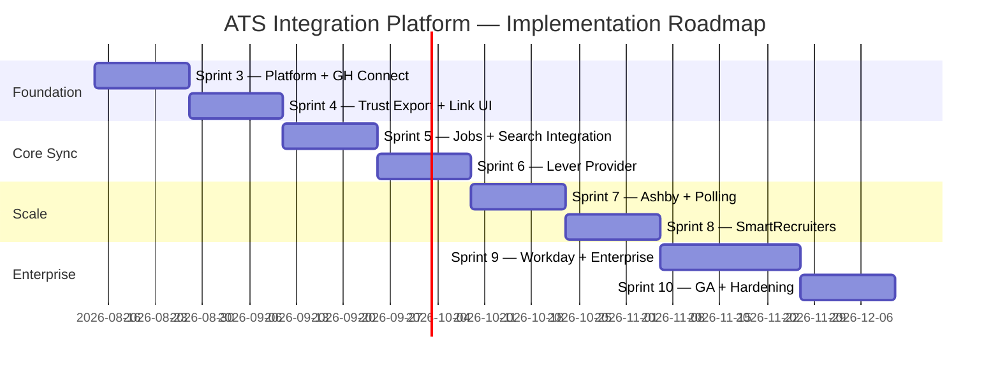
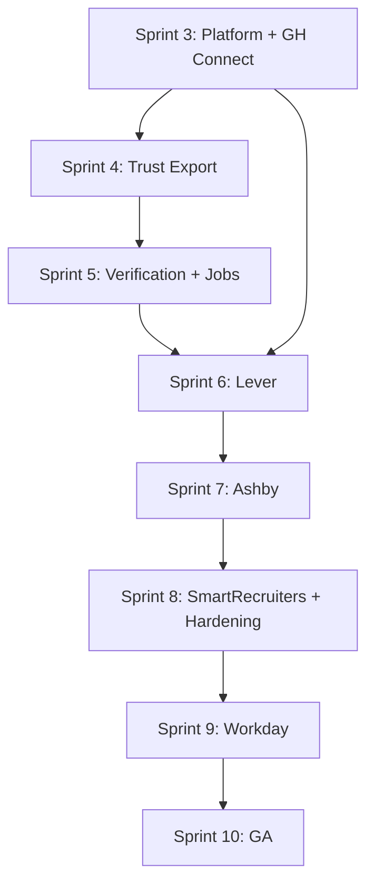

# 14 — Implementation Roadmap

> **Sprint:** Operation Greenhouse — Sprint 2 (Design Only)  
> **Last updated:** 2026-08-07  
> **Starting point:** Sprint 3 (first implementation sprint)

---

## Roadmap Overview

---

## Sprint 3 — Platform Foundation + Greenhouse Connect

**Duration:** 2 weeks  
**Theme:** Build the platform skeleton and connect Greenhouse

### Objectives
- Create all `ats_*` database tables (additive migrations)
- Implement core platform services (OAuth, Webhook, Event Bus, Logging)
- Implement `GreenhouseAdapter` (connect, disconnect, healthCheck, verifyWebhook)
- Build connection wizard UI
- Register and receive first Greenhouse webhook

### Deliverables

| Deliverable | Type |
|-------------|------|
| DB migrations 1–5 (all ats_* tables + RLS) | Migration |
| `lib/integrations/platform/` | Code |
| `lib/integrations/providers/base/AtsProvider.ts` | Code |
| `lib/integrations/providers/greenhouse/` | Code |
| `lib/integrations/services/oauth/OAuthService.ts` | Code |
| `lib/integrations/services/webhooks/WebhookService.ts` | Code |
| `lib/integrations/services/events/EventBus.ts` | Code |
| `lib/integrations/services/logging/IntegrationLogger.ts` | Code |
| `POST /api/integrations/v1/connect/greenhouse` | API |
| `GET /api/integrations/v1/connect/greenhouse/callback` | API |
| `DELETE /api/integrations/v1/disconnect/greenhouse` | API |
| `GET /api/integrations/v1/status` | API |
| `POST /api/integrations/v1/webhooks/greenhouse` | API |
| `GET /api/integrations/v1/providers` | API |
| `/employer/settings/integrations` (hub page) | UI |
| `/employer/settings/integrations/greenhouse/setup` (wizard) | UI |
| `tests/integrations/providers/greenhouse/` | Tests |
| Add "Integrations" link to employer settings | UI (additive) |

### Testing
- [ ] OAuth flow end-to-end with Greenhouse sandbox
- [ ] Webhook signature verification (valid + invalid)
- [ ] Webhook deduplication
- [ ] Token encryption/decryption round-trip
- [ ] Cross-employer isolation (employer A cannot access employer B's connection)
- [ ] Non-owner cannot connect/disconnect
- [ ] Contract test suite passes for GreenhouseAdapter

### Risks
| Risk | Mitigation |
|------|-----------|
| Greenhouse OAuth credentials not ready | Use MockAtsAdapter for CI; GH sandbox for staging |
| Token encryption key not in Vercel env | Block deploy until key configured |
| Webhook URL not reachable in dev | Use ngrok/staging for webhook testing |

### Rollback Plan
- Feature flag: `feature_flags.integrations_enabled = false` hides UI
- Disable webhook endpoint (return 503)
- No existing functionality affected — pure additive

---

## Sprint 4 — Trust Export + Candidate Linking

**Duration:** 2 weeks  
**Theme:** Export trust scores and link candidates

### Objectives
- Implement Sync Engine (TrustExportService, CandidateSyncService)
- Export trust scores to Greenhouse custom fields
- Email-based auto-linking on candidate_created webhook
- Manual candidate link UI
- Sync dashboard and health dashboard

### Deliverables

| Deliverable | Type |
|-------------|------|
| `lib/integrations/services/sync/SyncEngine.ts` | Code |
| `lib/integrations/services/sync/TrustExportService.ts` | Code |
| `lib/integrations/services/sync/CandidateSyncService.ts` | Code |
| `lib/integrations/services/retry/RetryService.ts` | Code |
| `lib/integrations/workers/WebhookWorker.ts` | Code |
| `lib/integrations/workers/ExportWorker.ts` | Code |
| `POST /api/integrations/v1/candidates/{profileId}/link` | API |
| `POST /api/integrations/v1/candidates/{profileId}/export` | API |
| `GET /api/integrations/v1/candidates` | API |
| `GET /api/integrations/v1/sync` | API |
| `GET /api/integrations/v1/health` | API |
| `POST /api/cron/ats-process-events` | Cron |
| `POST /api/cron/ats-trust-export` | Cron |
| `POST /api/cron/ats-refresh-tokens` | Cron |
| `/employer/settings/integrations/greenhouse` (detail page) | UI |
| `/employer/settings/integrations/sync` (sync dashboard) | UI |
| `/employer/settings/integrations/health` (health dashboard) | UI |
| Employer notification types (5 new) | DB + code |

### Testing
- [ ] Trust score export to Greenhouse sandbox custom fields
- [ ] Email auto-link (single match, no match, ambiguous)
- [ ] Manual link flow
- [ ] Trust export cron (changed scores only)
- [ ] Retry on provider 429/5xx
- [ ] DLQ on mapping error
- [ ] Sync log written for every operation

### Risks
| Risk | Mitigation |
|------|-----------|
| Trust score read breaks if trust engine changes | Read-only via trust_scores table; contract test |
| Email match false positives | Require single exact match; ambiguous → manual |
| Greenhouse custom field setup required | Document required custom fields; validate on connect |

### Rollback Plan
- Disable cron jobs (stop trust export)
- Webhook processing continues (link only, no export)
- Feature flag: `integrations.trust_export_enabled = false`

---

## Sprint 5 — Verification Export + Job Sync + Search Integration

**Duration:** 2 weeks  
**Theme:** Complete core sync + employer search integration

### Objectives
- Export verification status to Greenhouse
- Job sync (inbound from Greenhouse)
- Application status sync
- Greenhouse applicants tab in employer search
- Candidate link panel on candidate profile viewer

### Deliverables

| Deliverable | Type |
|-------------|------|
| `lib/integrations/services/sync/VerificationExportService.ts` | Code |
| `lib/integrations/services/sync/JobSyncService.ts` | Code |
| `lib/integrations/workers/SyncWorker.ts` | Code |
| `POST /api/cron/ats-verification-export` | Cron |
| `POST /api/cron/ats-candidate-sync` | Cron |
| `POST /api/cron/ats-job-sync` | Cron |
| `GET /api/integrations/v1/jobs` | API |
| `CandidateLinkPanel` on candidate profile viewer | UI (additive) |
| Greenhouse filter tab in EmployerSearchClient | UI (additive) |
| Pending links management UI | UI |

### Testing
- [ ] Verification export to Greenhouse notes/custom fields
- [ ] Job sync (inbound, location country/state only)
- [ ] Application status update on webhook
- [ ] Search integration tab shows GH-linked candidates
- [ ] CandidateLinkPanel shows correct link status

### Risks
| Risk | Mitigation |
|------|-----------|
| Location data in GH jobs (city/zip) | Strip to country/state in mapper |
| Search integration breaks existing search | Additive tab only; existing search unchanged |
| Candidate profile viewer regression | Additive panel only; no existing code modified |

### Rollback Plan
- Disable job sync cron
- Remove search tab (feature flag)
- Verification export continues independently

---

## Sprint 6 — Lever Provider

**Duration:** 2 weeks  
**Theme:** Validate provider abstraction with second provider

### Objectives
- Implement `LeverAdapter` implementing full `AtsProvider` interface
- Register Lever in ProviderRegistry
- Enable Lever in IntegrationsHub UI
- Validate no platform changes needed

### Deliverables

| Deliverable | Type |
|-------------|------|
| `lib/integrations/providers/lever/` | Code |
| `POST /api/integrations/v1/webhooks/lever` | API |
| Lever ProviderCard in IntegrationsHub | UI |
| Lever contract test suite | Tests |

### Testing
- [ ] Lever OAuth flow
- [ ] Lever webhook processing
- [ ] Trust export to Lever custom fields
- [ ] Platform unchanged — Greenhouse still works

### Risks
| Risk | Mitigation |
|------|-----------|
| Lever API differs enough to require platform changes | Document changes needed; minimize scope |
| Lever sandbox access | Apply for sandbox early in sprint |

### Rollback Plan
- Disable Lever in ProviderRegistry (status: coming_soon)
- Greenhouse unaffected

---

## Sprint 7 — Ashby Provider + Polling Support

**Duration:** 2 weeks  
**Theme:** API key auth + polling-based sync

### Objectives
- Implement `AshbyAdapter` with dual auth (API key + OAuth)
- Add polling-based sync to Sync Engine (for providers without webhooks)
- Enable Ashby in UI

### Deliverables

| Deliverable | Type |
|-------------|------|
| `lib/integrations/providers/ashby/` | Code |
| Polling sync in SyncEngine | Code |
| API key auth in OAuthService | Code |
| Ashby ProviderCard | UI |

### Testing
- [ ] Ashby API key connect flow
- [ ] Polling sync (cron-based candidate pull)
- [ ] Ashby webhook processing

---

## Sprint 8 — SmartRecruiters + Platform Hardening

**Duration:** 2 weeks  
**Theme:** Fourth provider + production hardening

### Objectives
- Implement SmartRecruiters adapter
- Admin integration dashboard (`/admin/integrations`)
- Performance optimization (batch trust export)
- Security review and penetration test

### Deliverables

| Deliverable | Type |
|-------------|------|
| `lib/integrations/providers/smartrecruiters/` | Code |
| `/admin/integrations` dashboard | UI |
| Batch trust export optimization | Code |
| Security review report | Doc |
| Load test results | Doc |

---

## Sprint 9 — Workday + Enterprise Multi-Tenant

**Duration:** 3 weeks  
**Theme:** Enterprise provider + org-level connections

### Objectives
- Workday adapter (tenant-specific config)
- Enterprise org-level ATS connections
- Bulk trust export for enterprise roster

---

## Sprint 10 — GA + Documentation

**Duration:** 2 weeks  
**Theme:** General availability

### Objectives
- Public documentation for integration setup
- GA launch for Greenhouse, Lever, Ashby
- Customer success playbook
- SLA definition for sync operations

---

## Cross-Sprint Dependencies

---

## Definition of Done (All Sprints)

- [ ] All new code in `lib/integrations/` or `app/api/integrations/`
- [ ] Zero modifications to existing production code paths
- [ ] Unit tests for all new services
- [ ] Integration tests with provider sandbox
- [ ] Security checklist passed (see [11-security.md](./11-security.md))
- [ ] Monitoring metrics emitting
- [ ] Employer UI uses Wv* design system
- [ ] Documentation updated
- [ ] Feature flag in place for rollback

---

## Related Documents

- [13-provider-roadmap.md](./13-provider-roadmap.md)
- [15-architecture-review.md](./15-architecture-review.md)
- [docs/architecture/greenhouse-readiness-score.md](../architecture/greenhouse-readiness-score.md)
