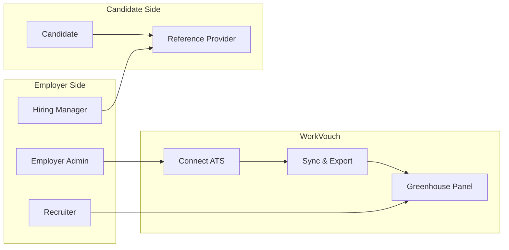
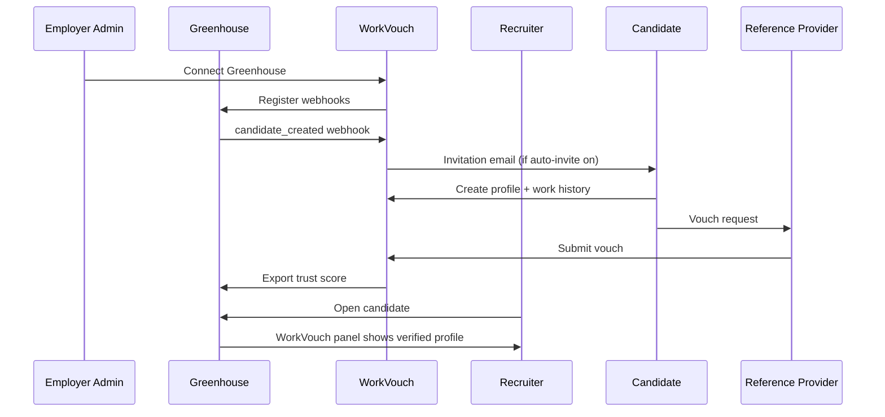

# 01 — User Journeys

> **Sprint:** Operation Greenhouse — Sprint 2.5 (Product Design)  
> **Last updated:** 2026-08-07  
> **Status:** Product blueprint — no implementation

---

## Journey Map Overview



---

## 1. Recruiter

### Goals
- Evaluate candidate trust without leaving Greenhouse
- Understand verification status in seconds
- Avoid duplicate data entry
- Make confident hire/no-hire decisions faster

### Pain Points (Today)
- Trust data lives outside ATS — context switching kills momentum
- No single view of employment verification + peer vouches
- Manual LinkedIn/background checks are slow and inconsistent
- Unclear what "verified" actually means

### Primary Journey: Evaluate Candidate in Greenhouse

| Step | Action | System Response | UI |
|------|--------|-----------------|-----|
| 1 | Opens candidate in Greenhouse | WorkVouch panel loads in sidebar | Skeleton → Status Card |
| 2 | Sees trust score + band | Score, band label, last synced | Trust Score widget |
| 3 | Expands employment timeline | Verified roles with dates | Timeline panel |
| 4 | Reads AI summary | 3-sentence recruiter brief | AI Summary card |
| 5 | Clicks "View full profile" | Opens WorkVouch in new tab (optional) | External link |
| 6 | Moves candidate to next stage | Status syncs to GH custom field | Background — no action needed |

**Success state:** Recruiter decides in <60 seconds with confidence. No tab switching required.

**Failure state:** Panel shows "Not linked" — one-click link by email or manual search.

**Recovery flow:**
```
Not linked → "Link this candidate" → Email pre-filled from GH → Match found → Panel populates
Not linked → No match → "Invite to WorkVouch" → Email sent → Track invitation status
OAuth expired → "Reconnect Greenhouse" banner → Admin notified → Panel shows cached data + stale badge
```

### Secondary Journey: Request Verification from GH

| Step | Action | System Response |
|------|--------|-----------------|
| 1 | Clicks "Request verification" in panel | Modal: confirm candidate email |
| 2 | Confirms | Verification request sent via WorkVouch |
| 3 | — | Candidate receives email |
| 4 | Returns later | Panel shows "Verification pending" |
| 5 | Candidate completes | Panel updates to "Verified" + trust score refresh |

---

## 2. Employer Admin

### Goals
- Connect Greenhouse once, never think about it again
- Control what syncs and when
- Monitor integration health
- Manage team access to integration settings

### Pain Points
- ATS integrations are notoriously fragile
- Unclear what data flows where
- Fear of breaking existing workflows
- No visibility when sync fails silently

### Primary Journey: Connect Greenhouse

| Step | Action | System Response |
|------|--------|-----------------|
| 1 | Navigates to Settings → Integrations | Integrations hub with provider cards |
| 2 | Clicks "Connect Greenhouse" | Connection wizard Step 1: overview |
| 3 | Clicks "Continue to Greenhouse" | Redirect to GH OAuth |
| 4 | Authorizes WorkVouch | Redirect back — "Connected!" |
| 5 | Chooses automation settings | Toggle: auto-invite, auto-export, job filters |
| 6 | Saves settings | Initial sync queued — progress bar |
| 7 | Views sync dashboard | 47 candidates linked, 3 pending |

**Success state:** Connected in <5 minutes. First trust scores exported within 15 minutes.

**Failure state:** OAuth denied → "Authorization cancelled" with retry button.

**Recovery flow:**
```
OAuth denied → Retry connect
Token expired → Red badge + email to admin + "Reconnect" CTA
Webhook failure → Health dashboard alert + auto-retry + admin email after 3 failures
```

### Secondary Journey: Monitor Integration Health

| Step | Action | System Response |
|------|--------|-----------------|
| 1 | Opens Integrations → Health | Connection status, 24h metrics |
| 2 | Sees 2 DLQ items | Error dashboard with details |
| 3 | Clicks "Replay" on failed export | Event re-queued |
| 4 | Confirms success | DLQ count → 0 |

---

## 3. Hiring Manager

### Goals
- Quickly vouch for or verify a former employee
- Minimal friction — complete in <3 minutes
- Understand why they're being asked

### Pain Points
- Reference requests feel like spam
- Unclear what's expected
- No visibility into impact on candidate

### Primary Journey: Respond to Vouch Request

| Step | Action | System Response |
|------|--------|-----------------|
| 1 | Receives email: "Alex asked you to vouch" | Clear subject, candidate name, company |
| 2 | Clicks link | Landing page — no login required initially |
| 3 | Confirms identity | "Were you Alex's manager at Acme Corp?" |
| 4 | Rates 4 dimensions | Reliability, teamwork, leadership, overall |
| 5 | Adds optional comment | Free text |
| 6 | Submits | Confirmation: "Your vouch strengthens Alex's profile" |

**Success state:** Completed in <3 minutes. Candidate notified. Trust score updated.

**Failure state:** Link expired → "Request a new link" form.

**Recovery flow:** See [05-reference-provider-experience.md](./05-reference-provider-experience.md)

---

## 4. Candidate

### Goals
- Build a verified professional profile
- Get credit for verified work history
- Understand trust score and how to improve it
- Complete verification with minimal effort

### Pain Points
- Multiple platforms asking for same employment data
- Unclear why verification matters
- Reference requests feel awkward to send

### Primary Journey: Invitation → Verified Profile

| Step | Action | System Response |
|------|--------|-----------------|
| 1 | Receives invitation email | "Your employer uses WorkVouch for verified hiring" |
| 2 | Clicks "Get verified" | Branded landing page |
| 3 | Creates account (or logs in) | Email match pre-fills profile |
| 4 | Adds work history | Dates, company, title |
| 5 | Invites manager/coworker | Email invite sent |
| 6 | Manager vouches | Notification: "Sarah vouched for you!" |
| 7 | Views trust score | Score increases — celebration moment |
| 8 | Profile synced to Greenhouse | Recruiter sees verified badge in GH |

**Success state:** Verified profile in <24 hours. Trust score visible to recruiters.

**Failure state:** Abandons at step 4 → Reminder email at 24h, 72h, 7d.

**Recovery flow:** See [04-candidate-experience.md](./04-candidate-experience.md)

---

## 5. Reference Provider (Manager / Coworker)

### Goals
- Respond quickly without creating an account (if possible)
- Understand the candidate's request context
- Know their vouch is meaningful

### Primary Journey: See [05-reference-provider-experience.md](./05-reference-provider-experience.md)

**Success state:** Vouch submitted in <3 minutes.

**Failure state:** Expired link → Request new link flow.

---

## 6. System Administrator (WorkVouch Admin)

### Goals
- Monitor platform-wide integration health
- Resolve DLQ items and connection failures
- Support employer admins with integration issues
- No PII exposure in admin tools

### Primary Journey: Resolve Integration Failure

| Step | Action | System Response |
|------|--------|-----------------|
| 1 | Receives admin alert: DLQ spike | Alert in `/admin/alerts` |
| 2 | Opens `/admin/integrations` | Platform metrics dashboard |
| 3 | Filters DLQ by provider | List of failed events |
| 4 | Inspects failure reason | "Token expired for employer X" |
| 5 | Contacts employer OR replays after reconnect | Event replayed |
| 6 | Confirms resolution | DLQ count decreases |

**Success state:** Issue resolved without candidate/recruiter impact.

---

## Cross-Journey Dependencies



---

## Related Documents

- [02-recruiter-experience.md](./02-recruiter-experience.md)
- [03-employer-experience.md](./03-employer-experience.md)
- [04-candidate-experience.md](./04-candidate-experience.md)
- [14-product-principles.md](./14-product-principles.md)
