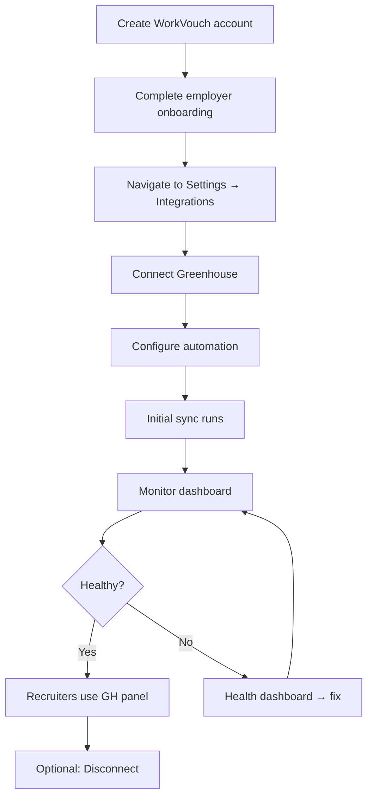

# 03 — Employer Experience

> **Sprint:** Operation Greenhouse — Sprint 2.5 (Product Design)  
> **Last updated:** 2026-08-07

---

## End-to-End Employer Journey



---

## Screen 1: Create WorkVouch Account

**Route:** `/signup/employer`  
**Existing screen — no changes to flow**

| Element | Copy |
|---------|------|
| Headline | "Hire with verified trust" |
| CTA | "Create employer account" |
| Post-signup | Redirect to employer onboarding |

**Success:** Account created → onboarding wizard  
**Failure:** Email already exists → login prompt

---

## Screen 2: Employer Onboarding (Existing + Integration Teaser)

**Route:** `/employer/onboarding/start`

At completion, show integration teaser:

```
┌─────────────────────────────────────────────────┐
│  ✓ Company profile complete                     │
│                                                 │
│  Next: Connect your ATS                         │
│  Export trust scores directly to Greenhouse     │
│  [Connect Greenhouse now]  [Skip for now]       │
└─────────────────────────────────────────────────┘
```

**Skip:** Lands on `/employer/dashboard` with integration CTA card  
**Connect:** → Screen 3

---

## Screen 3: Integrations Hub

**Route:** `/employer/settings/integrations`

```
┌─────────────────────────────────────────────────────────────┐
│  Settings  ›  Integrations                                  │
│                                                             │
│  Connect your ATS to sync candidates and export trust       │
│  scores automatically.                                      │
│                                                             │
│  ┌─────────────────────┐  ┌─────────────────────┐          │
│  │ [GH logo]           │  │ [Lever logo]        │          │
│  │ Greenhouse          │  │ Lever               │          │
│  │ ○ Not connected     │  │ Coming soon         │          │
│  │                     │  │                     │          │
│  │ [Connect]           │  │ [Notify me]         │          │
│  └─────────────────────┘  └─────────────────────┘          │
│                                                             │
│  Why connect?                                               │
│  • Trust scores appear in Greenhouse automatically          │
│  • Candidates linked by email — no manual work              │
│  • Verification status synced to custom fields                │
└─────────────────────────────────────────────────────────────┘
```

---

## Screen 4: Connection Wizard — Overview

**Route:** `/employer/settings/integrations/greenhouse/setup`

**Step 1 of 3: Overview**

```
┌─────────────────────────────────────────────────────────────┐
│  Connect Greenhouse                          Step 1 of 3      │
│                                                             │
│  WorkVouch will:                                            │
│  ✓ Export trust scores to candidate profiles               │
│  ✓ Export verification status                               │
│  ✓ Link candidates by email automatically                   │
│  ✓ Sync when candidates are added to Greenhouse             │
│                                                             │
│  WorkVouch will NOT:                                        │
│  ✗ Modify your Greenhouse data without permission           │
│  ✗ Share vouch text content with recruiters                 │
│  ✗ Access candidates outside your Greenhouse account        │
│                                                             │
│  [Continue to Greenhouse →]                                 │
│  [Cancel]                                                   │
└─────────────────────────────────────────────────────────────┘
```

**Click "Continue":** Redirect to Greenhouse OAuth (Screen 5)

---

## Screen 5: Greenhouse OAuth (External)

**Location:** Greenhouse authorization page  
**User action:** Authorize WorkVouch  
**On success:** Redirect to Screen 6  
**On deny:** Redirect to Screen 5b (Cancelled)

### Screen 5b: Authorization Cancelled

```
┌─────────────────────────────────────────────────────────────┐
│  Connection cancelled                                       │
│                                                             │
│  You declined authorization. WorkVouch cannot sync          │
│  without access to your Greenhouse account.                 │
│                                                             │
│  [Try again]  [Back to integrations]                        │
└─────────────────────────────────────────────────────────────┘
```

---

## Screen 6: Connection Wizard — Automation Settings

**Route:** `/employer/settings/integrations/greenhouse/setup?step=2`  
**Step 2 of 3: Automation**

```
┌─────────────────────────────────────────────────────────────┐
│  Configure automation                        Step 2 of 3      │
│  ✓ Connected to Greenhouse · Acme Corp                      │
│                                                             │
│  Trust score export                                         │
│  ☑ Automatically export trust scores to Greenhouse          │
│  ☑ Export when score changes                                │
│                                                             │
│  Candidate linking                                          │
│  ☑ Auto-link candidates by email                            │
│  ☐ Auto-invite unlinked candidates to WorkVouch            │
│                                                             │
│  When to auto-invite (if enabled):                          │
│  ○ When added to any job                                    │
│  ● Only after Final Interview stage                           │
│  ○ Only after Offer stage                                   │
│                                                             │
│  Job filters (optional)                                     │
│  [All jobs ▾]  or  [Select specific jobs...]                │
│                                                             │
│  [Save and run initial sync →]                              │
└─────────────────────────────────────────────────────────────┘
```

See [10-settings-and-automation.md](./10-settings-and-automation.md) for full automation spec.

---

## Screen 7: Connection Wizard — Initial Sync

**Step 3 of 3: Syncing**

```
┌─────────────────────────────────────────────────────────────┐
│  Running initial sync                        Step 3 of 3      │
│                                                             │
│  ████████████░░░░░░░░  62%                                  │
│                                                             │
│  ✓ Webhooks registered                                      │
│  ✓ 47 candidates found in Greenhouse                        │
│  ⏳ Linking candidates by email... (29/47)                  │
│  ○ Exporting trust scores                                   │
│                                                             │
│  This may take a few minutes. You can leave this page.      │
└─────────────────────────────────────────────────────────────┘
```

**On complete:**

```
┌─────────────────────────────────────────────────────────────┐
│  ✓ Greenhouse connected!                                    │
│                                                             │
│  29 candidates linked automatically                         │
│  12 pending manual link                                     │
│  6 no WorkVouch profile (invitations available)             │
│  Trust scores exported for 29 linked candidates             │
│                                                             │
│  [View integration dashboard]  [Invite unlinked candidates] │
└─────────────────────────────────────────────────────────────┘
```

---

## Screen 8: Integration Dashboard (Connected State)

**Route:** `/employer/settings/integrations/greenhouse`

**Tabs:** Overview | Candidates | Sync Log | Settings

### Overview Tab

```
┌─────────────────────────────────────────────────────────────┐
│  ← Integrations    Greenhouse    ● Connected    [Disconnect]│
│  Acme Corp · Last sync 2 minutes ago                        │
│                                                             │
│  [Sync now]                                                 │
│                                                             │
│  ┌──────────┐ ┌──────────┐ ┌──────────┐ ┌──────────┐       │
│  │ 47       │ │ 29       │ │ 12       │ │ 98.2%    │       │
│  │ Linked   │ │ Auto-    │ │ Pending  │ │ Success  │       │
│  │          │ │ linked   │ │ link     │ │ rate 24h │       │
│  └──────────┘ └──────────┘ └──────────┘ └──────────┘       │
│                                                             │
│  Recent activity                                            │
│  ✓ Trust exported · Jane Smith · 2m ago                    │
│  ✓ Auto-linked · john@example.com · 1h ago                 │
│  ⚠ Pending link · sarah@example.com · 3h ago [Link now]    │
└─────────────────────────────────────────────────────────────┘
```

---

## Screen 9: Monitor — Health Dashboard

**Route:** `/employer/settings/integrations/health`

See [08-notification-system.md](./08-notification-system.md) for alert integration.

---

## Screen 10: Disconnect Flow

**Trigger:** Click "Disconnect" on integration dashboard

```
┌─────────────────────────────────────────────────────────────┐
│  Disconnect Greenhouse?                                     │
│                                                             │
│  This will:                                                 │
│  • Stop automatic trust score exports                       │
│  • Revoke WorkVouch's access to your Greenhouse account     │
│  • Preserve sync history for your records                   │
│                                                             │
│  Candidate links will be preserved but inactive.              │
│  Recruiters will no longer see WorkVouch data in Greenhouse.│
│                                                             │
│  [Cancel]  [Disconnect Greenhouse]                          │
└─────────────────────────────────────────────────────────────┘
```

**On confirm:**
```
✓ Greenhouse disconnected.
Sync history preserved. [View history] [Reconnect]
```

---

## Employer Experience Metrics (Target)

| Metric | Target |
|--------|--------|
| Time to connect | <5 minutes |
| Initial sync completion | <10 minutes |
| Auto-link rate | >70% of candidates |
| Admin actions after setup | <1 per week |
| Time to recover from error | <2 minutes |

---

## Related Documents

- [10-settings-and-automation.md](./10-settings-and-automation.md)
- [12-error-handling.md](./12-error-handling.md)
- [docs/integrations/10-ui-specification.md](../integrations/10-ui-specification.md)
