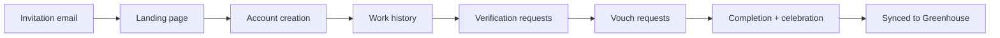

# 04 — Candidate Experience

> **Sprint:** Operation Greenhouse — Sprint 2.5 (Product Design)  
> **Last updated:** 2026-08-07

---

## Journey Overview



---

## 1. Invitation Email

**Trigger:** Employer auto-invite OR recruiter manual invite OR Greenhouse webhook auto-link failed

**Subject lines (A/B tested):**
- Primary: `{Company} uses WorkVouch to verify your professional background`
- Alt: `Get verified — stand out to {Company} recruiters`

```
┌─────────────────────────────────────────────────────────────┐
│  [WorkVouch logo]                                           │
│                                                             │
│  Hi Jane,                                                   │
│                                                             │
│  Acme Corp uses WorkVouch to verify candidate backgrounds   │
│  during hiring. A verified profile helps recruiters see     │
│  your real work history and trust score.                    │
│                                                             │
│  It takes about 10 minutes.                                 │
│                                                             │
│  [Get verified →]                                           │
│                                                             │
│  ─────────────────────────────────────────────────────────  │
│  Why am I receiving this? Acme Corp invited you as part     │
│  of their hiring process. Your data is private until you    │
│  choose to share it. [Privacy policy]                       │
└─────────────────────────────────────────────────────────────┘
```

**From:** `verify@workvouch.com`  
**Reply-to:** no-reply  
**Link expires:** 30 days

---

## 2. Landing Page

**Route:** `/invite/{token}` or `/vouch/{token}`

```
┌─────────────────────────────────────────────────────────────┐
│  [WorkVouch]                                                │
│                                                             │
│  Get verified for your application at Acme Corp             │
│                                                             │
│  ✓ Verify your work history                                 │
│  ✓ Get vouches from former managers and coworkers           │
│  ✓ Build a trust score recruiters can see                   │
│                                                             │
│  jane@example.com  (pre-filled, read-only)                  │
│                                                             │
│  [Create my verified profile →]                             │
│                                                             │
│  Already have an account? [Sign in]                         │
└─────────────────────────────────────────────────────────────┘
```

**Mobile:** Single column, large CTA button (min 48px height)

---

## 3. Account Creation

**Route:** `/signup` (pre-filled email from invite token)

| Field | Behavior |
|-------|----------|
| Email | Pre-filled from invite, read-only |
| Password | Required |
| Full name | Pre-filled from Greenhouse if available |

**Success:** → Work history onboarding  
**Failure:** Email already registered → "Sign in to continue" with redirect

---

## 4. Work History

**Route:** `/my-jobs` or onboarding step

```
┌─────────────────────────────────────────────────────────────┐
│  Add your work history                          Step 2 of 4 │
│                                                             │
│  Add accurate employment dates so WorkVouch can identify    │
│  coworkers who worked with you.                             │
│                                                             │
│  ┌─────────────────────────────────────────────────────┐   │
│  │ Acme Corp · Senior Engineer                         │   │
│  │ Jan 2020 – Present  [Edit]                          │   │
│  └─────────────────────────────────────────────────────┘   │
│  (Pre-filled if imported from resume or GH sync)            │
│                                                             │
│  [+ Add another role]                                       │
│                                                             │
│  [Continue →]                                               │
└─────────────────────────────────────────────────────────────┘
```

**Empty state:** Uses canonical copy from enterprise copy pass.

---

## 5. Employment Verification

**Route:** `/verify/request`

```
┌─────────────────────────────────────────────────────────────┐
│  Request employment verification                Step 3 of 4   │
│                                                             │
│  Invite a manager or HR contact to confirm you worked       │
│  at Acme Corp. Verified employment strengthens your         │
│  trust score.                                               │
│                                                             │
│  Manager email: [________________________]                  │
│  Their name:    [________________________]                  │
│  Company:       Acme Corp (pre-filled)                      │
│                                                             │
│  [Send verification request]                                │
│  [Skip for now]                                             │
└─────────────────────────────────────────────────────────────┘
```

---

## 6. Vouch Requests (Coworker)

**Route:** `/coworker-matches`

```
┌─────────────────────────────────────────────────────────────┐
│  Find coworkers to vouch for you                Step 4 of 4   │
│                                                             │
│  We found 3 potential coworkers from Acme Corp:             │
│                                                             │
│  ┌─────────────────────────────────────────────────────┐   │
│  │ Sarah Chen · Product Manager · Overlap: 2 years      │   │
│  │ [Request vouch]                                      │   │
│  └─────────────────────────────────────────────────────┘   │
│                                                             │
│  [Finish setup →]                                           │
└─────────────────────────────────────────────────────────────┘
```

---

## 7. Completion Screen + Celebration

**Route:** `/onboarding/complete` or dashboard first visit

```
┌─────────────────────────────────────────────────────────────┐
│                    ✓ Profile started!                         │
│                                                             │
│              Your Trust Score                               │
│              ┌────────┐                                     │
│              │   52   │  Moderate                           │
│              └────────┘                                     │
│                                                             │
│  What's next:                                               │
│  ○ Employment verification (pending — Sarah notified)       │
│  ○ 1 vouch request sent (waiting for response)              │
│                                                             │
│  Your score will increase as verifications complete.        │
│  Acme Corp recruiters will see updates in Greenhouse.       │
│                                                             │
│  [View my profile]  [Share on LinkedIn]                     │
└─────────────────────────────────────────────────────────────┘
```

**Celebration:** Subtle confetti animation on first score display. Trust score animates from 0 to current value.

---

## 8. Reminder Flow

| Timing | Channel | Message |
|--------|---------|---------|
| 24h after invite, no account | Email | "Your verification invite is waiting" |
| 72h after invite, no account | Email | "Complete your profile in 10 minutes" |
| 7d after invite, no account | Email | Final reminder — then stop |
| 48h after vouch request, no response | Email to reference | "Reminder: Alex requested your vouch" |
| 7d after vouch request | Email to reference | Final reminder |
| Trust score increased | In-app + email | "Your trust score increased to 78!" |

**Max reminders:** 3 per flow. Never more.

---

## 9. Success Celebration Moments

| Moment | Celebration |
|--------|-------------|
| First vouch received | "Sarah vouched for you! +8 trust score" |
| Employment verified | "Acme Corp verified your employment! +15 trust score" |
| Score crosses band threshold | "You're now Strong! (was Moderate)" |
| Profile 100% complete | Badge: "Complete profile" |
| Synced to Greenhouse | "Recruiters at Acme Corp can now see your verified profile" |

---

## Candidate Experience Metrics (Target)

| Metric | Target |
|--------|--------|
| Invite → account created | >40% within 7 days |
| Account → work history added | >80% |
| Work history → first vouch request | >60% |
| Time to complete onboarding | <10 minutes |
| Reminder → completion rate | >25% |

---

## Related Documents

- [05-reference-provider-experience.md](./05-reference-provider-experience.md)
- [08-notification-system.md](./08-notification-system.md)
- [09-status-system.md](./09-status-system.md)
