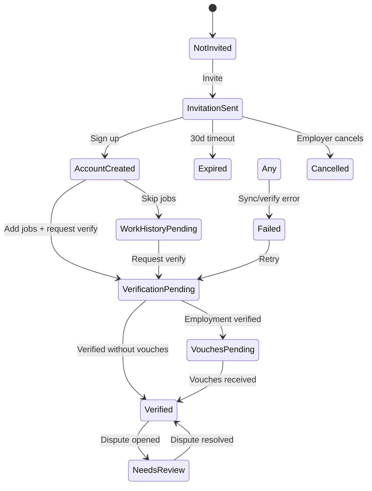

# 09 — Status System

> **Sprint:** Operation Greenhouse — Sprint 2.5 (Product Design)  
> **Last updated:** 2026-08-07

---

## Status Design System

Every status has: **Label · Color · Icon · Meaning · Allowed transitions**

Colors align with WorkVouch design system (`WvBadge` variants).

---

## Candidate / Profile Statuses

| Status | Color | Icon | Meaning |
|--------|-------|------|---------|
| **Not Invited** | Gray | ○ | No WorkVouch profile; not in system |
| **Invitation Sent** | Blue | ✉ | Invite email delivered, no account yet |
| **Account Created** | Blue | 👤 | Registered; profile incomplete |
| **Work History Pending** | Amber | 📋 | Account exists; no jobs added |
| **Verification Pending** | Amber | ⏳ | Verification request sent; awaiting response |
| **Vouches Pending** | Amber | 👥 | Vouch requests outstanding |
| **AI Processing** | Purple | ✦ | AI summary generating (transient) |
| **Verified** | Green | ✓ | ≥1 verified employment OR ≥2 vouches |
| **Needs Review** | Amber | ⚠ | Ambiguous link, dispute, or flag |
| **Rejected** | Red | ✗ | Candidate declined or reference declined employment |
| **Expired** | Gray | ⊘ | Invitation or verification link expired |
| **Cancelled** | Gray | — | Employer cancelled invitation |
| **Failed** | Red | ⚠ | Sync or verification failed |

---

## Status Transition Diagram

---

## Integration / Link Statuses

| Status | Color | Icon | GH Panel display |
|--------|-------|------|-----------------|
| **Not Linked** | Gray | ○ | "Not linked to WorkVouch" |
| **Pending Link** | Amber | ⏳ | "Manual link required" |
| **Auto Linked** | Green | ⚡ | "Linked automatically" |
| **Manual Linked** | Green | 🔗 | "Linked by recruiter" |
| **Sync Pending** | Blue | ↻ | "Syncing..." |
| **Synced** | Green | ✓ | "Synced 2m ago" |
| **Stale** | Amber | ⚠ | "Data may be outdated" |
| **Sync Failed** | Red | ✗ | "Sync failed — showing cached" |
| **Disconnected** | Gray | ⊘ | "Integration disconnected" |

---

## Connection Statuses (Employer)

| Status | Badge | Action |
|--------|-------|--------|
| **Not Connected** | Gray | Connect |
| **Pending** | Blue pulse | Wait |
| **Connected** | Green | Manage |
| **Token Expired** | Red | Reconnect |
| **Error** | Red | View error + Reconnect |
| **Disconnected** | Gray | Connect |

---

## Verification Statuses

| Status | Color | Meaning |
|--------|-------|---------|
| **None** | Gray | No verification requested |
| **Requested** | Blue | Email sent to verifier |
| **Pending** | Amber | Awaiting verifier response |
| **Verified** | Green | Confirmed by employer/manager |
| **Disputed** | Red | Candidate or employer disputed |
| **Declined** | Red | Verifier said "didn't work here" |
| **Expired** | Gray | Request link expired |

---

## Vouch Statuses

| Status | Color | Meaning |
|--------|-------|---------|
| **Not Requested** | Gray | No vouch requests sent |
| **Requested** | Blue | Email sent to reference |
| **Submitted** | Green | Vouch received |
| **Declined** | Gray | "Not the right person" |
| **Expired** | Gray | Link expired |

---

## Allowed Transitions (Integration)

| From | To | Trigger |
|------|-----|---------|
| Not Linked | Pending Link | GH webhook received, no email match |
| Not Linked | Auto Linked | GH webhook + email match |
| Pending Link | Manual Linked | Recruiter confirms link |
| Auto Linked | Synced | Trust export success |
| Synced | Stale | No sync >24h or token issue |
| Stale | Synced | Successful re-sync |
| Any | Sync Failed | Export error |
| Sync Failed | Synced | Retry success |
| Connected | Token Expired | Refresh failed |
| Token Expired | Connected | Reconnect |

---

## Status in Greenhouse Custom Fields

Export verification status as GH custom field:

| WorkVouch status | GH field value |
|------------------|----------------|
| Verified | `Verified` |
| Verification Pending | `Pending` |
| Not Linked | *(empty)* |
| Needs Review | `Needs Review` |

---

## Related Documents

- [02-recruiter-experience.md](./02-recruiter-experience.md)
- [06-workvouch-panel.md](./06-workvouch-panel.md)
- [12-error-handling.md](./12-error-handling.md)
