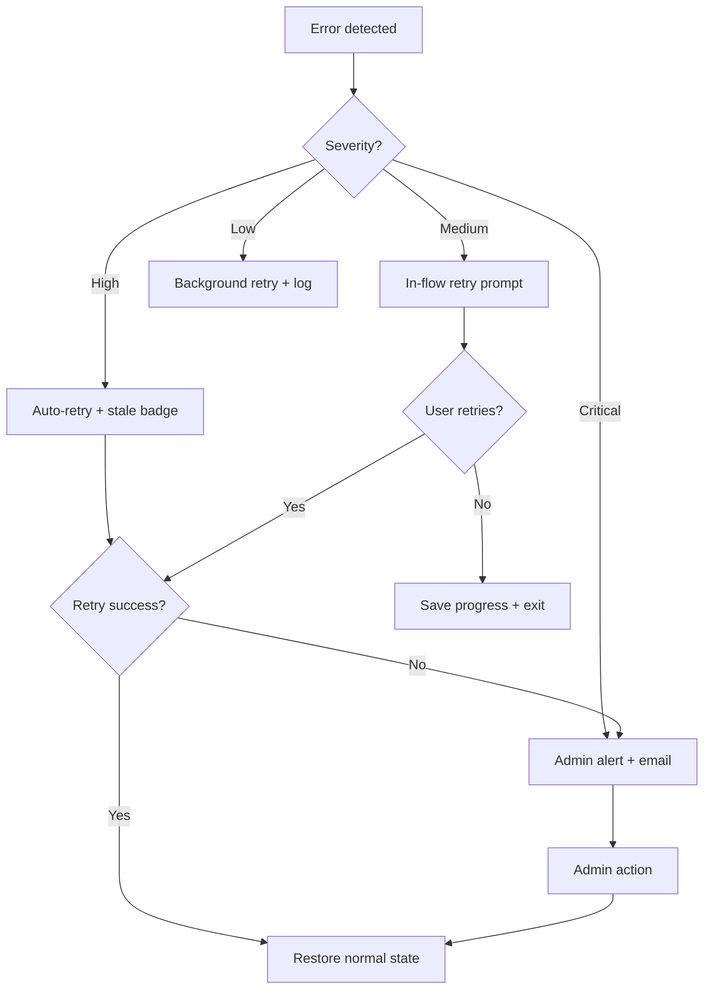

# 12 — Error Handling and Recovery UX

> **Sprint:** Operation Greenhouse — Sprint 2.5 (Product Design)  
> **Last updated:** 2026-08-07

---

## Error Design Principles

1. **Never block the recruiter** — Show cached data with stale badge
2. **Always explain what happened** — Plain language, no error codes to users
3. **Always offer a recovery action** — One-click fix when possible
4. **Fail silently for candidates** — Retry in background; notify only if persistent
5. **Escalate to admin for systemic issues** — DLQ, token expiry, webhook failures

---

## Error Catalog

### 1. Expired Links

**Scenarios:** Invitation link, verification link, vouch link expired

| Actor | Error state | Recovery |
|-------|-------------|----------|
| **Candidate** | "This invitation has expired. Contact your recruiter for a new invite." + [Request new invite] button (emails recruiter) | Recruiter re-invites from GH panel (1 click) |
| **Reference** | "This vouch request has expired. Ask {candidate} to send a new request." | Candidate resends from WorkVouch app |
| **Verifier** | "This verification link has expired." + [Request new link] (emails candidate to resend) | Candidate resends verification request |

**UI pattern:**
```
┌─────────────────────────┐
│  ⏰ Link expired         │
│                         │
│  This link is no longer  │
│  valid. Invitations      │
│  expire after 30 days.   │
│                         │
│  [Request new invite]    │
└─────────────────────────┘
```

---

### 2. Duplicate Candidates

**Scenario:** GH candidate email matches existing WorkVouch profile linked to different GH candidate

| Actor | Detection | Recovery |
|-------|-----------|----------|
| **System** | Email match but GH candidate ID differs | Flag as "Needs Review" |
| **Recruiter (panel)** | Amber banner: "Possible duplicate — review link" | [Confirm link] or [Unlink and re-link] |
| **Admin** | In-app notification | Manual review in integration dashboard |

**Panel state:**
```
┌─────────────────────────┐
│  ⚠ Needs Review          │
│  This email is linked to │
│  a different Greenhouse  │
│  candidate.              │
│  [Review link ↗]         │
└─────────────────────────┘
```

---

### 3. Invalid Email

**Scenario:** Candidate or reference email bounces

| Actor | Detection | Recovery |
|-------|-----------|----------|
| **System** | Email bounce webhook | Mark invite as Failed |
| **Recruiter (panel)** | Red badge: "Invitation failed — invalid email" | [Update email in Greenhouse] (link to GH candidate edit) |
| **Candidate** | N/A — never received invite | Recruiter fixes email in GH → re-invite |

---

### 4. Webhook Failure

**Scenario:** Greenhouse webhook delivery fails or WorkVouch rejects payload

| Actor | Detection | Recovery |
|-------|-----------|----------|
| **System** | Webhook DLQ after 3 retries | Admin alert |
| **Admin** | Health dashboard: "Webhook errors: 3 in last hour" | [View DLQ] → [Retry all] or [Dismiss] |
| **Recruiter** | No impact — panel shows last synced data | Automatic retry on next GH event |

**Admin DLQ view:**
```
Failed webhooks (3)
┌──────────────────────────────────────────┐
│ candidate.updated · Jane Doe · 2h ago    │
│ Error: Invalid payload format            │
│ [Retry] [Dismiss] [View payload]         │
├──────────────────────────────────────────┤
│ application.created · John Smith · 3h ago│
│ Error: Rate limit exceeded               │
│ [Retry] [Dismiss]                        │
└──────────────────────────────────────────┘
```

---

### 5. OAuth Expired

**Scenario:** Greenhouse OAuth token refresh fails

| Actor | Detection | Recovery |
|-------|-----------|----------|
| **System** | Token refresh returns 401 | Mark connection as Token Expired |
| **Admin** | Email + in-app: "Greenhouse session expired" | [Reconnect Greenhouse] (1-click OAuth) |
| **Recruiter (panel)** | Amber stale badge: "Integration paused — contact admin" | No recruiter action; admin must reconnect |

**Admin reconnect flow:**
```
┌─────────────────────────┐
│  ⚠ Connection expired    │
│                         │
│  Your Greenhouse session │
│  has expired. Reconnect  │
│  to resume syncing.       │
│                         │
│  [Reconnect Greenhouse]  │
│                         │
│  Last successful sync:   │
│  2 days ago              │
└─────────────────────────┘
```

**Post-reconnect:** Automatic catch-up sync for all stale candidates.

---

### 6. API Unavailable

**Scenario:** WorkVouch API or Greenhouse API returns 5xx

| Actor | Detection | Recovery |
|-------|-----------|----------|
| **Recruiter (panel)** | Loading → Error state after 10s | Show cached data + "Unable to refresh — showing data from {time}" |
| **Candidate** | Form submission fails | "Something went wrong. Your progress is saved. [Try again]" |
| **Reference** | Vouch submission fails | "Unable to submit. [Try again]" + auto-retry once |
| **Admin** | Health dashboard red | Automatic retry with exponential backoff |

**Panel degraded state:**
```
┌─────────────────────────┐
│  WorkVouch · ⚠ Stale     │
│  Unable to refresh       │
│  Showing data from 2h ago│
│  [Retry ↻]               │
├─────────────────────────┤
│  Trust Score: 78 Strong  │
│  (cached)                │
└─────────────────────────┘
```

---

### 7. Permission Denied

**Scenario:** GH user lacks permission to view WorkVouch panel or admin lacks integration access

| Actor | Error | Recovery |
|-------|-------|----------|
| **Recruiter** | "You don't have permission to view WorkVouch data for this candidate." | Contact admin to grant WorkVouch access in GH |
| **Admin** | "Only organization admins can manage integrations." | Contact WorkVouch org admin |
| **Candidate** | "This employer hasn't connected WorkVouch yet." | N/A — employer must connect |

---

### 8. Missing References

**Scenario:** Candidate has no vouches and no verified employment

| Actor | State | Recovery |
|-------|-------|----------|
| **Recruiter (panel)** | Trust score: "Insufficient data" (gray) | [Request verification] button prominent |
| **Candidate** | Dashboard coaching: "Add work history and request vouches to build your trust score" | Guided flow |

**Panel empty state:**
```
┌─────────────────────────┐
│  Trust Score             │
│  — Insufficient data     │
│                         │
│  No verified employment  │
│  or vouches yet.         │
│                         │
│  [Request verification]  │
│  [Send reminder to       │
│   candidate]             │
└─────────────────────────┘
```

---

### 9. Timeouts

**Scenario:** API call exceeds timeout threshold

| Context | Timeout | Behavior |
|---------|---------|----------|
| Panel load | 10s | Show cached + stale badge |
| AI summary | 5s | Show structured fallback |
| Form submission | 15s | "Taking longer than expected..." → retry prompt |
| Initial sync | 5min | Progress bar with "Syncing {n} of {total}..." |

---

### 10. Sync Failures

**Scenario:** Trust score export to GH custom field fails

| Actor | Detection | Recovery |
|-------|-----------|----------|
| **System** | Export API returns error | Retry 3x with backoff → DLQ |
| **Admin** | "Trust export failed for {n} candidates" | [Retry failed exports] |
| **Recruiter (panel)** | Sync badge: Red "Export failed" | Automatic retry; no recruiter action |

**Batch retry (admin):**
```
Failed exports (12)
[Retry all failed]  [Export all now]

Jane Doe · Trust: 78 · Failed 2h ago · Rate limit
John Smith · Trust: 65 · Failed 2h ago · Rate limit
...
```

---

## Error Severity Matrix

| Severity | User impact | Response time | Channel |
|----------|-------------|---------------|---------|
| **Critical** | Integration down | Immediate admin alert | Email + in-app |
| **High** | Recruiter sees stale data | <1 hour auto-retry | Panel badge |
| **Medium** | Candidate flow blocked | User-initiated retry | In-flow message |
| **Low** | Background sync delay | Automatic retry | Admin log only |

---

## Recovery Flow Summary



---

## Related Documents

- [08-notification-system.md](./08-notification-system.md)
- [09-status-system.md](./09-status-system.md)
- [06-workvouch-panel.md](./06-workvouch-panel.md)
