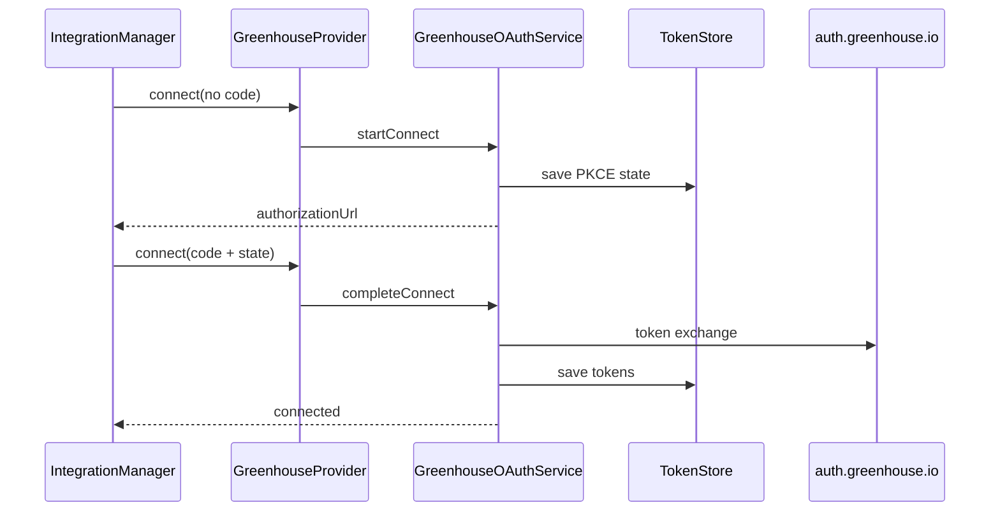

# Greenhouse Provider — Architecture

## Overview

Greenhouse is the first real ATS provider on the WorkVouch Integration Platform. Sprint 3B-1 delivers foundation only: OAuth, Harvest client, health checks, and registry integration.

## Layering

```
lib/integrations/providers/greenhouse/
├── provider.ts          # AtsProvider implementation
├── config/              # Manifest + env configuration
├── auth/                # OAuth (PKCE), token + state stores
├── api/                 # HTTP + Harvest client + error normalization
├── health/              # Provider-specific health evaluation
├── types/               # Greenhouse-only interfaces
├── fixtures/            # Test fixtures
└── client/              # Re-exports for Harvest client access
```

## Dependency Injection

`GreenhouseProvider` accepts optional dependencies:

- `config` — provider configuration
- `http` — `HttpClient` (default: `FetchHttpClient`)
- `tokenStore` — connection/token persistence
- `stateStore` — OAuth PKCE state
- `oauth`, `harvest`, `health` — service overrides

This enables full unit testing without network or database access.

## Platform Boundaries

| Layer | Responsibility |
|-------|----------------|
| Platform (`lib/integrations/`) | Registry, feature flags, health orchestration |
| Greenhouse provider | OAuth, Harvest API, provider health |
| WorkVouch core | Unchanged — no direct Greenhouse imports |

## Provider Isolation

All Greenhouse-specific logic lives under `providers/greenhouse/`. Another provider (e.g. Lever) can be added by copying the folder structure and replacing:

- OAuth endpoints and scopes
- API client and models
- Configuration env prefix
- Manifest capabilities

Platform code requires no changes beyond registration in `ProviderLoader`.

## Data Flow — Connect



## Not In Scope (3B-1)

- Database persistence (`ats_connections`)
- Webhook ingestion
- Candidate/job/application sync
- Employer UI / API routes
