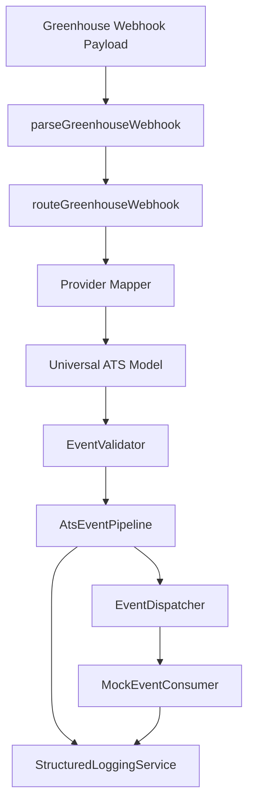

# Greenhouse Event Pipeline

## Overview

Sprint 3B-2 connects Greenhouse webhook payloads to the WorkVouch ATS Event Bus through a translation layer. Everything runs in memory — no database, no UI, no sync.

## Pipeline Flow



## Components

| Layer | Location | Responsibility |
|-------|----------|----------------|
| Greenhouse models | `providers/greenhouse/models/` | Typed GH payloads |
| Mappers | `providers/greenhouse/mappers/` | GH → universal conversion |
| Translator | `providers/greenhouse/services/event-translator.ts` | Orchestrates mapping |
| Universal models | `core/models/` | Provider-agnostic entities |
| Event types | `core/events/ats-event-types.ts` | Standard event catalog |
| Validation | `core/validation/` | Schema + ordering checks |
| Pipeline | `core/pipeline/ats-event-pipeline.ts` | Publish to bus |
| Consumer | `core/consumers/mock-event-consumer.ts` | Test consumer |

## Standard Events

Every provider emits the same universal events:

- `ats.candidate.created`, `ats.candidate.updated`, `ats.candidate.moved`
- `ats.application.created`
- `ats.job.created`, `ats.job.updated`
- `ats.offer.created`, `ats.offer.accepted`, `ats.offer.rejected`
- `ats.candidate.hired`, `ats.candidate.rejected`, `ats.candidate.withdrawn`

## Usage

```typescript
import {
  AtsEventPipeline,
  EventValidator,
  MockEventConsumer,
  StructuredLoggingService,
  ATS_EVENT_TYPES,
} from "@/lib/integrations";
import { createGreenhouseEventTranslator } from "@/lib/integrations/providers/greenhouse";

const pipeline = new AtsEventPipeline(dispatcher, logger, new EventValidator());
const translator = createGreenhouseEventTranslator(pipeline);
const consumer = new MockEventConsumer(logger);

dispatcher.subscribe(
  ATS_EVENT_TYPES.CandidateCreated,
  consumer.createHandler()
);

translator.translateAndPublish({
  rawPayload: fixtureJson,
  employerAccountId: "employer-1",
  connectionId: "conn-1",
});
```

## Logging

Each translated event produces structured logs with:

- Provider (`greenhouse`)
- Provider event (`candidate_created`, etc.)
- Universal event (`ats.candidate.created`)
- Correlation ID
- Company (employer account ID)
- Duration (ms)
- Mapper used
- Validation result (`valid` / `invalid`)

## Boundaries

- Greenhouse-specific logic stays under `providers/greenhouse/`
- Platform code only understands universal models and event types
- No WorkVouch core modifications
